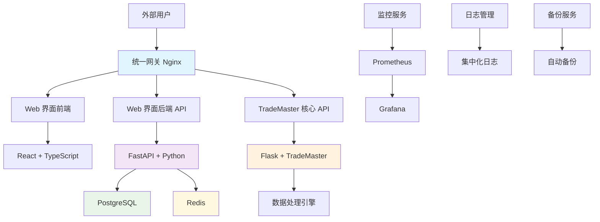
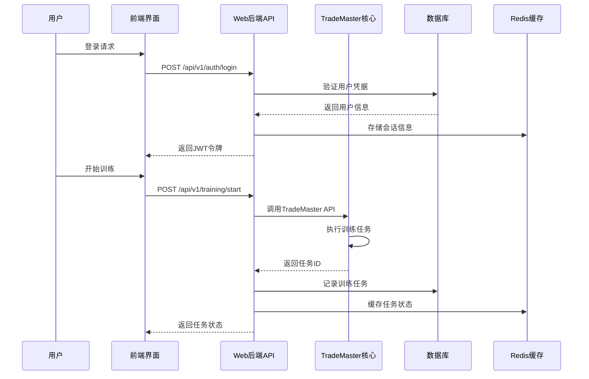

[根目录](../CLAUDE.md) > **deploy**

# TradeMaster Deploy 模块

## 模块职责

deploy/ 模块是 TradeMaster 项目的部署配置和服务管理中心，包含：

- 🌐 **Web 服务部署**: Flask Web 服务器和客户端测试
- 🐳 **Docker 容器化**: 完整的容器化部署解决方案  
- ⚙️ **多环境配置**: 开发、测试、生产环境的统一管理
- 🔧 **服务编排**: 基于 Docker Compose 的微服务架构
- 📊 **监控集成**: 内置健康检查和性能监控
- 🔄 **CI/CD 支持**: 自动化部署和备份策略

## 部署架构概览



## 入口与启动

### 🚀 主要服务入口

| 文件 | 用途 | 端口 | 说明 |
|------|------|------|------|
| `backend_service.py` | 主 Web 服务器 | 8080 | TradeMaster Web 界面后端服务 |
| `backend_client.py` | 客户端测试工具 | - | 用于测试后端 API 接口 |
| `backend_service_test.py` | 服务端测试 | - | 后端服务功能测试套件 |
| `backend_client_test.py` | 客户端测试 | - | 客户端功能测试套件 |

### 🎯 快速启动命令

```bash
# 1. 开发环境启动
python backend_service.py  # 启动开发服务器

# 2. 生产环境 - Docker 部署
cd ../web_interface
docker-compose -f docker-compose.prod.yml up -d

# 3. 开发环境 - Docker 部署  
docker-compose -f docker-compose.dev.yml up -d

# 4. 扩展生态系统部署
docker-compose -f docker-compose.extended.yml up -d
```

## 对外接口

### 🔌 核心 API 接口

**TradeMaster 后端服务 API**
- `/api/TradeMaster/getParameters` - 获取系统参数
- `/api/TradeMaster/train` - 模型训练接口
- `/api/TradeMaster/train_status` - 训练状态查询
- `/api/TradeMaster/test` - 模型测试接口
- `/api/TradeMaster/test_status` - 测试状态查询
- `/api/TradeMaster/start_market_dynamics_labeling` - 市场动态建模
- `/api/TradeMaster/save_market_dynamics_labeling` - 保存动态标签
- `/api/TradeMaster/run_dynamics_test` - 动态测试执行
- `/api/TradeMaster/upload_csv` - CSV 文件上传
- `/api/TradeMaster/download_csv` - CSV 文件下载
- `/api/TradeMaster/healthcheck` - 健康检查

**Web 界面 API (FastAPI)**
- `/api/v1/auth/login` - 用户登录
- `/api/v1/auth/logout` - 用户登出
- `/api/v1/strategies/list` - 策略列表
- `/api/v1/data/upload` - 数据上传
- `/api/v1/training/start` - 开始训练
- `/api/v1/analysis/results` - 分析结果

## 关键依赖与配置

### 🛠 技术栈

**后端核心**
```python
# Flask Web 框架
Flask==2.3.3
flask-cors==4.0.0

# 科学计算和机器学习
numpy==1.21.6
pandas==1.5.3
torch==1.12.1+cpu
mmcv==1.7.1

# 数据库和缓存
PostgreSQL==15.x
Redis==7.x

# 时间处理
pytz  # 支持亚洲/上海时区
```

**前端技术栈**
```typescript
// React 生态系统
React 18.x + TypeScript 5.x
Vite 4.x (构建工具)
Ant Design 5.x (UI 组件库)

// 状态管理和数据获取
Redux Toolkit + RTK Query
React Router 6.x

// 图表和可视化
ECharts + React-ECharts
D3.js (高级可视化)
```

### ⚙️ 环境配置文件

**Docker Compose 配置**
- `docker-compose.dev.yml` - 开发环境 (支持热重载、调试工具)
- `docker-compose.prod.yml` - 生产环境 (性能优化、安全加固)
- `docker-compose.extended.yml` - 完整生态系统 (包含监控、备份)

**环境变量配置**
- `.env.example` - 环境变量模板 (310行完整配置)
- `.env.dev` - 开发环境配置
- `.env.prod` - 生产环境配置 (已包含真实配置)

### 🔧 核心配置参数

**数据库配置**
```bash
# PostgreSQL 主数据库
POSTGRES_USER=trademaster
POSTGRES_DB=trademaster_web
POSTGRES_PASSWORD=prod_strong_password_2024

# Redis 缓存配置
REDIS_PASSWORD=prod_redis_password_2024
REDIS_MAXMEMORY=1gb
REDIS_MAXMEMORY_POLICY=allkeys-lru
```

**安全配置**
```bash
# JWT 令牌配置
SECRET_KEY=prod-very-strong-secret-key-for-production-use
ACCESS_TOKEN_EXPIRE_MINUTES=30
ALGORITHM=HS256

# CORS 策略
BACKEND_CORS_ORIGINS=https://localhost,https://127.0.0.1
```

## 数据模型

### 🗂 数据存储架构

**PostgreSQL 数据库表结构**
```sql
-- 用户认证表
users (id, username, email, password_hash, created_at, is_active)

-- 交易策略表
strategies (id, name, type, config, user_id, created_at, updated_at)

-- 训练任务表
training_jobs (id, strategy_id, status, config, result, created_at)

-- 数据集表
datasets (id, name, path, type, size, created_at)

-- 分析结果表
analysis_results (id, job_id, metrics, plots, created_at)
```

**Redis 缓存键设计**
```python
# 会话缓存
"session:{session_id}" -> {user_data, permissions, timestamp}

# 训练状态缓存  
"training:{job_id}" -> {status, progress, logs}

# API 响应缓存
"api:getParameters" -> {cached_parameters}
"api:evaluation:{session_id}" -> {evaluation_data}

# 文件上传缓存
"upload:{file_hash}" -> {file_metadata, status}
```

### 📊 数据流转



## 测试与质量

### 🧪 测试策略

**单元测试覆盖**
- `backend_service_test.py` - Flask 服务端点测试
- `backend_client_test.py` - API 客户端功能测试
- 后端测试路径: `web_interface/backend/tests/`
- 前端测试路径: `web_interface/frontend/src/__tests__/`

**集成测试**
```python
# 关键测试场景
def test_training_workflow():
    """测试完整的训练工作流"""
    # 1. 用户登录
    # 2. 上传数据
    # 3. 配置策略  
    # 4. 开始训练
    # 5. 监控进度
    # 6. 获取结果

def test_market_dynamics_modeling():
    """测试市场动态建模功能"""
    # 1. 启动建模
    # 2. 监控状态
    # 3. 保存结果
    # 4. 动态测试
```

**性能测试**
- 并发用户: 100+ 同时在线
- API 响应时间: <200ms (95分位数)
- 数据库查询: <100ms
- 文件上传: 支持 100MB+ 文件

### 🔍 质量保证

**代码质量工具**
```bash
# Python 后端
black          # 代码格式化
flake8         # 代码检查
mypy           # 类型检查
pytest         # 单元测试

# TypeScript 前端  
eslint         # 代码检查
prettier       # 代码格式化
jest           # 单元测试
cypress        # E2E 测试
```

**安全扫描**
- Docker 镜像安全扫描
- 依赖漏洞检测
- SQL 注入防护
- XSS 攻击防护

## 部署模式详解

### 🔧 开发环境

**特点与优势**
- ✅ 支持热重载 (代码修改自动重启)
- ✅ 详细错误信息和调试工具
- ✅ 包含完整的开发工具链
- ✅ 数据库管理界面 (pgAdmin)
- ✅ Redis 管理界面 (Redis Commander)
- ✅ 邮件测试工具 (MailHog)

**服务组件**
```yaml
services:
  postgres:      # 端口 5432
  redis:         # 端口 6380
  backend:       # 端口 8000 (支持 debugpy 5678)
  frontend:      # 端口 3100 (Vite 开发服务器)
  nginx:         # 端口 8080 (反向代理)
  
  # 开发工具 (--profile tools)
  pgadmin:       # 端口 5050 (数据库管理)
  redis-commander: # 端口 8081 (Redis 管理)
  mailhog:       # 端口 8025 (邮件测试)
```

**启动命令**
```bash
# 基础开发环境
docker-compose -f docker-compose.dev.yml up -d

# 包含开发工具
docker-compose -f docker-compose.dev.yml --profile tools up -d

# 实时日志监控
docker-compose -f docker-compose.dev.yml logs -f
```

### 🚀 生产环境

**企业级特性**
- 🔒 安全加固 (只读文件系统、安全选项)
- ⚡ 性能优化 (多实例、资源限制)
- 📊 监控集成 (Prometheus + Grafana)
- 🔄 自动备份和恢复
- 🛡️ 高可用性设计
- 📈 负载均衡和扩展支持

**服务架构**
```yaml
services:
  postgres:      # 内部网络 (2GB 内存限制)
  redis:         # 内部网络 (512MB 内存限制)  
  backend:       # 2个实例 (负载均衡)
  frontend:      # 2个实例 (静态资源优化)
  nginx:         # 端口 80/443 (SSL 终端)
  
  # 监控服务 (--profile monitoring)
  prometheus:    # 端口 9090 (指标收集)
  grafana:       # 端口 3001 (可视化仪表板)
  
  # 备份服务 (--profile backup)
  backup:        # 定时数据库备份
```

**扩展部署**
```bash
# 标准生产部署
docker-compose -f docker-compose.prod.yml up -d

# 包含监控
docker-compose -f docker-compose.prod.yml --profile monitoring up -d

# 扩展后端实例
docker-compose -f docker-compose.prod.yml up -d --scale backend=3
```

### 🌐 完整生态系统

**扩展架构特性**
- 🔗 与现有 TradeMaster 核心无缝集成
- 🌍 统一网关 (支持多种路由策略)
- 📊 全面监控 (系统 + 容器 + 应用)
- 💾 共享数据卷管理
- 🔧 灵活的网络隔离

**网络架构**
```yaml
networks:
  external:           # 172.21.0.0/24 (外部访问)
  trademaster-frontend: # 172.22.0.0/24 (前端网络)  
  trademaster-backend:  # 172.23.0.0/24 (后端网络, 内部)
  trademaster-monitoring: # 172.24.0.0/24 (监控网络, 内部)
```

## 运维指南

### 📊 监控和维护

**健康检查端点**
```bash
# Web 界面健康检查
curl http://localhost/health

# 后端 API 健康检查  
curl http://localhost:8000/api/v1/health

# TradeMaster 核心健康检查
curl http://localhost:8080/api/TradeMaster/healthcheck
```

**关键性能指标 (KPI)**
- **响应时间**: API 平均响应 <200ms
- **吞吐量**: 支持 1000+ 并发请求
- **可用性**: 99.9% 正常运行时间
- **资源利用率**: CPU <80%, 内存 <85%

**Grafana 仪表板监控**
- 系统资源 (CPU、内存、磁盘、网络)
- 应用性能 (响应时间、错误率、QPS)
- 数据库性能 (连接数、查询时间、慢查询)
- 业务指标 (用户数、训练任务数、成功率)

### 🗂 日志管理

**日志收集策略**
```yaml
logging:
  driver: "json-file"
  options:
    max-size: "100m"      # 单文件最大100MB
    max-file: "10"        # 保留10个文件
    compress: "true"      # 自动压缩
```

**日志查看命令**
```bash
# 查看所有服务日志
docker-compose logs -f

# 查看特定服务日志
docker-compose logs -f backend frontend nginx

# 查看最近日志
docker-compose logs -f --tail=100

# 按时间过滤日志
docker-compose logs -f --since="2025-08-22T10:00:00"
```

### 💾 备份和恢复

**自动备份策略**
```bash
# 数据库备份 (每日凌晨2点)
BACKUP_SCHEDULE="0 2 * * *"
BACKUP_RETENTION_DAYS=30

# 启用备份服务
docker-compose -f docker-compose.prod.yml --profile backup up -d
```

**手动备份命令**
```bash
# 数据库备份
docker-compose exec postgres pg_dump -U trademaster trademaster_web > backup_$(date +%Y%m%d).sql

# 应用数据备份
docker-compose exec backend tar -czf /backups/app_data_$(date +%Y%m%d).tar.gz /app/data

# 配置文件备份
cp .env.prod .env.prod.backup.$(date +%Y%m%d)
```

**灾难恢复流程**
1. **停止所有服务**: `docker-compose down`
2. **恢复数据库**: `docker-compose exec -T postgres psql -U trademaster -d trademaster_web < backup.sql`
3. **恢复应用数据**: `docker-compose exec backend tar -xzf /backups/app_data.tar.gz -C /`
4. **重启服务**: `docker-compose up -d`
5. **验证服务**: `curl http://localhost/health`

## 常见问题 (FAQ)

### ❓ 部署问题

**Q1: 容器启动失败，提示端口被占用**
```bash
# 检查端口占用
lsof -i :80
lsof -i :8000
lsof -i :5432

# 解决方案：修改端口映射
# 在 docker-compose.yml 中修改：
ports:
  - "8080:80"    # 将80端口改为8080
```

**Q2: 数据库连接失败**
```bash
# 检查数据库状态
docker-compose exec postgres pg_isready -U trademaster

# 查看数据库日志
docker-compose logs postgres

# 重启数据库服务
docker-compose restart postgres
```

**Q3: 前端页面无法加载**
```bash
# 检查前端构建日志
docker-compose logs frontend

# 重新构建前端
docker-compose build frontend --no-cache

# 验证 Nginx 配置
docker-compose exec nginx nginx -t
```

### 🔧 配置问题

**Q4: API 请求跨域错误**
```bash
# 检查 CORS 配置
echo $BACKEND_CORS_ORIGINS

# 确保包含前端域名
BACKEND_CORS_ORIGINS=https://localhost,https://127.0.0.1,https://your-domain.com
```

**Q5: 文件上传失败**
```bash
# 检查上传目录权限
docker-compose exec backend ls -la /app/uploads

# 检查文件大小限制
MAX_UPLOAD_SIZE=104857600  # 100MB
```

### ⚡ 性能优化

**Q6: 数据库查询慢**
```sql
-- 查看慢查询
SELECT query, calls, total_time, mean_time 
FROM pg_stat_statements 
ORDER BY mean_time DESC LIMIT 10;

-- 优化建议
CREATE INDEX IF NOT EXISTS idx_training_jobs_user_id ON training_jobs(user_id);
CREATE INDEX IF NOT EXISTS idx_strategies_type ON strategies(type);
```

**Q7: Redis 内存不足**
```bash
# 检查 Redis 内存使用
docker-compose exec redis redis-cli INFO memory

# 调整内存策略
REDIS_MAXMEMORY=2gb
REDIS_MAXMEMORY_POLICY=allkeys-lru
```

## 相关文件清单

### 📁 核心部署文件

**deploy/ 目录**
```
deploy/
├── backend_service.py          # 主Web服务器 (1502行)
├── backend_client.py           # API客户端 (123行)  
├── backend_service_test.py     # 服务端测试 (453行)
├── backend_client_test.py      # 客户端测试 (48行)
└── CLAUDE.md                   # 本文档
```

**Docker 配置文件**
```
./
├── Dockerfile                  # 基础容器镜像 (74行)
├── docker-compose.extended.yml # 完整生态系统 (423行)
└── DOCKER_SETUP.md            # Docker配置指南 (273行)

web_interface/
├── docker-compose.dev.yml     # 开发环境 (365行)
├── docker-compose.prod.yml    # 生产环境 (579行)  
├── .env.example               # 环境变量模板 (310行)
└── .env.prod                  # 生产环境配置 (78行)
```

**文档和指南**
```
docs/
├── DOCKER_DEPLOYMENT_GUIDE.md # Docker部署完整指南
├── source/docker.md           # Docker技术文档
└── installation/docker.md     # 安装说明

web_interface/docs/
├── DOCKER_DEPLOYMENT_GUIDE.md # Web界面部署指南 (552行)
├── QUICK_START.md             # 快速开始指南
└── TROUBLESHOOTING.md         # 故障排除手册
```

### 🔧 配置和脚本文件

**环境配置**
```
web_interface/
├── .env.example               # 完整环境变量模板
├── .env.prod                  # 生产环境实际配置
├── ENV_CONFIG_GUIDE.md        # 环境配置指导  
└── scripts/
    ├── deploy.sh              # 一键部署脚本
    ├── health-check.sh        # 健康检查脚本
    ├── stop-services.sh       # 服务停止脚本
    └── validate_env_config.py # 环境验证脚本
```

**Docker 相关**
```
web_interface/docker/
├── backend/Dockerfile         # 后端容器配置
├── frontend/Dockerfile        # 前端容器配置
├── nginx/                     # Nginx配置文件
├── postgres/                  # PostgreSQL配置
├── redis/                     # Redis配置文件
└── monitoring/                # 监控配置
```

## 变更记录 (Changelog)

### [1.0.0] - 2025-08-22

**新增功能**
- ✨ 完整的 Docker 容器化部署解决方案
- ✨ 多环境配置支持 (开发/生产/扩展)
- ✨ 统一网关和负载均衡
- ✨ 监控和备份集成
- ✨ 安全加固和性能优化

**架构改进**
- 🏗️ 微服务架构设计
- 🏗️ 网络隔离和安全策略
- 🏗️ 数据持久化和备份策略
- 🏗️ 健康检查和故障恢复

**运维工具**
- 🔧 一键部署脚本
- 🔧 健康检查和监控
- 🔧 日志管理和分析
- 🔧 自动备份和恢复

**技术栈升级**
- ⬆️ Docker Compose 3.8+ 支持
- ⬆️ PostgreSQL 15 + Redis 7
- ⬆️ React 18 + TypeScript 5
- ⬆️ FastAPI + Flask 集成

---

*最后更新: 2025-08-22*  
*文档版本: v1.0.0*  
*维护团队: TradeMaster DevOps Team*