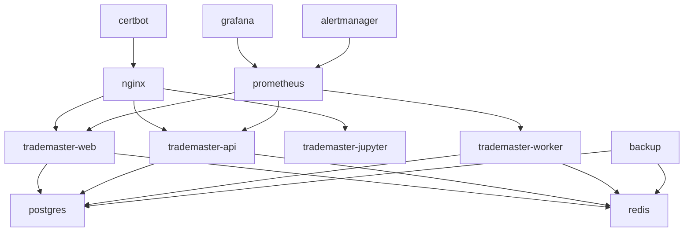
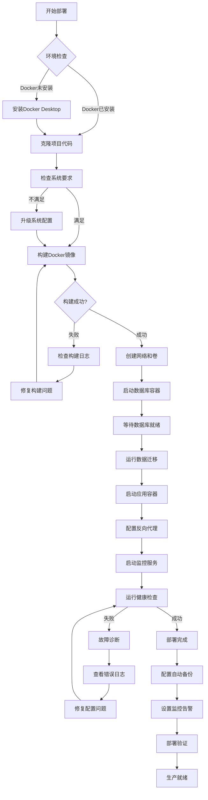
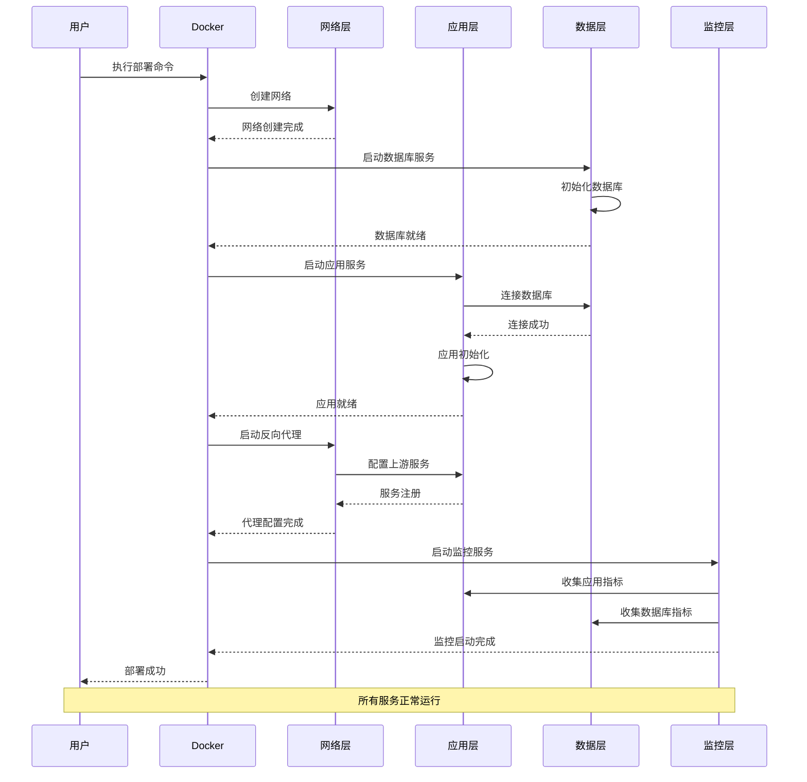
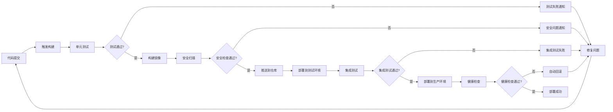
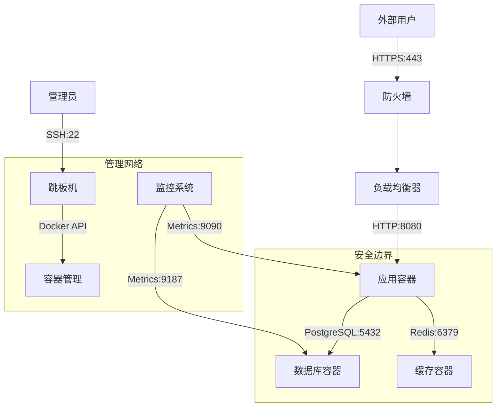
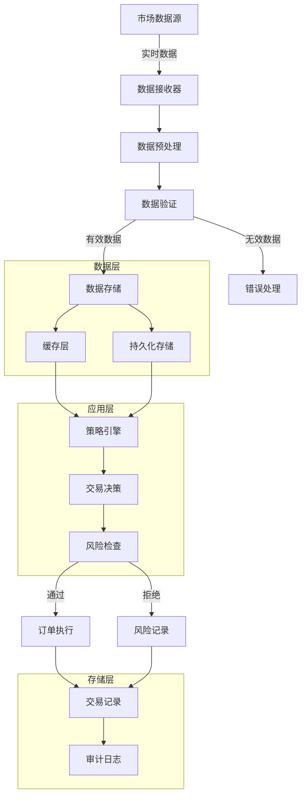
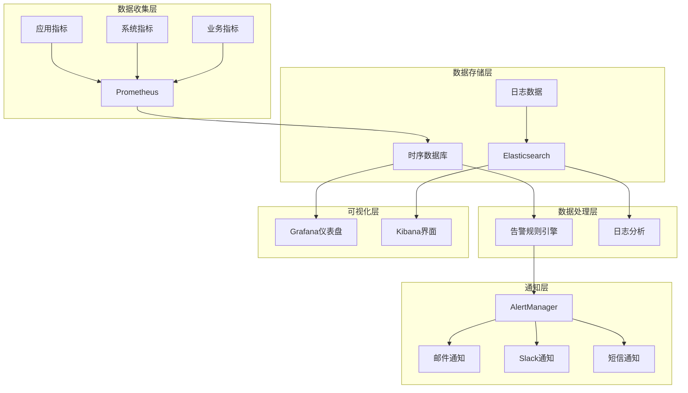
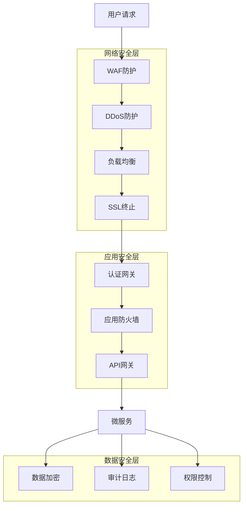
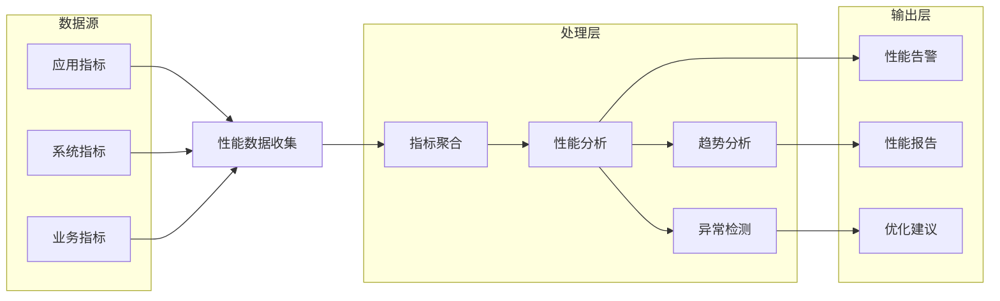
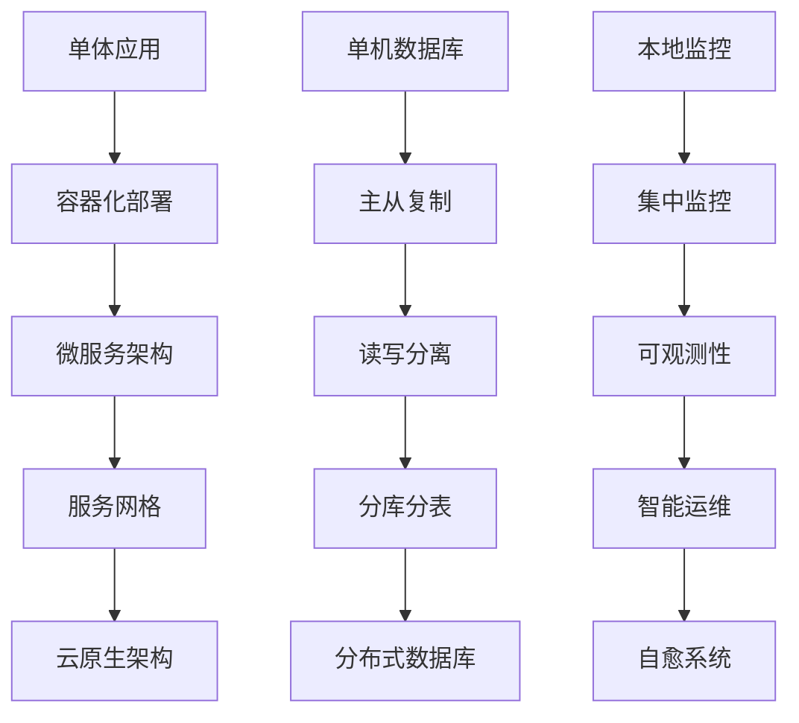

# TradeMaster Docker 架构设计指南

<div align="center">
    <h2>🏗️ 系统架构与部署流程</h2>
    <p>深入理解TradeMaster Docker容器化架构</p>
</div>

---

## 📋 目录

- [🏗️ 总体架构设计](#总体架构设计)
- [🐳 Docker容器架构](#docker容器架构)
- [🔄 部署流程图](#部署流程图)
- [🌐 网络架构设计](#网络架构设计)
- [💾 数据流架构](#数据流架构)
- [📊 监控架构](#监控架构)
- [🔒 安全架构](#安全架构)
- [⚡ 性能架构](#性能架构)

---

## 🏗️ 总体架构设计

### 系统整体架构

```
┌─────────────────────────────────────────────────────────────────┐
│                        TradeMaster 系统架构                      │
├─────────────────────────────────────────────────────────────────┤
│                          用户访问层                              │
│  ┌─────────┐  ┌─────────┐  ┌─────────┐  ┌─────────┐           │
│  │Web浏览器│  │移动应用 │  │API客户端│  │Jupyter  │           │
│  └─────────┘  └─────────┘  └─────────┘  └─────────┘           │
├─────────────────────────────────────────────────────────────────┤
│                         负载均衡层                               │
│  ┌─────────────────────────────────────────────────────────────┐ │
│  │                   Nginx / HAProxy                          │ │
│  │        SSL终止 │ 负载均衡 │ 反向代理 │ 缓存              │ │
│  └─────────────────────────────────────────────────────────────┘ │
├─────────────────────────────────────────────────────────────────┤
│                        应用服务层                                │
│  ┌─────────────┐  ┌─────────────┐  ┌─────────────┐           │
│  │TradeMaster  │  │TradeMaster  │  │TradeMaster  │           │
│  │Container-1  │  │Container-2  │  │Container-3  │           │
│  │             │  │             │  │             │           │
│  │┌───────────┐│  │┌───────────┐│  │┌───────────┐│           │
│  ││ Web服务   ││  ││ API服务   ││  ││ 后台任务  ││           │
│  ││ Jupyter   ││  ││ 策略引擎  ││  ││ 数据处理  ││           │
│  ││ 模型训练  ││  ││ 风险管理  ││  ││ 监控代理  ││           │
│  │└───────────┘│  │└───────────┘│  │└───────────┘│           │
│  └─────────────┘  └─────────────┘  └─────────────┘           │
├─────────────────────────────────────────────────────────────────┤
│                         数据服务层                               │
│  ┌─────────────┐  ┌─────────────┐  ┌─────────────┐           │
│  │ PostgreSQL  │  │    Redis    │  │ Time Series │           │
│  │    主库     │  │    缓存     │  │     DB      │           │
│  │┌───────────┐│  │┌───────────┐│  │┌───────────┐│           │
│  ││用户数据   ││  ││会话缓存   ││  ││市场数据   ││           │
│  ││交易记录   ││  ││查询缓存   ││  ││价格序列   ││           │
│  ││策略配置   ││  ││实时数据   ││  ││技术指标   ││           │
│  │└───────────┘│  │└───────────┘│  │└───────────┘│           │
│  └─────────────┘  └─────────────┘  └─────────────┘           │
├─────────────────────────────────────────────────────────────────┤
│                        基础设施层                                │
│  ┌─────────────┐  ┌─────────────┐  ┌─────────────┐           │
│  │   Docker    │  │   监控系统  │  │   日志系统  │           │
│  │   Engine    │  │ Prometheus  │  │    ELK      │           │
│  │             │  │  Grafana    │  │  Fluentd    │           │
│  └─────────────┘  └─────────────┘  └─────────────┘           │
└─────────────────────────────────────────────────────────────────┘
```

### 核心组件说明

| 组件层级 | 组件名称 | 职责描述 | 关键特性 |
|----------|----------|-----------|----------|
| **用户层** | Web界面 | 用户交互入口 | 响应式设计、实时更新 |
| **用户层** | API接口 | 程序化访问 | RESTful设计、认证授权 |
| **用户层** | Jupyter | 研究分析 | 交互式开发、可视化 |
| **负载层** | Nginx | 反向代理 | SSL终止、负载均衡 |
| **应用层** | TradeMaster | 核心应用 | 策略执行、风险管理 |
| **数据层** | PostgreSQL | 关系数据 | ACID特性、高可用 |
| **数据层** | Redis | 缓存存储 | 高性能、持久化 |
| **基础层** | Docker | 容器平台 | 隔离性、可移植性 |

---

## 🐳 Docker容器架构

### 容器组织结构

```
TradeMaster Docker 容器生态
├── 核心应用容器
│   ├── trademaster-web      # Web服务容器
│   ├── trademaster-api      # API服务容器
│   ├── trademaster-worker   # 后台任务容器
│   └── trademaster-jupyter  # Jupyter服务容器
├── 数据存储容器
│   ├── postgres             # 主数据库容器
│   ├── redis               # 缓存数据库容器
│   └── timescaledb         # 时序数据库容器
├── 基础服务容器
│   ├── nginx               # 反向代理容器
│   ├── certbot             # SSL证书容器
│   └── backup              # 数据备份容器
└── 监控运维容器
    ├── prometheus          # 指标收集容器
    ├── grafana            # 监控面板容器
    ├── alertmanager       # 告警管理容器
    └── jaeger             # 链路追踪容器
```

### 容器间依赖关系



### 网络拓扑设计

```
Docker 网络架构
┌─────────────────────────────────────────────────────────────┐
│                      Docker Host                           │
│                                                             │
│  ┌─────────────────┐    ┌─────────────────┐               │
│  │  frontend-net   │    │  backend-net    │               │
│  │  (bridge)       │    │  (bridge)       │               │
│  │                 │    │  internal: true │               │
│  │  ┌────────────┐ │    │                 │               │
│  │  │   nginx    │ │    │  ┌────────────┐ │               │
│  │  │ 172.20.0.2 │ │    │  │ postgres   │ │               │
│  │  └────────────┘ │    │  │ 172.21.0.2 │ │               │
│  │         │       │    │  └────────────┘ │               │
│  └─────────┼───────┘    │                 │               │
│            │            │  ┌────────────┐ │               │
│  ┌─────────┼───────┐    │  │   redis    │ │               │
│  │  app-net        │    │  │ 172.21.0.3 │ │               │
│  │  (bridge)       │    │  └────────────┘ │               │
│  │                 │    └─────────────────┘               │
│  │  ┌────────────┐ │                                      │
│  │  │trademaster │ │    ┌─────────────────┐               │
│  │  │ 172.22.0.2 │ │    │ monitoring-net  │               │
│  │  └────────────┘ │    │  (bridge)       │               │
│  │                 │    │                 │               │
│  │  ┌────────────┐ │    │  ┌────────────┐ │               │
│  │  │trademaster │ │    │  │prometheus  │ │               │
│  │  │ 172.22.0.3 │ │    │  │ 172.23.0.2 │ │               │
│  │  └────────────┘ │    │  └────────────┘ │               │
│  └─────────────────┘    │                 │               │
│                         │  ┌────────────┐ │               │
│                         │  │  grafana   │ │               │
│                         │  │ 172.23.0.3 │ │               │
│                         │  └────────────┘ │               │
│                         └─────────────────┘               │
└─────────────────────────────────────────────────────────────┘
           │                        │
           ▼                        ▼
    ┌─────────────┐          ┌─────────────┐
    │外部网络访问  │          │ 内部服务通信 │
    │  80/443     │          │  专用端口   │
    └─────────────┘          └─────────────┘
```

---

## 🔄 部署流程图

### 完整部署流程



### 微服务部署流程



### CI/CD部署管道



---

## 🌐 网络架构设计

### 网络分层模型

```
┌─────────────────────────────────────────────────────────────┐
│                      网络架构设计                            │
├─────────────────────────────────────────────────────────────┤
│                     DMZ区域                                 │
│  ┌─────────────────────────────────────────────────────────┐ │
│  │          负载均衡器 (Nginx/HAProxy)                     │ │
│  │  ┌─────────┐  ┌─────────┐  ┌─────────┐               │ │
│  │  │SSL终止  │  │负载均衡 │  │WAF防护  │               │ │
│  │  └─────────┘  └─────────┘  └─────────┘               │ │
│  └─────────────────────────────────────────────────────────┘ │
├─────────────────────────────────────────────────────────────┤
│                   应用服务区域                               │
│  ┌─────────────────────────────────────────────────────────┐ │
│  │              TradeMaster 应用集群                       │ │
│  │  ┌─────────┐  ┌─────────┐  ┌─────────┐               │ │
│  │  │Web服务  │  │API服务  │  │后台服务 │               │ │
│  │  └─────────┘  └─────────┘  └─────────┘               │ │
│  └─────────────────────────────────────────────────────────┘ │
├─────────────────────────────────────────────────────────────┤
│                    数据存储区域                              │
│  ┌─────────────────────────────────────────────────────────┐ │
│  │                  数据库集群                             │ │
│  │  ┌─────────┐  ┌─────────┐  ┌─────────┐               │ │
│  │  │主数据库 │  │从数据库 │  │缓存数据库│               │ │
│  │  └─────────┘  └─────────┘  └─────────┘               │ │
│  └─────────────────────────────────────────────────────────┘ │
├─────────────────────────────────────────────────────────────┤
│                    管理监控区域                              │
│  ┌─────────────────────────────────────────────────────────┐ │
│  │              监控和管理服务                             │ │
│  │  ┌─────────┐  ┌─────────┐  ┌─────────┐               │ │
│  │  │监控服务 │  │日志服务 │  │备份服务 │               │ │
│  │  └─────────┘  └─────────┘  └─────────┘               │ │
│  └─────────────────────────────────────────────────────────┘ │
└─────────────────────────────────────────────────────────────┘
```

### 网络安全策略



---

## 💾 数据流架构

### 数据处理流程



### 数据库设计架构

```
TradeMaster 数据库架构
┌─────────────────────────────────────────────────────────────┐
│                      PostgreSQL 主库                        │
├─────────────────────────────────────────────────────────────┤
│  ┌─────────────┐  ┌─────────────┐  ┌─────────────┐       │
│  │   用户管理  │  │   策略配置  │  │   交易记录  │       │
│  │             │  │             │  │             │       │
│  │ • users     │  │• strategies │  │• trades     │       │
│  │ • roles     │  │• parameters │  │• orders     │       │
│  │ • sessions  │  │• backtest   │  │• positions  │       │
│  └─────────────┘  └─────────────┘  └─────────────┘       │
├─────────────────────────────────────────────────────────────┤
│                      Redis 缓存层                           │
├─────────────────────────────────────────────────────────────┤
│  ┌─────────────┐  ┌─────────────┐  ┌─────────────┐       │
│  │   会话缓存  │  │   查询缓存  │  │   实时数据  │       │
│  │             │  │             │  │             │       │
│  │• user_sess  │  │• query_res  │  │• live_price │       │
│  │• api_tokens │  │• computed   │  │• indicators │       │
│  │• temp_data  │  │• aggregated │  │• signals    │       │
│  └─────────────┘  └─────────────┘  └─────────────┘       │
├─────────────────────────────────────────────────────────────┤
│                    TimescaleDB 时序库                       │
├─────────────────────────────────────────────────────────────┤
│  ┌─────────────┐  ┌─────────────┐  ┌─────────────┐       │
│  │   价格数据  │  │   指标数据  │  │   性能数据  │       │
│  │             │  │             │  │             │       │
│  │• ohlcv      │  │• technical  │  │• portfolio  │       │
│  │• tick_data  │  │• custom     │  │• benchmark  │       │
│  │• volume     │  │• signals    │  │• metrics    │       │
│  └─────────────┘  └─────────────┘  └─────────────┘       │
└─────────────────────────────────────────────────────────────┘
```

---

## 📊 监控架构

### 监控系统架构



### 监控指标体系

```
监控指标分层架构
├── 基础设施监控
│   ├── 主机监控
│   │   ├── CPU使用率
│   │   ├── 内存使用率
│   │   ├── 磁盘I/O
│   │   └── 网络流量
│   └── 容器监控
│       ├── 容器状态
│       ├── 资源限制
│       ├── 重启次数
│       └── 镜像版本
├── 应用服务监控
│   ├── 服务可用性
│   │   ├── 健康检查
│   │   ├── 响应时间
│   │   ├── 错误率
│   │   └── 吞吐量
│   └── 业务指标
│       ├── 用户活跃度
│       ├── 交易数量
│       ├── 策略性能
│       └── 风险指标
└── 数据存储监控
    ├── 数据库监控
    │   ├── 连接数
    │   ├── 查询性能
    │   ├── 锁等待
    │   └── 复制延迟
    └── 缓存监控
        ├── 命中率
        ├── 内存使用
        ├── 网络延迟
        └── 键空间统计
```

---

## 🔒 安全架构

### 安全防护体系



### 安全控制矩阵

| 安全层级 | 控制措施 | 实现方式 | 监控指标 |
|----------|----------|----------|----------|
| **网络层** | 防火墙规则 | iptables/ufw | 连接统计 |
| **网络层** | DDoS防护 | CloudFlare | 请求频率 |
| **传输层** | SSL/TLS | Let's Encrypt | 证书有效期 |
| **应用层** | 身份认证 | JWT Token | 登录成功率 |
| **应用层** | 权限控制 | RBAC模型 | 权限违规次数 |
| **数据层** | 数据加密 | AES-256 | 加密状态 |
| **数据层** | 访问审计 | 日志记录 | 异常访问 |

---

## ⚡ 性能架构

### 性能优化层次

```
性能优化金字塔
                    ┌─────────────────┐
                    │   应用层优化    │
                    │ • 算法优化      │
                    │ • 代码重构      │
                    │ • 内存管理      │
                    └─────────────────┘
                  ┌─────────────────────┐
                  │     缓存层优化      │
                  │ • Redis集群        │
                  │ • 应用缓存         │
                  │ • CDN加速          │
                  └─────────────────────┘
                ┌─────────────────────────┐
                │       数据库优化        │
                │ • 索引优化             │
                │ • 查询优化             │
                │ • 读写分离             │
                │ • 分库分表             │
                └─────────────────────────┘
              ┌─────────────────────────────┐
              │         系统层优化          │
              │ • 容器资源配置             │
              │ • 网络参数调优             │
              │ • 存储I/O优化              │
              │ • 操作系统调优             │
              └─────────────────────────────┘
            ┌─────────────────────────────────┐
            │           基础设施优化          │
            │ • 硬件配置                     │
            │ • 网络架构                     │
            │ • 存储架构                     │
            │ • 负载均衡                     │
            └─────────────────────────────────┘
```

### 性能监控架构



---

## 📝 架构决策记录

### 关键架构决策

| 决策ID | 决策内容 | 原因 | 影响 | 状态 |
|--------|----------|------|------|------|
| **AD-001** | 选择Docker作为容器化平台 | 成熟稳定、生态丰富 | 简化部署、提高一致性 | ✅ 已采用 |
| **AD-002** | 使用PostgreSQL作为主数据库 | ACID特性、JSON支持 | 数据一致性、扩展性 | ✅ 已采用 |
| **AD-003** | Redis作为缓存和会话存储 | 高性能、数据结构丰富 | 提升响应速度 | ✅ 已采用 |
| **AD-004** | Nginx作为反向代理 | 高性能、配置灵活 | 负载均衡、SSL终止 | ✅ 已采用 |
| **AD-005** | Prometheus+Grafana监控 | 云原生、功能强大 | 全面监控、可视化 | ✅ 已采用 |

### 技术选型对比

| 组件类型 | 候选方案 | 最终选择 | 选择原因 |
|----------|----------|----------|----------|
| **容器平台** | Docker vs Podman | Docker | 生态成熟、文档完善 |
| **数据库** | PostgreSQL vs MySQL | PostgreSQL | JSON支持、扩展性 |
| **缓存** | Redis vs Memcached | Redis | 数据结构丰富 |
| **代理** | Nginx vs Apache | Nginx | 高并发性能 |
| **监控** | Prometheus vs InfluxDB | Prometheus | 云原生生态 |

---

## 🚀 扩展和演进

### 架构演进路线



### 技术栈演进

| 阶段 | 当前架构 | 目标架构 | 关键技术 |
|------|----------|----------|----------|
| **第1阶段** | 单容器部署 | 多容器编排 | Docker Compose |
| **第2阶段** | 垂直扩展 | 水平扩展 | Docker Swarm |
| **第3阶段** | 单体架构 | 微服务架构 | Kubernetes |
| **第4阶段** | 手动运维 | 自动化运维 | GitOps, ArgoCD |
| **第5阶段** | 基础监控 | 智能运维 | AI/ML, Chaos Engineering |

---

## 📞 架构咨询

### 技术支持

如需架构设计咨询，请联系：
- **GitHub Issues**: https://github.com/TradeMaster-NTU/TradeMaster/issues
- **技术讨论**: https://github.com/TradeMaster-NTU/TradeMaster/discussions
- **邮件支持**: TradeMaster.NTU@gmail.com

### 架构评审

我们提供架构评审服务：
- **设计评审**: 架构设计合理性评估
- **性能评审**: 性能瓶颈识别和优化
- **安全评审**: 安全风险评估和加固
- **扩展评审**: 扩展性和演进路径规划

---

## 📄 版本信息

**文档版本**: v2.0.0  
**最后更新**: 2025年8月15日  
**适用版本**: TradeMaster Docker v1.0+  
**维护团队**: TradeMaster Architecture Team