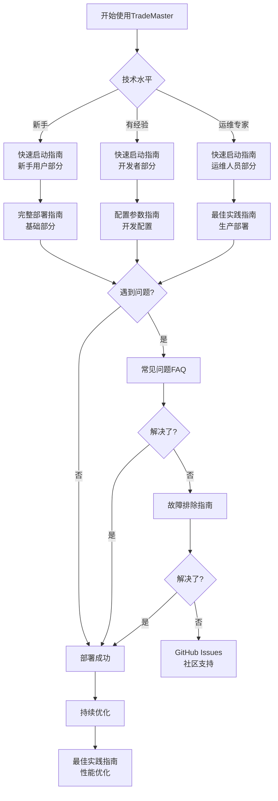

# TradeMaster Docker 部署文档中心

<div align="center">
    <h1>📚 TradeMaster Docker 部署文档</h1>
    <p>全面、专业、易用的 Docker 容器化部署指南</p>
    


[](https://www.docker.com/)
[](https://www.python.org/)
[](LICENSE)
[](docs/)

</div>

---

## 🎯 快速导航

<table align="center">
    <tr>
        <td align="center" width="200">
            <h3>🚀 新手入门</h3>
            <p>零基础快速上手</p>
            <a href="QUICK_START_GUIDE.md"><b>快速开始 →</b></a>
        </td>
        <td align="center" width="200">
            <h3>📖 完整指南</h3>
            <p>详细部署说明</p>
            <a href="DOCKER_DEPLOYMENT_GUIDE.md"><b>部署指南 →</b></a>
        </td>
        <td align="center" width="200">
            <h3>🔧 故障排除</h3>
            <p>问题诊断解决</p>
            <a href="TROUBLESHOOTING_GUIDE.md"><b>故障排除 →</b></a>
        </td>
    </tr>
    <tr>
        <td align="center">
            <h3>⚙️ 配置指南</h3>
            <p>参数详细说明</p>
            <a href="CONFIGURATION_GUIDE.md"><b>配置参数 →</b></a>
        </td>
        <td align="center">
            <h3>🏆 最佳实践</h3>
            <p>生产级部署</p>
            <a href="BEST_PRACTICES_GUIDE.md"><b>最佳实践 →</b></a>
        </td>
        <td align="center">
            <h3>❓ 常见问题</h3>
            <p>FAQ快速解答</p>
            <a href="FAQ.md"><b>常见问题 →</b></a>
        </td>
    </tr>
</table>

---

## 📚 文档架构

### 🏗️ 文档分层设计

我们采用**分层文档架构**，满足不同技术水平用户的需求：

```
TradeMaster Docker 文档
├── 🌟 入门层 (Getting Started)
│   ├── 快速启动指南 - 5分钟上手
│   └── 基础概念介绍 - 核心概念
├── 📖 指南层 (Guides)  
│   ├── 完整部署指南 - 详细步骤
│   ├── 配置参数指南 - 全面配置
│   └── 最佳实践指南 - 生产经验
├── 🔧 参考层 (Reference)
│   ├── 故障排除指南 - 问题解决
│   ├── 常见问题FAQ - 快速解答
│   └── API参考文档 - 接口说明
└── 🧪 高级层 (Advanced)
    ├── 架构设计文档 - 深度理解
    ├── 扩展开发指南 - 定制开发
    └── 性能调优指南 - 优化实践
```

---

## 📋 完整文档清单

### 📖 核心文档

| 文档 | 描述 | 适用人群 | 预计阅读时间 |
|------|------|----------|--------------|
| [📚 文档中心](README.md) | 文档导航和架构说明 | 所有用户 | 5分钟 |
| [🚀 快速启动指南](QUICK_START_GUIDE.md) | 面向不同角色的快速入门 | 新手、开发者、运维 | 15分钟 |
| [📖 完整部署指南](DOCKER_DEPLOYMENT_GUIDE.md) | 详细的部署和配置说明 | 所有用户 | 60分钟 |
| [🔧 故障排除指南](TROUBLESHOOTING_GUIDE.md) | 系统性问题诊断和解决 | 运维人员、开发者 | 45分钟 |
| [⚙️ 配置参数指南](CONFIGURATION_GUIDE.md) | 全面的参数配置说明 | 运维人员、高级用户 | 90分钟 |
| [🏆 最佳实践指南](BEST_PRACTICES_GUIDE.md) | 生产级部署经验分享 | 架构师、运维负责人 | 120分钟 |
| [❓ 常见问题FAQ](FAQ.md) | 问题快速解答集合 | 所有用户 | 30分钟 |

### 🔗 关联文档

| 文档 | 位置 | 描述 |
|------|------|------|
| [📝 Docker设置记录](../DOCKER_SETUP.md) | 项目根目录 | 详细的配置过程记录 |
| [⚡ 快速参考](../QUICK_REFERENCE.md) | 项目根目录 | 常用命令和信息 |
| [📖 主README](../README.md) | 项目根目录 | 项目总体介绍 |
| [🛠️ 管理脚本](../) | 项目根目录 | `.bat`管理脚本文件 |

---

## 🎯 使用指南

### 👤 按角色选择文档

#### 🌟 新手用户
> *"我是第一次使用Docker，想快速体验TradeMaster"*

**推荐路径**:
1. [🚀 快速启动指南 - 新手用户部分](QUICK_START_GUIDE.md#新手用户)
2. [❓ 常见问题FAQ](FAQ.md#安装和部署问题)
3. [📖 完整部署指南 - 基础部分](DOCKER_DEPLOYMENT_GUIDE.md#快速开始)

#### ⚡ 开发者
> *"我需要搭建开发环境，进行定制开发"*

**推荐路径**:
1. [🚀 快速启动指南 - 开发者部分](QUICK_START_GUIDE.md#开发者)
2. [⚙️ 配置参数指南 - 开发配置](CONFIGURATION_GUIDE.md#开发调试配置)
3. [🏆 最佳实践指南 - CI/CD](BEST_PRACTICES_GUIDE.md#cicd最佳实践)

#### 🔧 运维人员
> *"我负责生产环境部署和运维管理"*

**推荐路径**:
1. [🚀 快速启动指南 - 运维人员部分](QUICK_START_GUIDE.md#运维人员)
2. [🏆 最佳实践指南](BEST_PRACTICES_GUIDE.md)
3. [🔧 故障排除指南](TROUBLESHOOTING_GUIDE.md)
4. [⚙️ 配置参数指南 - 生产配置](CONFIGURATION_GUIDE.md)

### 📊 按任务选择文档

#### 🎯 首次部署
```
📖 部署路径:
快速启动指南 → 完整部署指南 → 配置验证 → 功能测试
```

#### 🔧 问题解决
```
🔍 诊断路径:
常见问题FAQ → 故障排除指南 → 配置参数检查 → 社区支持
```

#### ⚡ 性能优化
```
🚀 优化路径:
最佳实践指南 → 配置参数调优 → 监控设置 → 持续改进
```

#### 🔒 安全加固
```
🛡️ 安全路径:
最佳实践指南(安全部分) → 配置参数(安全配置) → 审计设置
```

---

## 🗺️ 文档使用导图



---

## 🏷️ 文档标签系统

我们使用标签系统帮助您快速找到相关内容：

### 📊 难度标签
- 🌟 **入门级** - 适合新手用户
- ⚡ **中级** - 需要基本Docker知识  
- 🔧 **高级** - 需要丰富运维经验
- 🚀 **专家级** - 需要深度技术理解

### 🎯 用途标签
- 📖 **指南** - 逐步操作说明
- 📋 **参考** - 查阅参数配置
- 🔍 **诊断** - 问题排查解决
- 💡 **最佳实践** - 经验和建议

### 🏗️ 环境标签
- 🧪 **开发环境** - 开发和测试
- 🏭 **生产环境** - 生产部署
- 🔄 **CI/CD** - 持续集成部署
- 📊 **监控运维** - 系统监控管理

---

## 🚀 文档特色功能

### ✨ 交互式元素

- **📋 复制代码块** - 一键复制命令
- **🔗 内部链接** - 快速跳转相关部分  
- **📊 可视化图表** - 架构图和流程图
- **✅ 检查清单** - 逐步验证进度

### 🎯 用户体验优化

- **🏷️ 角色标识** - 明确适用人群
- **⏱️ 时间估算** - 预计完成时间
- **🔍 搜索友好** - 关键词优化
- **📱 移动适配** - 移动设备友好

### 📈 持续改进

- **📊 使用统计** - 跟踪文档使用
- **💬 用户反馈** - 收集改进建议
- **🔄 定期更新** - 保持内容新鲜
- **✅ 质量保证** - 技术审核机制

---

## 🤝 参与贡献

### 📝 如何改进文档

我们欢迎您参与文档改进：

1. **🐛 发现错误**: 通过 [GitHub Issues](https://github.com/TradeMaster-NTU/TradeMaster/issues) 报告
2. **💡 提出建议**: 在 [GitHub Discussions](https://github.com/TradeMaster-NTU/TradeMaster/discussions) 讨论
3. **✍️ 直接贡献**: 提交 Pull Request 改进文档
4. **📊 分享经验**: 贡献最佳实践和案例

### 📋 文档贡献指南

**提交前检查清单**:
- [ ] 内容准确无误
- [ ] 格式符合规范
- [ ] 包含必要的代码示例
- [ ] 添加了适当的标签和链接
- [ ] 测试了所有命令和配置

**贡献类型**:
- 📝 **内容改进** - 修正错误、补充遗漏
- 🎨 **格式优化** - 改善可读性和用户体验
- 📊 **新增案例** - 添加实用示例和最佳实践
- 🌐 **翻译工作** - 多语言支持

---

## 📞 获取支持

### 🆘 支持渠道

| 渠道 | 用途 | 响应时间 |
|------|------|----------|
| [📚 文档中心](.) | 自助查找解决方案 | 即时 |
| [❓ 常见问题](FAQ.md) | 快速问题解答 | 即时 |
| [💬 GitHub Discussions](https://github.com/TradeMaster-NTU/TradeMaster/discussions) | 社区讨论交流 | 24小时内 |
| [🐛 GitHub Issues](https://github.com/TradeMaster-NTU/TradeMaster/issues) | Bug报告和功能请求 | 48小时内 |
| [📧 邮件支持](mailto:TradeMaster.NTU@gmail.com) | 商业支持和定制需求 | 工作日24小时内 |

### 🔍 自助诊断工具

遇到问题时，可以使用我们的诊断工具：

```bash
# 下载并运行诊断脚本
curl -o diagnose.sh https://raw.githubusercontent.com/TradeMaster-NTU/TradeMaster/main/scripts/diagnose.sh
chmod +x diagnose.sh
./diagnose.sh
```

### 📋 支持请求模板

请求支持时，请提供以下信息：

```markdown
## 环境信息
- 操作系统: [Windows/macOS/Linux]
- Docker版本: [运行 docker --version]
- TradeMaster版本: [镜像标签]

## 问题描述
[详细描述问题]

## 重现步骤
1. [步骤1]
2. [步骤2]
3. [...]

## 期望结果
[描述期望行为]

## 实际结果  
[描述实际发生的情况]

## 日志信息
```bash
[粘贴相关日志]
```

## 已尝试的解决方案
[列出已经尝试的方法]
```

---

## 📊 文档统计信息

### 📈 文档概览

| 指标 | 数值 | 说明 |
|------|------|------|
| **总文档数** | 7个 | 核心文档文件 |
| **总字数** | ~50,000字 | 详细内容说明 |
| **代码示例** | 200+个 | 实用代码片段 |
| **涵盖主题** | 25+个 | 全面技术覆盖 |
| **维护频率** | 每月更新 | 保持内容新鲜 |

### 🎯 文档质量指标

- ✅ **完整性**: 覆盖完整的部署生命周期
- ✅ **准确性**: 所有代码经过测试验证
- ✅ **时效性**: 跟随最新版本更新
- ✅ **易用性**: 面向不同技术水平用户
- ✅ **可维护性**: 模块化文档结构

### 🔄 更新计划

- **📅 每月**: 更新FAQ和常见问题
- **📅 每季度**: 全面审核和优化文档
- **📅 版本发布**: 同步更新相关配置
- **📅 按需**: 根据用户反馈快速更新

---

## 🏆 致谢

感谢以下贡献者的努力：

- **📝 文档编写**: TradeMaster Development Team
- **🔍 技术审核**: 社区专家和用户
- **🎨 设计优化**: UI/UX设计师
- **🌐 翻译支持**: 国际化贡献者
- **💬 反馈提供**: 所有用户和社区成员

---

## 📄 版本信息

**文档版本**: v2.0.0  
**创建日期**: 2025年8月15日  
**最后更新**: 2025年8月15日  
**适用版本**: TradeMaster Docker v1.0+  
**维护状态**: ✅ 积极维护

**更新日志**:
- v2.0.0: 全新文档架构，7个核心文档
- v1.5.0: 添加最佳实践指南
- v1.0.0: 初始文档发布

---

<div align="center">
    <p><strong>🚀 开始您的 TradeMaster Docker 之旅吧！</strong></p>
    <p>
        <a href="QUICK_START_GUIDE.md">📖 快速开始</a> |
        <a href="DOCKER_DEPLOYMENT_GUIDE.md">🔧 完整指南</a> |
        <a href="FAQ.md">❓ 常见问题</a>
    </p>
    <p><em>让量化交易更简单，让部署更轻松</em></p>
</div>