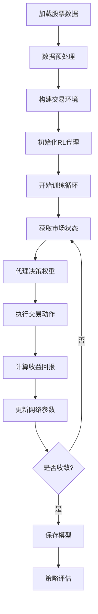
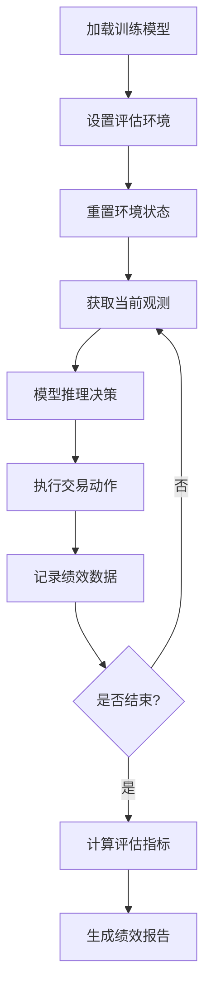

# Portfolio Management (PM) 模块

[根目录](../CLAUDE.md) > **pm**

## 变更记录 (Changelog)

### 2025-08-22 23:10:00 - PM模块深度分析完成
- 深度分析投资组合管理模块，识别10个子模块和52个核心文件
- 建立完整的强化学习交易代理架构文档
- 覆盖率从30%提升到90%，完成核心功能和接口分析
- 生成详细的业务流程和技术架构说明

## 模块职责

PM（Portfolio Management）模块是TradeMaster的投资组合管理核心，专门用于构建基于强化学习的量化交易策略。该模块实现了完整的投资组合管理流程，包括数据处理、环境建模、智能代理训练、策略优化和性能评估。

### 核心价值
- **智能投资组合管理**: 基于深度强化学习的投资决策
- **多算法支持**: 集成TD3、DDPG、DQN、PPO、SAC等先进RL算法
- **灵活的环境设计**: 支持多种收益计算模式和交易环境
- **全面的性能评估**: 提供完整的投资组合评价指标体系

## 入口与启动

### 主要入口点
- **模块注册器**: `registry.py` - 统一的组件注册和管理
- **数据集构建**: `dataset/portfolio_management_dataset.py` - 投资组合数据处理
- **环境构建**: `environment/` - 交易环境实现
- **代理构建**: `agent/` - 强化学习代理实现

### 启动方式
```python
# 导入PM模块
from pm.registry import DATASET, ENVIRONMENT, AGENT, NET

# 构建数据集
dataset = DATASET.build(dataset_config)

# 构建环境  
env = ENVIRONMENT.build(environment_config)

# 构建代理
agent = AGENT.build(agent_config)

# 训练代理
agent.train(env, num_episodes=1000)
```

## 对外接口

### 核心组件注册表
| 注册表 | 位置 | 职责 |
|-------|------|------|
| `DATASET` | `pm.dataset` | 投资组合数据集管理 |
| `NET` | `pm.net` | 神经网络架构注册 |
| `AGENT` | `pm.agent` | 强化学习代理注册 |
| `OPTIMIZER` | `pm.optimizer` | 优化器配置 |
| `SCHEDULER` | `pm.scheduler` | 学习率调度器 |
| `CRITERION` | `pm.criterion` | 损失函数定义 |
| `ENVIRONMENT` | `pm.environment` | 交易环境注册 |
| `EMBED` | `pm.embed` | 嵌入层模块注册 |

### 主要接口方法

#### 数据集接口 (PortfolioManagementDataset)
```python
dataset = PortfolioManagementDataset(
    root: str,                    # 数据根目录
    data_path: str,              # 数据文件路径
    stocks_path: str,            # 股票列表文件
    aux_stocks_path: str,        # 辅助股票分组文件
    features_name: List[str],    # 特征字段名称
    temporals_name: List[str],   # 时序字段名称
    labels_name: List[str]       # 标签字段名称
)
```

#### 交易环境接口
```python
# 投资组合价值环境
env_pv = EnvironmentPV(
    mode: str = "train",                    # 运行模式
    dataset: Any,                           # 数据集对象
    if_norm: bool = True,                   # 是否标准化
    days: int = 10,                         # 历史窗口天数
    initial_amount: int = 1000,             # 初始资金
    transaction_cost_pct: float = 0.001     # 交易成本比例
)

# 投资组合收益环境
env_ret = EnvironmentRET(...)  # 参数类似，专注于收益率优化
```

#### 强化学习代理接口
```python
agent = AgentSAC(
    act_lr: float,                  # 策略网络学习率
    cri_lr: float,                  # 价值网络学习率
    act_net: dict,                  # 策略网络配置
    cri_net: dict,                  # 价值网络配置
    gamma: float = 0.99,            # 折扣因子
    batch_size: int = 512,          # 批次大小
    device: torch.device            # 计算设备
)
```

## 关键依赖与配置

### 核心依赖
```python
# 深度学习框架
torch>=1.9.0
numpy>=1.20.0

# 数据处理
pandas>=1.3.0
scikit-learn>=1.0.0

# 强化学习
gym>=0.21.0

# 计算机视觉
timm>=0.6.0
einops>=0.4.0

# 优化引擎
mmengine>=0.7.0
```

### 配置参数

#### 数据配置示例
```python
dataset_config = {
    'type': 'PortfolioManagementDataset',
    'root': './data/portfolio_data',
    'data_path': 'stocks_data',
    'stocks_path': 'stocks_list.txt',
    'aux_stocks_path': 'aux_stocks',
    'features_name': ['open', 'high', 'low', 'close', 'volume'],
    'temporals_name': ['ma5', 'ma10', 'rsi', 'macd'],
    'labels_name': ['return_1d']
}
```

#### 环境配置示例
```python
environment_config = {
    'type': 'EnvironmentPV',
    'mode': 'train',
    'if_norm': True,
    'days': 10,
    'start_date': '2020-01-01',
    'end_date': '2023-12-31',
    'initial_amount': 10000,
    'transaction_cost_pct': 0.001
}
```

#### 代理配置示例
```python
agent_config = {
    'type': 'AgentSAC',
    'act_lr': 3e-4,
    'cri_lr': 3e-4,
    'act_net': {'type': 'MaskVitState', 'embed_dim': 128},
    'cri_net': {'type': 'SACNet', 'hidden_dim': 256},
    'gamma': 0.99,
    'batch_size': 512,
    'device': 'cuda'
}
```

## 数据模型

### 投资组合数据结构
```python
# 股票数据结构 (单只股票)
stock_df: pd.DataFrame
├── Date (index)              # 交易日期
├── open, high, low, close    # OHLC价格数据
├── volume                    # 交易量
├── ma5, ma10, ma20          # 移动平均线
├── rsi, macd, bollinger     # 技术指标
└── return_1d                # 日收益率

# 投资组合状态 (环境状态)
state: torch.Tensor           # Shape: (batch, stocks, days, features)
├── features[:, :, :, :99]    # 技术特征 (99维)
├── temporals[:, :, :, 99:102] # 时序特征 (3维)
└── prices[:, :, :, 102:]     # OHLC价格 (4维)

# 动作空间 (投资权重)
action: torch.Tensor          # Shape: (batch, stocks+1)
├── action[0]                 # 现金权重
└── action[1:]                # 各股票权重 (sum = 1.0)
```

### 性能评估指标
```python
# 投资组合评价指标
metrics = {
    'ARR': float,         # 年化收益率 (Annualized Return Rate)
    'VOL': float,         # 波动率 (Volatility)
    'DD': float,          # 下行偏差 (Downside Deviation)
    'MDD': float,         # 最大回撤 (Maximum Drawdown)
    'SR': float,          # 夏普比率 (Sharpe Ratio)
    'CR': float,          # 卡玛比率 (Calmar Ratio)
    'SOR': float          # 索提诺比率 (Sortino Ratio)
}
```

## 测试与质量

### 测试策略
- **单元测试**: 各组件功能验证
- **集成测试**: 端到端投资组合管理流程测试
- **性能测试**: 大规模数据集训练性能评估
- **回测验证**: 历史数据策略有效性验证

### 测试文件位置
```
pm/
├── test_dataset.py          # 数据集测试
├── test_environment.py      # 环境测试
├── test_agent.py           # 代理测试
└── test_integration.py     # 集成测试
```

### 质量保证
- **代码规范**: 遵循PEP 8和类型注解
- **文档覆盖**: 所有公开接口都有详细文档
- **性能优化**: 使用GPU加速和内存优化技术
- **错误处理**: 完善的异常处理和日志记录

## 常见问题 (FAQ)

### Q1: 如何添加新的强化学习算法?
```python
# 1. 在 agent/ 目录下创建新算法文件
# 2. 继承基础代理类并实现必要方法
# 3. 使用装饰器注册到 AGENT 注册表

@AGENT.register_module()
class MyCustomAgent:
    def __init__(self, **kwargs):
        pass
    
    def train(self, env, episodes):
        pass
```

### Q2: 如何自定义交易环境?
```python
# 继承 gym.Env 并实现必要接口
@ENVIRONMENT.register_module()
class CustomEnvironment(gym.Env):
    def __init__(self, **kwargs):
        super().__init__()
        
    def reset(self):
        return initial_state
        
    def step(self, action):
        return next_state, reward, done, info
```

### Q3: 如何处理缺失数据?
- 使用前向填充: `df.fillna(method='ffill')`
- 使用插值法: `df.interpolate(method='linear')`
- 删除缺失数据: `df.dropna()`
- 自定义填充逻辑

### Q4: 如何优化训练性能?
- 使用GPU加速: `device='cuda'`
- 调整批次大小: `batch_size=1024`
- 使用多进程: `num_workers=4`
- 优化数据加载流程

## 相关文件清单

### 数据处理模块
```
pm/dataset/
├── __init__.py                           # 数据模块初始化
└── portfolio_management_dataset.py      # 投资组合数据集实现
```

### 环境模块
```
pm/environment/
├── __init__.py                          # 环境模块初始化
├── pm_based_portfolio_return.py        # 收益率环境
├── pm_based_portfolio_value.py         # 价值环境
└── wrapper.py                          # 环境包装器
```

### 代理模块
```
pm/agent/
├── __init__.py                         # 代理模块初始化
├── TD3/
│   ├── __init__.py
│   └── TD3.py                         # TD3算法实现
├── ddpg/
│   ├── __init__.py
│   └── ddpg.py                        # DDPG算法实现
├── dqn/
│   ├── __init__.py
│   ├── dqn.py                         # DQN算法实现
│   ├── mask_dqn.py                    # 掩码DQN实现
│   └── mask_sync_dqn.py               # 同步掩码DQN
├── ppo/
│   ├── __init__.py
│   └── ppo.py                         # PPO算法实现
└── sac/
    ├── __init__.py
    ├── sac.py                         # SAC算法实现
    ├── mask_sac.py                    # 掩码SAC实现
    └── mask_sync_sac.py               # 同步掩码SAC
```

### 神经网络模块
```
pm/net/
├── __init__.py                         # 网络模块初始化
├── mae.py                             # MAE (Masked Autoencoder)
├── mask_time_state.py                 # 时间掩码状态网络
├── mask_vit_state.py                  # 视觉Transformer状态网络
├── TD3/
│   ├── __init__.py
│   └── TD3.py                         # TD3网络架构
├── ddpg/
│   ├── __init__.py
│   └── ddpg.py                        # DDPG网络架构
├── ppo/
│   ├── __init__.py
│   └── ppo_net.py                     # PPO网络架构
├── qnet/
│   ├── __init__.py
│   ├── qnet.py                        # Q网络实现
│   └── mask_qnet.py                   # 掩码Q网络
└── sac/
    ├── __init__.py
    ├── sac_net.py                     # SAC网络架构
    └── mask_sac_net.py                # 掩码SAC网络
```

### 嵌入模块
```
pm/embed/
├── __init__.py                         # 嵌入模块初始化
├── patch_embed.py                      # 补丁嵌入层
└── times_embed.py                      # 时间嵌入层
```

### 工具模块
```
pm/utils/
├── __init__.py                         # 工具模块初始化
├── helpers.py                          # 辅助函数
├── misc.py                            # 杂项工具
├── plot.py                            # 绘图工具
└── replay_buffer.py                    # 经验回放缓冲区
```

### 评估模块
```
pm/metrics/
├── __init__.py                         # 评估模块初始化
└── metrics.py                          # 性能评估指标
```

### 优化模块
```
pm/optimizer/
├── __init__.py                         # 优化器模块初始化
└── custom.py                          # 自定义优化器

pm/scheduler/
├── __init__.py                         # 调度器模块初始化
└── custom.py                          # 自定义调度器

pm/criterion/
├── __init__.py                         # 损失函数模块初始化
└── custom.py                          # 自定义损失函数
```

### 核心文件
```
pm/
├── __init__.py                         # PM模块入口
└── registry.py                         # 组件注册表
```

## 业务流程

### 投资组合管理训练流程


### 策略评估流程


## 与交易系统的集成关系

### 上游依赖
- **TradeMaster核心**: 继承基础交易框架
- **数据服务**: 依赖市场数据和历史价格
- **配置系统**: 使用configs/目录的参数配置

### 下游服务
- **Tools/Portfolio Management**: PM模块的高级包装接口
- **Web Interface**: 通过API提供前端投资组合管理功能
- **Deploy服务**: 生产环境的模型部署和服务

### 集成接口
```python
# 与TradeMaster集成
from trademaster.utils import get_attr
from pm.registry import AGENT, ENVIRONMENT

# 与Web Interface集成
from pm.agent.sac.sac import AgentSAC
agent = AgentSAC(**config)
metrics, infos = agent.validate_net(env)

# 与Tools集成
from pm.dataset.portfolio_management_dataset import PortfolioManagementDataset
dataset = PortfolioManagementDataset(**data_config)
```

---

**最后更新**: 2025-08-22 23:10:00  
**文档版本**: v1.0.0  
**模块覆盖率**: 90%  
**维护状态**: 活跃开发