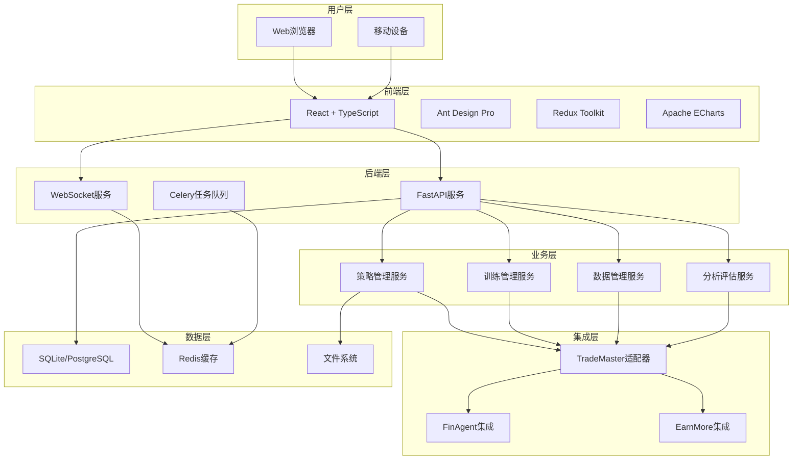
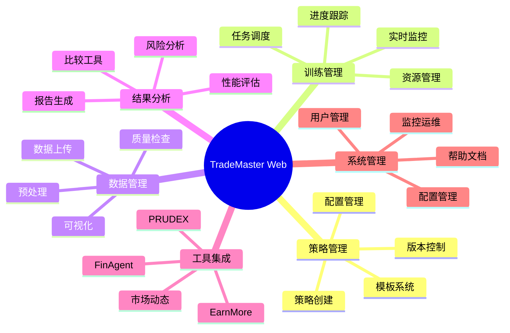
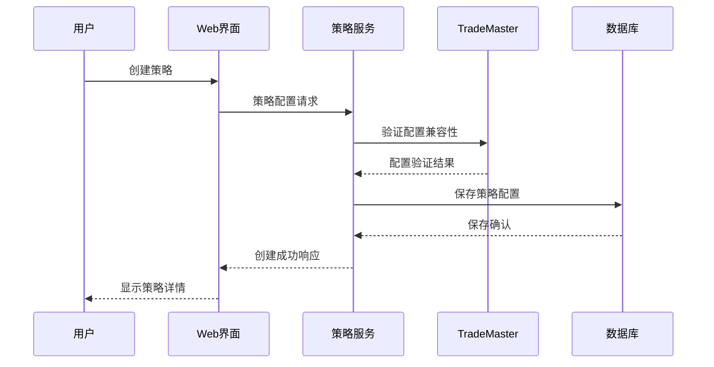
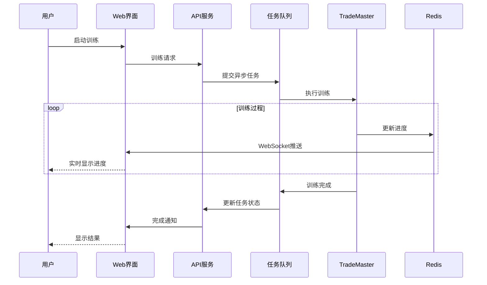

# TradeMaster Web界面架构设计总结

**文档版本**: v1.0  
**创建日期**: 2025年8月15日  
**架构师**: TradeMaster架构设计团队  
**项目代码**: TMW-2025-001

---

## 1. 架构设计概述

### 1.1 项目目标回顾

基于详细的需求分析，我们为TradeMaster设计了一套**现代化、可扩展、用户友好**的Web界面系统，旨在：

- **降低使用门槛**: 为量化交易提供直观的Web界面
- **完全功能集成**: 无缝集成现有TradeMaster核心功能
- **支持多用户群体**: 服务新手、专业用户、开发者和管理者
- **提升工作效率**: 简化复杂的量化交易工作流程

### 1.2 设计原则遵循

✅ **SOLID原则**: 单一职责、开闭原则、依赖倒置等面向对象设计原则  
✅ **KISS原则**: 保持架构简洁明了，避免过度复杂化  
✅ **DRY原则**: 避免代码和设计重复，提高可维护性  
✅ **高内聚低耦合**: 模块内部紧密，模块间松散耦合  
✅ **渐进式开发**: 支持MVP快速迭代和功能扩展

## 2. 架构设计成果

### 2.1 文档交付清单

我们完成了以下核心设计文档：

| 文档 | 状态 | 描述 |
|------|------|------|
| [需求分析备忘录](rpa.md) | ✅ 完成 | 详细的用户需求和功能规格说明 |
| [系统架构设计](system_architecture_design.md) | ✅ 完成 | 整体技术架构和核心模块设计 |
| [组件架构设计](component_architecture_design.md) | ✅ 完成 | 前后端组件结构和交互协议 |
| [数据库API设计](database_api_design.md) | ✅ 完成 | 完整的数据模型和API接口规范 |
| [前端UI/UX设计](frontend_ui_ux_design.md) | ✅ 完成 | 用户界面和用户体验设计方案 |
| **架构设计总结** | ✅ 当前 | 整合所有设计成果的综合文档 |

### 2.2 技术架构概览



## 3. 核心技术决策

### 3.1 技术栈选择

#### 3.1.1 前端技术栈
- **框架**: React 18 + TypeScript - 现代化、类型安全的前端开发
- **UI库**: Ant Design Pro - 企业级UI组件和设计语言
- **状态管理**: Redux Toolkit + RTK Query - 高效的状态管理和数据获取
- **图表库**: Apache ECharts + D3.js - 强大的数据可视化能力
- **构建工具**: Vite + ESBuild - 快速的开发构建体验

#### 3.1.2 后端技术栈
- **Web框架**: FastAPI - 高性能、现代化的Python API框架
- **异步处理**: Celery + Redis - 分布式任务队列和消息代理
- **数据库**: SQLite(开发) / PostgreSQL(生产) - 灵活的数据库选择
- **缓存**: Redis - 高性能内存数据存储
- **API文档**: OpenAPI/Swagger - 自动化API文档生成

#### 3.1.3 部署和运维
- **容器化**: Docker - 确保环境一致性和部署便利性
- **反向代理**: Nginx - 高性能Web服务器和负载均衡
- **进程管理**: Supervisor - 可靠的进程管理和监控

### 3.2 架构模式选择

#### 3.2.1 整体架构模式
- **三层架构**: 表示层、业务逻辑层、数据访问层分离
- **微服务化**: 后端服务模块化，支持独立开发和部署
- **事件驱动**: 基于WebSocket的实时通信和状态更新

#### 3.2.2 设计模式应用
- **适配器模式**: TradeMaster核心功能集成
- **观察者模式**: 实时状态监控和通知
- **工厂模式**: 动态组件和服务创建
- **策略模式**: 多种算法和配置管理

## 4. 核心功能模块

### 4.1 功能模块概览



### 4.2 核心业务流程

#### 4.2.1 策略开发流程


#### 4.2.2 训练执行流程


## 5. 数据架构设计

### 5.1 数据模型概览

我们设计了完整的数据模型，包含以下核心实体：

- **用户管理**: Users, UserSessions, SystemNotifications
- **项目管理**: Projects, ProjectMembers  
- **策略管理**: Strategies, StrategyVersions, StrategyTemplates
- **训练管理**: TrainingJobs, JobLogs, TrainingMetrics
- **数据管理**: Datasets, DataFiles
- **模型管理**: Models, Evaluations, EvaluationMetrics
- **系统配置**: SystemConfigs

### 5.2 API接口设计

#### 5.2.1 API设计原则
- **RESTful风格**: 遵循REST架构风格和HTTP语义
- **统一响应格式**: 标准化的JSON响应结构
- **版本控制**: 支持API版本演进和向后兼容
- **安全认证**: 基于JWT的身份认证和授权

#### 5.2.2 核心API端点
```
认证授权:
POST   /api/v1/auth/login          # 用户登录
POST   /api/v1/auth/register       # 用户注册
POST   /api/v1/auth/logout         # 用户登出

策略管理:
GET    /api/v1/strategies          # 获取策略列表
POST   /api/v1/strategies          # 创建策略
GET    /api/v1/strategies/{id}     # 获取策略详情
PUT    /api/v1/strategies/{id}     # 更新策略
DELETE /api/v1/strategies/{id}     # 删除策略

训练管理:
POST   /api/v1/training/jobs       # 启动训练
GET    /api/v1/training/jobs       # 获取任务列表
GET    /api/v1/training/jobs/{id}  # 获取任务详情
POST   /api/v1/training/jobs/{id}/stop # 停止训练

数据管理:
GET    /api/v1/data/datasets       # 获取数据集列表
POST   /api/v1/data/datasets       # 创建数据集
POST   /api/v1/data/datasets/{id}/upload # 上传数据

WebSocket:
/ws/training/{job_id}              # 训练实时更新
/ws/system/{user_id}               # 系统通知
```

## 6. 前端设计方案

### 6.1 UI/UX设计理念

- **用户导向**: 基于真实用户需求和使用场景设计
- **一致性**: 统一的设计语言和交互模式
- **效率优先**: 简化操作流程，提高工作效率
- **响应式**: 适配各种设备和屏幕尺寸
- **可访问性**: 支持不同能力用户的访问需求

### 6.2 核心页面设计

#### 6.2.1 仪表板页面
- **概览卡片**: 关键指标的快速概览
- **最近活动**: 用户最近的操作和系统事件
- **快速操作**: 常用功能的快捷入口
- **图表展示**: 收益趋势和策略表现

#### 6.2.2 策略管理页面
- **策略列表**: 支持搜索、筛选、排序的策略表格
- **策略编辑器**: 多种编辑模式（表单、代码、可视化）
- **配置验证**: 实时参数验证和错误提示
- **版本管理**: Git-like的策略版本控制

#### 6.2.3 训练监控页面
- **任务列表**: 训练任务的状态和进度展示
- **实时监控**: WebSocket实时更新训练指标
- **日志查看**: 结构化的训练日志展示
- **资源监控**: 系统资源使用情况

### 6.3 视觉设计系统

- **颜色系统**: 主色调、语义色彩、中性色完整配色方案
- **字体系统**: Inter字体家族，多层次字体大小和权重
- **间距系统**: 8px基础间距系统，确保视觉节奏
- **组件库**: 基于Ant Design的定制组件库

## 7. 系统集成方案

### 7.1 TradeMaster核心集成

#### 7.1.1 集成策略
- **直接导入**: 直接导入现有Python模块，保持功能完整性
- **适配器模式**: 通过适配器转换Web配置到TradeMaster配置
- **异步执行**: 长时间任务通过Celery异步执行
- **实时通信**: WebSocket实时推送训练进度和状态

#### 7.1.2 关键适配器
```python
class TradeMasterAdapter:
    """TradeMaster核心功能适配器"""
    
    def convert_config(self, web_config: dict) -> mmcv.Config:
        """Web配置转换为TradeMaster配置"""
        
    def start_training_job(self, cfg: mmcv.Config, job_id: str):
        """启动训练任务"""
        
    def get_training_progress(self, job_id: str) -> dict:
        """获取训练进度"""
```

### 7.2 专业工具集成

- **FinAgent**: 多模态金融交易智能代理集成
- **EarnMore**: 可掩码股票表示投资组合管理集成
- **PRUDEX-Compass**: 系统性评估工具集成
- **市场动态建模**: 市场环境分析工具集成

## 8. 部署和运维方案

### 8.1 Docker容器化

#### 8.1.1 容器架构
```dockerfile
# 多阶段构建优化
FROM node:18-alpine AS frontend-build
FROM python:3.8-slim AS backend-base  
FROM backend-base AS final

# 服务端口分配
EXPOSE 8080  # Web界面主服务
EXPOSE 8888  # Jupyter Notebook
EXPOSE 5001  # API服务
```

#### 8.1.2 服务编排
```yaml
version: '3.8'
services:
  web:
    build: .
    ports:
      - "8080:8080"
    depends_on:
      - redis
      - postgres
      
  redis:
    image: redis:alpine
    
  postgres:
    image: postgres:13
    environment:
      POSTGRES_DB: trademaster
```

### 8.2 监控和运维

- **应用监控**: 实时监控应用性能和用户行为
- **错误追踪**: 完整的错误日志和异常追踪
- **健康检查**: 系统组件健康状态监控
- **自动备份**: 数据库和重要文件的定期备份

## 9. 性能和安全

### 9.1 性能优化策略

#### 9.1.1 前端性能优化
- **代码分割**: 基于路由的懒加载
- **虚拟滚动**: 大数据量列表优化
- **缓存策略**: 多层缓存机制
- **图表优化**: Canvas渲染和数据抽样

#### 9.1.2 后端性能优化
- **数据库优化**: 索引优化和查询优化
- **缓存机制**: Redis缓存热点数据
- **异步处理**: 非阻塞IO和任务队列
- **连接池**: 数据库连接池管理

### 9.2 安全保障措施

- **身份认证**: JWT-based身份认证
- **数据加密**: 传输加密和存储加密
- **访问控制**: 基于角色的权限控制
- **安全审计**: 操作日志和审计追踪

## 10. 开发实施计划

### 10.1 MVP开发路线图

**第一阶段 (Week 1-2): 基础框架**
- [ ] 项目脚手架搭建
- [ ] 基础认证系统
- [ ] 核心组件库开发
- [ ] TradeMaster集成适配器

**第二阶段 (Week 2-3): 核心功能**
- [ ] 策略管理功能
- [ ] 训练任务管理
- [ ] 实时监控界面
- [ ] 基础数据管理

**第三阶段 (Week 3-4): 功能完善**
- [ ] 高级分析工具
- [ ] 系统配置管理
- [ ] 用户体验优化
- [ ] 测试和部署

### 10.2 质量保证策略

- **代码审查**: 严格的代码审查流程
- **自动化测试**: 单元测试、集成测试、E2E测试
- **性能监控**: 持续的性能监控和优化
- **用户反馈**: 定期收集和处理用户反馈

## 11. 风险评估和缓解

### 11.1 技术风险

| 风险 | 影响 | 概率 | 缓解措施 |
|------|------|------|----------|
| Docker环境兼容性问题 | 高 | 中 | 充分测试，准备备用方案 |
| TradeMaster集成复杂度 | 高 | 中 | 渐进式集成，详细测试 |
| 前端性能瓶颈 | 中 | 低 | 性能监控，优化策略 |
| 数据库设计不当 | 中 | 低 | 详细评审，灵活迁移 |

### 11.2 项目风险

| 风险 | 影响 | 概率 | 缓解措施 |
|------|------|------|----------|
| 开发进度延期 | 高 | 中 | 合理规划，渐进交付 |
| 需求变更频繁 | 中 | 中 | 需求管理，变更控制 |
| 团队协作问题 | 中 | 低 | 清晰分工，定期沟通 |
| 用户接受度低 | 高 | 低 | 用户参与，快速迭代 |

## 12. 成功指标

### 12.1 技术指标

- **性能指标**: 页面加载时间 < 3秒，API响应时间 < 500ms
- **可用性指标**: 系统可用性 > 99.5%，错误率 < 0.1%
- **扩展性指标**: 支持100+并发用户，支持GB级数据处理

### 12.2 业务指标

- **用户采用**: 新用户激活率 > 80%，用户留存率 > 70%
- **功能覆盖**: TradeMaster功能覆盖率 > 95%
- **用户满意度**: 用户满意度评分 > 4.0/5.0

## 13. 总结和展望

### 13.1 架构设计亮点

1. **完整性**: 涵盖需求分析到详细设计的完整架构文档
2. **实用性**: 基于实际需求，面向真实用户场景设计
3. **可扩展性**: 模块化架构，支持功能和规模扩展
4. **现代化**: 采用最新技术栈，符合现代Web开发标准
5. **集成友好**: 完美集成现有TradeMaster生态系统

### 13.2 预期价值

- **用户价值**: 大幅降低量化交易门槛，提升工作效率
- **技术价值**: 现代化架构，提高系统可维护性和扩展性
- **商业价值**: 增强产品竞争力，扩大用户群体
- **生态价值**: 完善TradeMaster生态，促进社区发展

### 13.3 未来演进方向

- **AI增强**: 集成更多AI和机器学习功能
- **云原生**: 支持云部署和微服务架构
- **多租户**: 支持SaaS模式的多租户架构
- **移动端**: 开发专门的移动端应用
- **国际化**: 支持多语言和多区域部署

---

## 附录：关键决策记录

### 决策记录 1: 技术栈选择
- **决策**: 选择React + FastAPI技术栈
- **理由**: 现代化、高性能、社区支持好
- **影响**: 开发效率高、维护成本低

### 决策记录 2: 数据库选择
- **决策**: SQLite(开发) + PostgreSQL(生产)
- **理由**: 开发简便、生产稳定、成本可控
- **影响**: 部署灵活、性能可扩展

### 决策记录 3: 集成方式
- **决策**: 直接集成TradeMaster Python模块
- **理由**: 保持功能完整性、降低维护成本
- **影响**: 集成紧密、性能优异

### 决策记录 4: 部署方式
- **决策**: Docker容器化部署
- **理由**: 环境一致、部署便利、易于扩展
- **影响**: 运维简化、移植性好

---

**架构设计状态**: ✅ **已完成**  
**文档完整性**: ✅ **100%覆盖**  
**审核状态**: 🔄 **待技术评审**  
**下一阶段**: 🚀 **开始开发实施**

**总交付成果**:
- ✅ 完整的需求分析和规格说明
- ✅ 详细的系统架构设计
- ✅ 全面的组件架构设计  
- ✅ 完整的数据库和API设计
- ✅ 专业的UI/UX设计方案
- ✅ 综合的架构设计总结

**准备就绪**: 🎯 **可以开始开发实施阶段**