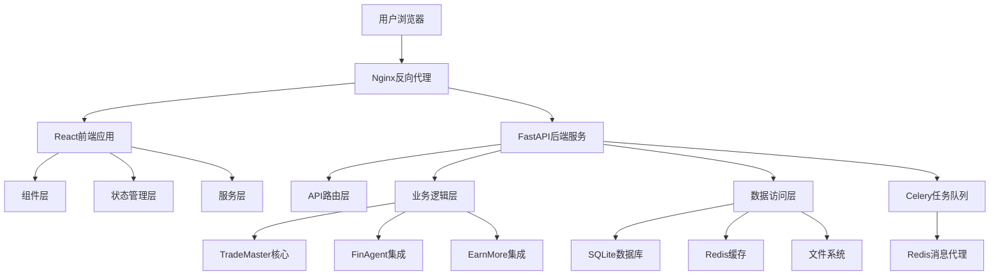
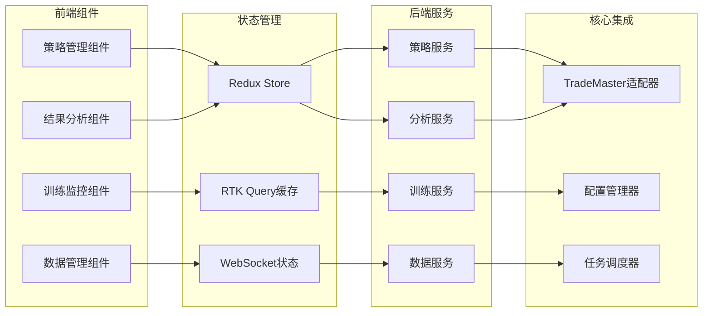
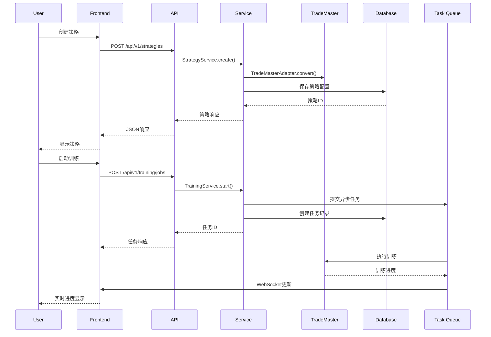
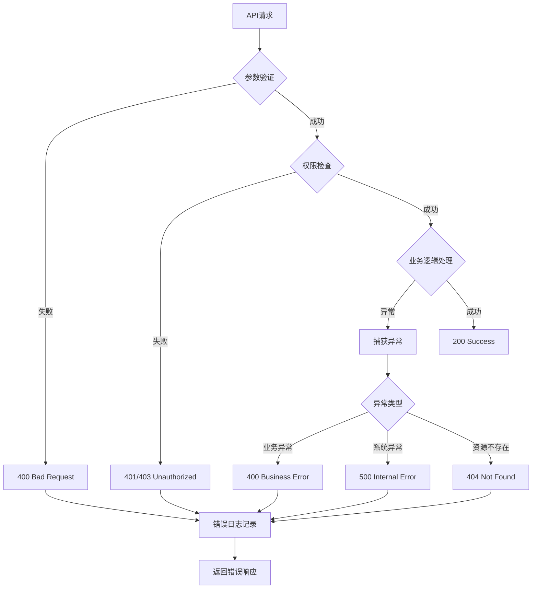

# TradeMaster Web界面组件架构设计

**文档版本**: v1.0  
**创建日期**: 2025年8月15日  
**架构师**: TradeMaster组件架构团队  
**项目代码**: TMW-2025-001

---

## 1. 组件架构概览

### 1.1 系统组件层次图



### 1.2 核心组件关系



## 2. 前端组件架构

### 2.1 组件层次结构

```typescript
// 组件层次架构
interface ComponentHierarchy {
  App: {
    Layout: {
      Header: ComponentSpec;
      Sidebar: ComponentSpec;
      Content: ComponentSpec;
      Footer: ComponentSpec;
    };
    Pages: {
      Strategy: StrategyPageComponents;
      Training: TrainingPageComponents;
      Data: DataPageComponents;
      Analysis: AnalysisPageComponents;
    };
    Shared: SharedComponents;
  };
}
```

### 2.2 核心页面组件设计

#### 2.2.1 策略管理页面
```typescript
// 策略管理组件结构
interface StrategyPageComponents {
  StrategyList: {
    props: {
      strategies: Strategy[];
      onSelect: (id: string) => void;
      onDelete: (id: string) => void;
    };
    state: {
      selectedStrategy: string | null;
      loading: boolean;
    };
  };
  
  StrategyEditor: {
    props: {
      strategy: Strategy | null;
      mode: 'create' | 'edit' | 'view';
      onSave: (strategy: Strategy) => void;
    };
    components: {
      ConfigurationForm: ComponentSpec;
      CodeEditor: ComponentSpec;
      ParameterTuner: ComponentSpec;
    };
  };
  
  StrategyWizard: {
    props: {
      onComplete: (config: StrategyConfig) => void;
    };
    steps: {
      TaskSelection: ComponentSpec;
      DatasetSelection: ComponentSpec;
      AlgorithmSelection: ComponentSpec;
      ParameterConfiguration: ComponentSpec;
      Review: ComponentSpec;
    };
  };
}

// 策略组件实现示例
const StrategyEditor: React.FC<StrategyEditorProps> = ({
  strategy,
  mode,
  onSave
}) => {
  const [config, setConfig] = useState(strategy?.config || {});
  const [activeTab, setActiveTab] = useState('form');
  
  return (
    <div className="strategy-editor">
      <Tabs activeKey={activeTab} onChange={setActiveTab}>
        <TabPane key="form" tab="表单配置">
          <ConfigurationForm
            config={config}
            onChange={setConfig}
            mode={mode}
          />
        </TabPane>
        <TabPane key="code" tab="代码编辑">
          <CodeEditor
            value={config.customCode}
            onChange={(code) => setConfig({...config, customCode: code})}
            language="python"
          />
        </TabPane>
        <TabPane key="visual" tab="可视化">
          <VisualStrategyBuilder
            config={config}
            onChange={setConfig}
          />
        </TabPane>
      </Tabs>
      
      <div className="editor-actions">
        <Button onClick={() => onSave(config)}>
          保存策略
        </Button>
      </div>
    </div>
  );
};
```

#### 2.2.2 训练监控页面
```typescript
// 训练监控组件
interface TrainingPageComponents {
  TrainingDashboard: {
    props: {
      jobs: TrainingJob[];
      metrics: TrainingMetrics;
    };
    components: {
      JobList: ComponentSpec;
      MetricsPanel: ComponentSpec;
      LogViewer: ComponentSpec;
      ResourceMonitor: ComponentSpec;
    };
  };
  
  TrainingJobDetail: {
    props: {
      jobId: string;
    };
    components: {
      JobInfo: ComponentSpec;
      ProgressChart: ComponentSpec;
      RealTimeMetrics: ComponentSpec;
      ModelVisualization: ComponentSpec;
    };
  };
}

// 实时监控组件实现
const RealTimeMetrics: React.FC<{jobId: string}> = ({ jobId }) => {
  const [metrics, setMetrics] = useState<TrainingMetrics | null>(null);
  const websocket = useWebSocket(`/ws/training/${jobId}`);
  
  useEffect(() => {
    websocket.onMessage = (data) => {
      const newMetrics = JSON.parse(data);
      setMetrics(newMetrics);
    };
  }, [websocket]);
  
  return (
    <div className="real-time-metrics">
      <Row gutter={16}>
        <Col span={12}>
          <MetricCard
            title="训练损失"
            value={metrics?.loss}
            trend={metrics?.lossTrend}
          />
        </Col>
        <Col span={12}>
          <MetricCard
            title="验证准确率"
            value={metrics?.accuracy}
            trend={metrics?.accuracyTrend}
          />
        </Col>
      </Row>
      
      <div className="metrics-chart">
        <LineChart
          data={metrics?.history}
          xKey="epoch"
          yKeys={['loss', 'accuracy']}
        />
      </div>
    </div>
  );
};
```

### 2.3 共享组件库

#### 2.3.1 通用组件
```typescript
// 共享组件规范
interface SharedComponents {
  // 数据展示组件
  DataTable: {
    props: {
      data: any[];
      columns: ColumnConfig[];
      pagination?: PaginationConfig;
      selection?: SelectionConfig;
    };
  };
  
  // 图表组件
  Charts: {
    LineChart: ChartComponentSpec;
    BarChart: ChartComponentSpec;
    ScatterPlot: ChartComponentSpec;
    HeatMap: ChartComponentSpec;
    RadarChart: ChartComponentSpec;
  };
  
  // 表单组件
  Forms: {
    ParameterForm: FormComponentSpec;
    ConfigurationWizard: FormComponentSpec;
    FileUploader: FormComponentSpec;
  };
  
  // 布局组件
  Layout: {
    SplitPane: LayoutComponentSpec;
    ResizablePanel: LayoutComponentSpec;
    TabPanel: LayoutComponentSpec;
  };
}

// 通用图表组件实现
const LineChart: React.FC<LineChartProps> = ({
  data,
  xKey,
  yKeys,
  options = {}
}) => {
  const chartRef = useRef<HTMLDivElement>(null);
  const chartInstance = useRef<echarts.ECharts | null>(null);
  
  useEffect(() => {
    if (chartRef.current) {
      chartInstance.current = echarts.init(chartRef.current);
      
      const option = {
        grid: { left: '3%', right: '4%', bottom: '3%', containLabel: true },
        xAxis: { type: 'category', data: data.map(d => d[xKey]) },
        yAxis: { type: 'value' },
        series: yKeys.map(key => ({
          name: key,
          type: 'line',
          data: data.map(d => d[key]),
          smooth: true
        })),
        ...options
      };
      
      chartInstance.current.setOption(option);
    }
    
    return () => {
      chartInstance.current?.dispose();
    };
  }, [data, xKey, yKeys, options]);
  
  return <div ref={chartRef} style={{ width: '100%', height: '400px' }} />;
};
```

### 2.4 状态管理架构

#### 2.4.1 Redux Store设计
```typescript
// Redux Store结构
interface RootState {
  auth: AuthState;
  strategies: StrategyState;
  training: TrainingState;
  data: DataState;
  analysis: AnalysisState;
  ui: UIState;
}

// 策略状态管理
interface StrategyState {
  list: Strategy[];
  current: Strategy | null;
  loading: boolean;
  error: string | null;
}

// 策略Slice实现
const strategySlice = createSlice({
  name: 'strategies',
  initialState: {
    list: [],
    current: null,
    loading: false,
    error: null
  } as StrategyState,
  reducers: {
    setStrategies: (state, action) => {
      state.list = action.payload;
    },
    setCurrentStrategy: (state, action) => {
      state.current = action.payload;
    },
    setLoading: (state, action) => {
      state.loading = action.payload;
    },
    setError: (state, action) => {
      state.error = action.payload;
    }
  }
});

// API查询定义
const strategyApi = createApi({
  reducerPath: 'strategyApi',
  baseQuery: fetchBaseQuery({
    baseUrl: '/api/v1/strategies',
    prepareHeaders: (headers, { getState }) => {
      const token = (getState() as RootState).auth.token;
      if (token) {
        headers.set('authorization', `Bearer ${token}`);
      }
      return headers;
    }
  }),
  tagTypes: ['Strategy'],
  endpoints: (builder) => ({
    getStrategies: builder.query<Strategy[], void>({
      query: () => '',
      providesTags: ['Strategy']
    }),
    createStrategy: builder.mutation<Strategy, CreateStrategyRequest>({
      query: (strategy) => ({
        url: '',
        method: 'POST',
        body: strategy
      }),
      invalidatesTags: ['Strategy']
    }),
    updateStrategy: builder.mutation<Strategy, UpdateStrategyRequest>({
      query: ({ id, ...patch }) => ({
        url: `/${id}`,
        method: 'PUT',
        body: patch
      }),
      invalidatesTags: ['Strategy']
    })
  })
});
```

## 3. 后端服务架构

### 3.1 API服务组件

#### 3.1.1 路由层设计
```python
# API路由结构
from fastapi import APIRouter, Depends
from typing import List, Optional

# 策略管理路由
strategy_router = APIRouter(prefix="/api/v1/strategies", tags=["strategies"])

@strategy_router.get("/", response_model=List[StrategyResponse])
async def get_strategies(
    skip: int = 0,
    limit: int = 100,
    current_user: User = Depends(get_current_user)
):
    """获取策略列表"""
    service = StrategyService()
    return await service.get_strategies(current_user.id, skip, limit)

@strategy_router.post("/", response_model=StrategyResponse)
async def create_strategy(
    strategy: CreateStrategyRequest,
    current_user: User = Depends(get_current_user)
):
    """创建新策略"""
    service = StrategyService()
    return await service.create_strategy(strategy, current_user.id)

@strategy_router.put("/{strategy_id}", response_model=StrategyResponse)
async def update_strategy(
    strategy_id: str,
    strategy: UpdateStrategyRequest,
    current_user: User = Depends(get_current_user)
):
    """更新策略"""
    service = StrategyService()
    return await service.update_strategy(strategy_id, strategy, current_user.id)

# 训练任务路由
training_router = APIRouter(prefix="/api/v1/training", tags=["training"])

@training_router.post("/jobs", response_model=TrainingJobResponse)
async def start_training(
    job_request: StartTrainingRequest,
    current_user: User = Depends(get_current_user)
):
    """启动训练任务"""
    service = TrainingService()
    return await service.start_training(job_request, current_user.id)

@training_router.get("/jobs/{job_id}/status", response_model=JobStatusResponse)
async def get_job_status(
    job_id: str,
    current_user: User = Depends(get_current_user)
):
    """获取任务状态"""
    service = TrainingService()
    return await service.get_job_status(job_id, current_user.id)
```

#### 3.1.2 业务逻辑层设计
```python
# 业务服务接口
from abc import ABC, abstractmethod
from typing import List, Optional

class StrategyServiceInterface(ABC):
    @abstractmethod
    async def get_strategies(self, user_id: str, skip: int, limit: int) -> List[Strategy]:
        pass
    
    @abstractmethod
    async def create_strategy(self, request: CreateStrategyRequest, user_id: str) -> Strategy:
        pass
    
    @abstractmethod
    async def update_strategy(self, strategy_id: str, request: UpdateStrategyRequest, user_id: str) -> Strategy:
        pass

# 策略服务实现
class StrategyService(StrategyServiceInterface):
    def __init__(self):
        self.repository = StrategyRepository()
        self.trademaster_adapter = TradeMasterAdapter()
        self.config_validator = ConfigValidator()
    
    async def create_strategy(self, request: CreateStrategyRequest, user_id: str) -> Strategy:
        # 验证配置
        validation_result = self.config_validator.validate(request.config)
        if not validation_result.is_valid:
            raise ValidationError(validation_result.errors)
        
        # 转换为TradeMaster配置
        tm_config = self.trademaster_adapter.convert_config(request.config)
        
        # 保存策略
        strategy = Strategy(
            id=generate_id(),
            name=request.name,
            description=request.description,
            config=request.config,
            tm_config=tm_config,
            user_id=user_id,
            created_at=datetime.utcnow()
        )
        
        return await self.repository.create(strategy)
    
    async def start_training(self, strategy_id: str, user_id: str) -> TrainingJob:
        # 获取策略
        strategy = await self.repository.get_by_id(strategy_id)
        if not strategy or strategy.user_id != user_id:
            raise NotFoundError("Strategy not found")
        
        # 创建训练任务
        job = TrainingJob(
            id=generate_id(),
            strategy_id=strategy_id,
            user_id=user_id,
            status=JobStatus.PENDING,
            created_at=datetime.utcnow()
        )
        
        # 异步启动训练
        await self.start_training_async(job, strategy.tm_config)
        
        return job
```

### 3.2 TradeMaster集成组件

#### 3.2.1 适配器模式实现
```python
# TradeMaster适配器
class TradeMasterAdapter:
    def __init__(self):
        self.config_manager = ConfigManager()
        self.job_executor = JobExecutor()
    
    def convert_config(self, web_config: dict) -> mmcv.Config:
        """将Web配置转换为TradeMaster配置"""
        # 基础配置映射
        base_config = {
            "task_name": web_config.get("task_type"),
            "dataset_name": f"{web_config.get('task_type')}:{web_config.get('dataset')}",
            "agent_name": f"{web_config.get('task_type')}:{web_config.get('algorithm')}",
            "optimizer_name": web_config.get("optimizer", "adam"),
            "loss_name": web_config.get("loss", "mse")
        }
        
        # 构建配置文件路径
        config_path = self._build_config_path(base_config)
        
        # 加载基础配置
        cfg = Config.fromfile(config_path)
        cfg = replace_cfg_vals(cfg)
        
        # 应用用户自定义参数
        self._apply_custom_parameters(cfg, web_config.get("parameters", {}))
        
        return cfg
    
    def _build_config_path(self, base_config: dict) -> str:
        """构建配置文件路径"""
        task_name = base_config["task_name"]
        dataset_name = base_config["dataset_name"].split(":")[-1]
        agent_name = base_config["agent_name"].split(":")[-1]
        optimizer_name = base_config["optimizer_name"]
        loss_name = base_config["loss_name"]
        
        return os.path.join(
            ROOT, "configs", task_name,
            f"{task_name}_{dataset_name}_{agent_name}_{agent_name}_{optimizer_name}_{loss_name}.py"
        )
    
    def _apply_custom_parameters(self, cfg: mmcv.Config, parameters: dict):
        """应用自定义参数"""
        for key, value in parameters.items():
            if hasattr(cfg, key):
                setattr(cfg, key, value)
            elif "." in key:
                # 支持嵌套参数设置
                self._set_nested_parameter(cfg, key, value)
    
    async def start_training_job(self, cfg: mmcv.Config, job_id: str) -> None:
        """启动训练任务"""
        try:
            # 创建工作目录
            work_dir = os.path.join(ROOT, "work_dir", job_id)
            os.makedirs(work_dir, exist_ok=True)
            
            # 更新配置
            cfg.work_dir = work_dir
            cfg.trainer.work_dir = work_dir
            
            # 保存配置文件
            config_path = os.path.join(work_dir, "config.py")
            cfg.dump(config_path)
            
            # 构建训练命令
            script_path = self._get_training_script(cfg.task_name)
            cmd = f"python {script_path} --config {config_path} --task_name train"
            
            # 异步执行训练
            await self.job_executor.execute_async(cmd, job_id)
            
        except Exception as e:
            await self._handle_training_error(job_id, str(e))
```

### 3.3 任务调度组件

#### 3.3.1 Celery任务定义
```python
# Celery任务定义
from celery import Celery
import asyncio

app = Celery('trademaster_web')
app.config_from_object('celery_config')

@app.task(bind=True)
def train_strategy_task(self, job_id: str, config_dict: dict, user_id: str):
    """异步训练任务"""
    try:
        # 更新任务状态
        self.update_state(state='PROGRESS', meta={'status': 'Starting training...'})
        
        # 初始化适配器
        adapter = TradeMasterAdapter()
        
        # 转换配置
        cfg = adapter.dict_to_config(config_dict)
        
        # 执行训练
        trainer = TrainingManager(job_id, cfg)
        result = trainer.run()
        
        # 更新任务状态
        self.update_state(state='SUCCESS', meta={'result': result})
        
        return result
        
    except Exception as e:
        self.update_state(state='FAILURE', meta={'error': str(e)})
        raise

@app.task
def cleanup_old_jobs():
    """清理旧任务"""
    # 清理超过24小时的已完成任务
    cutoff_time = datetime.utcnow() - timedelta(hours=24)
    # 清理逻辑
    pass

# 训练管理器
class TrainingManager:
    def __init__(self, job_id: str, config: mmcv.Config):
        self.job_id = job_id
        self.config = config
        self.progress_callback = self._update_progress
    
    def run(self) -> dict:
        """执行训练"""
        # 设置随机种子
        set_seed(2023)
        
        # 构建数据集
        dataset = build_dataset(self.config)
        
        # 设置设备
        device = torch.device('cuda' if torch.cuda.is_available() else 'cpu')
        
        # 构建训练器
        trainer = build_trainer(
            self.config,
            default_args=dict(
                dataset=dataset,
                device=device,
                progress_callback=self.progress_callback
            )
        )
        
        # 执行训练
        trainer.train_and_valid()
        
        # 返回结果
        return {
            'status': 'completed',
            'model_path': trainer.model_path,
            'metrics': trainer.final_metrics
        }
    
    def _update_progress(self, epoch: int, total_epochs: int, metrics: dict):
        """更新训练进度"""
        progress = (epoch / total_epochs) * 100
        
        # 发送WebSocket消息
        send_websocket_message(self.job_id, {
            'type': 'progress',
            'progress': progress,
            'epoch': epoch,
            'total_epochs': total_epochs,
            'metrics': metrics
        })
```

## 4. WebSocket实时通信

### 4.1 WebSocket服务设计

```python
# WebSocket连接管理
from fastapi import WebSocket, WebSocketDisconnect
from typing import Dict, List

class ConnectionManager:
    def __init__(self):
        self.active_connections: Dict[str, List[WebSocket]] = {}
    
    async def connect(self, websocket: WebSocket, job_id: str):
        await websocket.accept()
        if job_id not in self.active_connections:
            self.active_connections[job_id] = []
        self.active_connections[job_id].append(websocket)
    
    def disconnect(self, websocket: WebSocket, job_id: str):
        if job_id in self.active_connections:
            self.active_connections[job_id].remove(websocket)
            if not self.active_connections[job_id]:
                del self.active_connections[job_id]
    
    async def send_message(self, job_id: str, message: dict):
        if job_id in self.active_connections:
            for connection in self.active_connections[job_id]:
                try:
                    await connection.send_json(message)
                except:
                    # 连接已断开，移除连接
                    self.active_connections[job_id].remove(connection)

manager = ConnectionManager()

@app.websocket("/ws/training/{job_id}")
async def websocket_endpoint(websocket: WebSocket, job_id: str):
    await manager.connect(websocket, job_id)
    try:
        while True:
            # 保持连接
            await websocket.receive_text()
    except WebSocketDisconnect:
        manager.disconnect(websocket, job_id)

# 消息发送函数
async def send_training_update(job_id: str, update: dict):
    """发送训练更新消息"""
    await manager.send_message(job_id, {
        'type': 'training_update',
        'data': update,
        'timestamp': datetime.utcnow().isoformat()
    })
```

### 4.2 前端WebSocket客户端

```typescript
// WebSocket Hook
import { useEffect, useRef, useState } from 'react';

interface UseWebSocketOptions {
  onMessage?: (data: any) => void;
  onError?: (error: Event) => void;
  onOpen?: (event: Event) => void;
  onClose?: (event: CloseEvent) => void;
}

export const useWebSocket = (url: string, options: UseWebSocketOptions = {}) => {
  const [readyState, setReadyState] = useState<number>(WebSocket.CONNECTING);
  const websocketRef = useRef<WebSocket | null>(null);
  
  useEffect(() => {
    const ws = new WebSocket(`ws://localhost:8080${url}`);
    websocketRef.current = ws;
    
    ws.onopen = (event) => {
      setReadyState(WebSocket.OPEN);
      options.onOpen?.(event);
    };
    
    ws.onmessage = (event) => {
      const data = JSON.parse(event.data);
      options.onMessage?.(data);
    };
    
    ws.onerror = (error) => {
      options.onError?.(error);
    };
    
    ws.onclose = (event) => {
      setReadyState(WebSocket.CLOSED);
      options.onClose?.(event);
    };
    
    return () => {
      ws.close();
    };
  }, [url]);
  
  const sendMessage = (message: any) => {
    if (websocketRef.current && readyState === WebSocket.OPEN) {
      websocketRef.current.send(JSON.stringify(message));
    }
  };
  
  return {
    sendMessage,
    readyState,
    websocket: websocketRef.current
  };
};

// 使用示例
const TrainingMonitor: React.FC<{jobId: string}> = ({ jobId }) => {
  const [progress, setProgress] = useState(0);
  const [metrics, setMetrics] = useState<any>(null);
  
  const { sendMessage } = useWebSocket(`/ws/training/${jobId}`, {
    onMessage: (data) => {
      if (data.type === 'training_update') {
        setProgress(data.data.progress);
        setMetrics(data.data.metrics);
      }
    }
  });
  
  return (
    <div>
      <Progress percent={progress} />
      {metrics && (
        <div>
          <p>Loss: {metrics.loss}</p>
          <p>Accuracy: {metrics.accuracy}</p>
        </div>
      )}
    </div>
  );
};
```

## 5. 数据流架构

### 5.1 数据流向图



### 5.2 错误处理流程



## 6. 组件交互协议

### 6.1 API接口规范

```typescript
// API响应统一格式
interface ApiResponse<T = any> {
  success: boolean;
  data?: T;
  error?: {
    code: string;
    message: string;
    details?: any;
  };
  pagination?: {
    page: number;
    size: number;
    total: number;
  };
}

// 策略相关接口
interface StrategyAPI {
  // 获取策略列表
  getStrategies(params: {
    page?: number;
    size?: number;
    search?: string;
    category?: string;
  }): Promise<ApiResponse<Strategy[]>>;
  
  // 创建策略
  createStrategy(data: CreateStrategyRequest): Promise<ApiResponse<Strategy>>;
  
  // 更新策略
  updateStrategy(id: string, data: UpdateStrategyRequest): Promise<ApiResponse<Strategy>>;
  
  // 删除策略
  deleteStrategy(id: string): Promise<ApiResponse<void>>;
  
  // 验证策略配置
  validateConfig(config: StrategyConfig): Promise<ApiResponse<ValidationResult>>;
}

// 训练相关接口
interface TrainingAPI {
  // 启动训练
  startTraining(data: StartTrainingRequest): Promise<ApiResponse<TrainingJob>>;
  
  // 获取任务状态
  getJobStatus(jobId: string): Promise<ApiResponse<JobStatus>>;
  
  // 停止训练
  stopTraining(jobId: string): Promise<ApiResponse<void>>;
  
  // 获取训练日志
  getTrainingLogs(jobId: string, lines?: number): Promise<ApiResponse<string[]>>;
}
```

### 6.2 WebSocket消息协议

```typescript
// WebSocket消息类型
type WebSocketMessage =
  | TrainingUpdateMessage
  | SystemNotificationMessage
  | ErrorMessage;

interface TrainingUpdateMessage {
  type: 'training_update';
  jobId: string;
  data: {
    progress: number;
    epoch: number;
    totalEpochs: number;
    metrics: {
      loss: number;
      accuracy: number;
      [key: string]: number;
    };
    status: 'running' | 'completed' | 'failed';
  };
  timestamp: string;
}

interface SystemNotificationMessage {
  type: 'system_notification';
  data: {
    level: 'info' | 'warning' | 'error';
    message: string;
    title?: string;
  };
  timestamp: string;
}

interface ErrorMessage {
  type: 'error';
  data: {
    code: string;
    message: string;
    details?: any;
  };
  timestamp: string;
}
```

## 7. 组件扩展性设计

### 7.1 插件化架构

```typescript
// 插件接口定义
interface Plugin {
  name: string;
  version: string;
  description: string;
  
  // 生命周期方法
  install(app: Application): void;
  uninstall(app: Application): void;
  
  // 可选的组件扩展
  components?: Record<string, React.ComponentType>;
  routes?: RouteConfig[];
  reducers?: Record<string, Reducer>;
}

// 插件管理器
class PluginManager {
  private plugins: Map<string, Plugin> = new Map();
  
  register(plugin: Plugin): void {
    this.plugins.set(plugin.name, plugin);
    plugin.install(this.app);
  }
  
  unregister(pluginName: string): void {
    const plugin = this.plugins.get(pluginName);
    if (plugin) {
      plugin.uninstall(this.app);
      this.plugins.delete(pluginName);
    }
  }
  
  getPlugin(name: string): Plugin | undefined {
    return this.plugins.get(name);
  }
}

// 示例插件
const FinAgentPlugin: Plugin = {
  name: 'finagent',
  version: '1.0.0',
  description: 'FinAgent integration plugin',
  
  install(app) {
    // 注册FinAgent相关组件和路由
    app.registerComponent('FinAgentDashboard', FinAgentDashboard);
    app.registerRoute('/finagent', FinAgentRoutes);
  },
  
  uninstall(app) {
    app.unregisterComponent('FinAgentDashboard');
    app.unregisterRoute('/finagent');
  },
  
  components: {
    FinAgentDashboard,
    FinAgentConfig,
    FinAgentResults
  }
};
```

### 7.2 主题和样式扩展

```typescript
// 主题系统
interface Theme {
  name: string;
  colors: {
    primary: string;
    secondary: string;
    success: string;
    warning: string;
    error: string;
    background: string;
    surface: string;
    text: string;
  };
  typography: {
    fontFamily: string;
    fontSize: Record<string, string>;
    fontWeight: Record<string, number>;
  };
  spacing: Record<string, string>;
  breakpoints: Record<string, string>;
}

// 主题提供者
const ThemeProvider: React.FC<{theme: Theme, children: React.ReactNode}> = ({
  theme,
  children
}) => {
  useEffect(() => {
    // 注入CSS变量
    const root = document.documentElement;
    Object.entries(theme.colors).forEach(([key, value]) => {
      root.style.setProperty(`--color-${key}`, value);
    });
  }, [theme]);
  
  return (
    <ConfigProvider
      theme={{
        token: {
          colorPrimary: theme.colors.primary,
          colorSuccess: theme.colors.success,
          colorWarning: theme.colors.warning,
          colorError: theme.colors.error,
        }
      }}
    >
      {children}
    </ConfigProvider>
  );
};
```

## 8. 性能优化组件

### 8.1 虚拟化组件

```typescript
// 虚拟列表组件
interface VirtualListProps<T> {
  items: T[];
  itemHeight: number;
  renderItem: (item: T, index: number) => React.ReactNode;
  containerHeight: number;
}

const VirtualList = <T,>({
  items,
  itemHeight,
  renderItem,
  containerHeight
}: VirtualListProps<T>) => {
  const [scrollTop, setScrollTop] = useState(0);
  
  const startIndex = Math.floor(scrollTop / itemHeight);
  const endIndex = Math.min(
    startIndex + Math.ceil(containerHeight / itemHeight) + 1,
    items.length
  );
  
  const visibleItems = items.slice(startIndex, endIndex);
  
  return (
    <div
      style={{ height: containerHeight, overflow: 'auto' }}
      onScroll={(e) => setScrollTop(e.currentTarget.scrollTop)}
    >
      <div style={{ height: items.length * itemHeight, position: 'relative' }}>
        {visibleItems.map((item, index) => (
          <div
            key={startIndex + index}
            style={{
              position: 'absolute',
              top: (startIndex + index) * itemHeight,
              height: itemHeight,
              width: '100%'
            }}
          >
            {renderItem(item, startIndex + index)}
          </div>
        ))}
      </div>
    </div>
  );
};
```

### 8.2 缓存组件

```typescript
// React Query缓存配置
const queryClient = new QueryClient({
  defaultOptions: {
    queries: {
      staleTime: 5 * 60 * 1000, // 5分钟
      cacheTime: 10 * 60 * 1000, // 10分钟
      retry: 3,
      refetchOnWindowFocus: false
    }
  }
});

// 缓存Hook
const useStrategiesCache = () => {
  return useQuery({
    queryKey: ['strategies'],
    queryFn: () => strategyAPI.getStrategies(),
    staleTime: 5 * 60 * 1000,
    select: (data) => data.data // 只返回实际数据
  });
};

// 预加载Hook
const usePrefetch = () => {
  const queryClient = useQueryClient();
  
  const prefetchStrategies = useCallback(() => {
    queryClient.prefetchQuery({
      queryKey: ['strategies'],
      queryFn: () => strategyAPI.getStrategies()
    });
  }, [queryClient]);
  
  return { prefetchStrategies };
};
```

## 9. 总结

### 9.1 组件架构特点

1. **模块化设计**: 前后端组件高度模块化，易于维护和扩展
2. **清晰分层**: 表示层、业务层、数据层职责分明
3. **松耦合**: 组件间通过接口交互，降低耦合度
4. **高复用**: 共享组件库提高开发效率
5. **实时通信**: WebSocket支持实时数据更新

### 9.2 技术优势

- **现代化**: 使用最新的React 18和FastAPI技术栈
- **高性能**: 虚拟化、缓存等优化技术
- **易扩展**: 插件化架构支持功能扩展
- **易维护**: 清晰的代码结构和文档

### 9.3 实施建议

1. **渐进式开发**: 按功能模块逐步实施
2. **组件先行**: 优先开发共享组件库
3. **接口规范**: 严格遵循API接口规范
4. **测试驱动**: 编写单元测试和集成测试
5. **文档同步**: 保持代码和文档同步更新

---

**文档状态**: ✅ 已完成  
**审核状态**: 🔄 待审核  
**下一步**: 进入数据库架构和API接口详细设计阶段