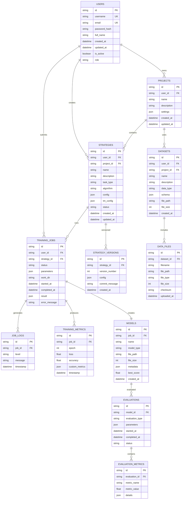

# TradeMaster Web界面数据库架构和API接口设计

**文档版本**: v1.0  
**创建日期**: 2025年8月15日  
**架构师**: TradeMaster数据架构团队  
**项目代码**: TMW-2025-001

---

## 1. 数据库架构设计

### 1.1 数据库技术选型

#### 1.1.1 主数据库：SQLite (开发) / PostgreSQL (生产)
```sql
-- 开发环境：SQLite
-- 优点：零配置、轻量级、适合开发和测试
-- 缺点：并发能力有限、功能相对简单

-- 生产环境：PostgreSQL 
-- 优点：高并发、丰富功能、ACID支持、JSON支持
-- 缺点：资源占用较大、配置复杂
```

#### 1.1.2 缓存数据库：Redis
```redis
-- 用途：
-- 1. 会话存储
-- 2. 任务队列（Celery broker）
-- 3. 实时数据缓存
-- 4. 临时数据存储
```

### 1.2 数据库E-R模型



### 1.3 数据库表结构详细设计

#### 1.3.1 用户管理表

```sql
-- 用户表
CREATE TABLE users (
    id VARCHAR(36) PRIMARY KEY DEFAULT (uuid()),
    username VARCHAR(50) UNIQUE NOT NULL,
    email VARCHAR(100) UNIQUE NOT NULL,
    password_hash VARCHAR(255) NOT NULL,
    full_name VARCHAR(100),
    created_at TIMESTAMP DEFAULT CURRENT_TIMESTAMP,
    updated_at TIMESTAMP DEFAULT CURRENT_TIMESTAMP ON UPDATE CURRENT_TIMESTAMP,
    is_active BOOLEAN DEFAULT TRUE,
    role VARCHAR(20) DEFAULT 'user',
    
    INDEX idx_username (username),
    INDEX idx_email (email),
    INDEX idx_created_at (created_at)
);

-- 用户会话表
CREATE TABLE user_sessions (
    id VARCHAR(36) PRIMARY KEY DEFAULT (uuid()),
    user_id VARCHAR(36) NOT NULL,
    session_token VARCHAR(255) UNIQUE NOT NULL,
    expires_at TIMESTAMP NOT NULL,
    created_at TIMESTAMP DEFAULT CURRENT_TIMESTAMP,
    last_accessed TIMESTAMP DEFAULT CURRENT_TIMESTAMP,
    
    FOREIGN KEY (user_id) REFERENCES users(id) ON DELETE CASCADE,
    INDEX idx_session_token (session_token),
    INDEX idx_expires_at (expires_at)
);
```

#### 1.3.2 项目管理表

```sql
-- 项目表
CREATE TABLE projects (
    id VARCHAR(36) PRIMARY KEY DEFAULT (uuid()),
    user_id VARCHAR(36) NOT NULL,
    name VARCHAR(100) NOT NULL,
    description TEXT,
    settings JSON,
    created_at TIMESTAMP DEFAULT CURRENT_TIMESTAMP,
    updated_at TIMESTAMP DEFAULT CURRENT_TIMESTAMP ON UPDATE CURRENT_TIMESTAMP,
    
    FOREIGN KEY (user_id) REFERENCES users(id) ON DELETE CASCADE,
    INDEX idx_user_id (user_id),
    INDEX idx_name (name),
    INDEX idx_created_at (created_at)
);

-- 项目成员表（为未来多用户协作预留）
CREATE TABLE project_members (
    id VARCHAR(36) PRIMARY KEY DEFAULT (uuid()),
    project_id VARCHAR(36) NOT NULL,
    user_id VARCHAR(36) NOT NULL,
    role VARCHAR(20) DEFAULT 'member',
    joined_at TIMESTAMP DEFAULT CURRENT_TIMESTAMP,
    
    FOREIGN KEY (project_id) REFERENCES projects(id) ON DELETE CASCADE,
    FOREIGN KEY (user_id) REFERENCES users(id) ON DELETE CASCADE,
    UNIQUE KEY unique_project_user (project_id, user_id)
);
```

#### 1.3.3 策略管理表

```sql
-- 策略表
CREATE TABLE strategies (
    id VARCHAR(36) PRIMARY KEY DEFAULT (uuid()),
    user_id VARCHAR(36) NOT NULL,
    project_id VARCHAR(36),
    name VARCHAR(100) NOT NULL,
    description TEXT,
    task_type VARCHAR(50) NOT NULL, -- 'portfolio_management', 'algorithmic_trading', 'order_execution'
    algorithm VARCHAR(50) NOT NULL, -- 'ppo', 'sac', 'dqn', etc.
    config JSON NOT NULL, -- Web界面配置
    tm_config JSON, -- TradeMaster配置
    status VARCHAR(20) DEFAULT 'draft', -- 'draft', 'active', 'archived'
    tags JSON, -- 标签数组
    created_at TIMESTAMP DEFAULT CURRENT_TIMESTAMP,
    updated_at TIMESTAMP DEFAULT CURRENT_TIMESTAMP ON UPDATE CURRENT_TIMESTAMP,
    
    FOREIGN KEY (user_id) REFERENCES users(id) ON DELETE CASCADE,
    FOREIGN KEY (project_id) REFERENCES projects(id) ON DELETE SET NULL,
    INDEX idx_user_id (user_id),
    INDEX idx_project_id (project_id),
    INDEX idx_task_type (task_type),
    INDEX idx_algorithm (algorithm),
    INDEX idx_status (status),
    INDEX idx_created_at (created_at)
);

-- 策略版本表
CREATE TABLE strategy_versions (
    id VARCHAR(36) PRIMARY KEY DEFAULT (uuid()),
    strategy_id VARCHAR(36) NOT NULL,
    version_number INT NOT NULL,
    config JSON NOT NULL,
    commit_message TEXT,
    created_at TIMESTAMP DEFAULT CURRENT_TIMESTAMP,
    
    FOREIGN KEY (strategy_id) REFERENCES strategies(id) ON DELETE CASCADE,
    UNIQUE KEY unique_strategy_version (strategy_id, version_number),
    INDEX idx_strategy_id (strategy_id),
    INDEX idx_version_number (version_number)
);

-- 策略模板表
CREATE TABLE strategy_templates (
    id VARCHAR(36) PRIMARY KEY DEFAULT (uuid()),
    name VARCHAR(100) NOT NULL,
    description TEXT,
    task_type VARCHAR(50) NOT NULL,
    algorithm VARCHAR(50) NOT NULL,
    config_template JSON NOT NULL,
    is_system BOOLEAN DEFAULT FALSE, -- 系统模板 vs 用户模板
    created_by VARCHAR(36),
    created_at TIMESTAMP DEFAULT CURRENT_TIMESTAMP,
    
    FOREIGN KEY (created_by) REFERENCES users(id) ON DELETE SET NULL,
    INDEX idx_task_type (task_type),
    INDEX idx_algorithm (algorithm),
    INDEX idx_is_system (is_system)
);
```

#### 1.3.4 训练任务表

```sql
-- 训练任务表
CREATE TABLE training_jobs (
    id VARCHAR(36) PRIMARY KEY DEFAULT (uuid()),
    user_id VARCHAR(36) NOT NULL,
    strategy_id VARCHAR(36) NOT NULL,
    name VARCHAR(100),
    status VARCHAR(20) DEFAULT 'pending', -- 'pending', 'running', 'completed', 'failed', 'cancelled'
    parameters JSON, -- 训练参数
    work_dir VARCHAR(255), -- 工作目录
    celery_task_id VARCHAR(255), -- Celery任务ID
    started_at TIMESTAMP NULL,
    completed_at TIMESTAMP NULL,
    result JSON, -- 训练结果
    error_message TEXT,
    progress INT DEFAULT 0, -- 进度百分比
    
    FOREIGN KEY (user_id) REFERENCES users(id) ON DELETE CASCADE,
    FOREIGN KEY (strategy_id) REFERENCES strategies(id) ON DELETE CASCADE,
    INDEX idx_user_id (user_id),
    INDEX idx_strategy_id (strategy_id),
    INDEX idx_status (status),
    INDEX idx_started_at (started_at),
    INDEX idx_celery_task_id (celery_task_id)
);

-- 训练日志表
CREATE TABLE job_logs (
    id VARCHAR(36) PRIMARY KEY DEFAULT (uuid()),
    job_id VARCHAR(36) NOT NULL,
    level VARCHAR(10) NOT NULL, -- 'DEBUG', 'INFO', 'WARNING', 'ERROR'
    message TEXT NOT NULL,
    timestamp TIMESTAMP DEFAULT CURRENT_TIMESTAMP,
    
    FOREIGN KEY (job_id) REFERENCES training_jobs(id) ON DELETE CASCADE,
    INDEX idx_job_id (job_id),
    INDEX idx_level (level),
    INDEX idx_timestamp (timestamp)
);

-- 训练指标表
CREATE TABLE training_metrics (
    id VARCHAR(36) PRIMARY KEY DEFAULT (uuid()),
    job_id VARCHAR(36) NOT NULL,
    epoch INT NOT NULL,
    loss FLOAT,
    accuracy FLOAT,
    custom_metrics JSON, -- 自定义指标
    timestamp TIMESTAMP DEFAULT CURRENT_TIMESTAMP,
    
    FOREIGN KEY (job_id) REFERENCES training_jobs(id) ON DELETE CASCADE,
    INDEX idx_job_id (job_id),
    INDEX idx_epoch (epoch),
    INDEX idx_timestamp (timestamp)
);
```

#### 1.3.5 数据管理表

```sql
-- 数据集表
CREATE TABLE datasets (
    id VARCHAR(36) PRIMARY KEY DEFAULT (uuid()),
    user_id VARCHAR(36) NOT NULL,
    project_id VARCHAR(36),
    name VARCHAR(100) NOT NULL,
    description TEXT,
    data_type VARCHAR(50), -- 'market_data', 'custom', 'synthetic'
    schema JSON, -- 数据架构描述
    file_path VARCHAR(500),
    file_size BIGINT, -- 文件大小（字节）
    row_count INT, -- 数据行数
    column_info JSON, -- 列信息
    tags JSON, -- 标签
    is_processed BOOLEAN DEFAULT FALSE,
    created_at TIMESTAMP DEFAULT CURRENT_TIMESTAMP,
    updated_at TIMESTAMP DEFAULT CURRENT_TIMESTAMP ON UPDATE CURRENT_TIMESTAMP,
    
    FOREIGN KEY (user_id) REFERENCES users(id) ON DELETE CASCADE,
    FOREIGN KEY (project_id) REFERENCES projects(id) ON DELETE SET NULL,
    INDEX idx_user_id (user_id),
    INDEX idx_project_id (project_id),
    INDEX idx_data_type (data_type),
    INDEX idx_created_at (created_at)
);

-- 数据文件表
CREATE TABLE data_files (
    id VARCHAR(36) PRIMARY KEY DEFAULT (uuid()),
    dataset_id VARCHAR(36) NOT NULL,
    filename VARCHAR(255) NOT NULL,
    file_path VARCHAR(500) NOT NULL,
    file_type VARCHAR(20), -- 'csv', 'json', 'parquet', etc.
    file_size BIGINT,
    checksum VARCHAR(64), -- MD5或SHA256校验和
    uploaded_at TIMESTAMP DEFAULT CURRENT_TIMESTAMP,
    
    FOREIGN KEY (dataset_id) REFERENCES datasets(id) ON DELETE CASCADE,
    INDEX idx_dataset_id (dataset_id),
    INDEX idx_filename (filename),
    INDEX idx_checksum (checksum)
);
```

#### 1.3.6 模型和评估表

```sql
-- 模型表
CREATE TABLE models (
    id VARCHAR(36) PRIMARY KEY DEFAULT (uuid()),
    job_id VARCHAR(36) NOT NULL,
    name VARCHAR(100),
    model_type VARCHAR(50), -- 'pytorch', 'tensorflow', etc.
    file_path VARCHAR(500),
    file_size BIGINT,
    metadata JSON, -- 模型元数据
    best_score FLOAT, -- 最佳得分
    hyperparameters JSON, -- 超参数
    created_at TIMESTAMP DEFAULT CURRENT_TIMESTAMP,
    
    FOREIGN KEY (job_id) REFERENCES training_jobs(id) ON DELETE CASCADE,
    INDEX idx_job_id (job_id),
    INDEX idx_model_type (model_type),
    INDEX idx_best_score (best_score),
    INDEX idx_created_at (created_at)
);

-- 评估任务表
CREATE TABLE evaluations (
    id VARCHAR(36) PRIMARY KEY DEFAULT (uuid()),
    model_id VARCHAR(36) NOT NULL,
    evaluation_type VARCHAR(50), -- 'backtest', 'stress_test', 'comparison'
    parameters JSON,
    started_at TIMESTAMP DEFAULT CURRENT_TIMESTAMP,
    completed_at TIMESTAMP NULL,
    status VARCHAR(20) DEFAULT 'pending',
    result JSON,
    
    FOREIGN KEY (model_id) REFERENCES models(id) ON DELETE CASCADE,
    INDEX idx_model_id (model_id),
    INDEX idx_evaluation_type (evaluation_type),
    INDEX idx_status (status)
);

-- 评估指标表
CREATE TABLE evaluation_metrics (
    id VARCHAR(36) PRIMARY KEY DEFAULT (uuid()),
    evaluation_id VARCHAR(36) NOT NULL,
    metric_name VARCHAR(50) NOT NULL,
    metric_value FLOAT NOT NULL,
    details JSON,
    
    FOREIGN KEY (evaluation_id) REFERENCES evaluations(id) ON DELETE CASCADE,
    INDEX idx_evaluation_id (evaluation_id),
    INDEX idx_metric_name (metric_name)
);
```

#### 1.3.7 系统配置表

```sql
-- 系统配置表
CREATE TABLE system_configs (
    id VARCHAR(36) PRIMARY KEY DEFAULT (uuid()),
    config_key VARCHAR(100) UNIQUE NOT NULL,
    config_value JSON NOT NULL,
    description TEXT,
    created_at TIMESTAMP DEFAULT CURRENT_TIMESTAMP,
    updated_at TIMESTAMP DEFAULT CURRENT_TIMESTAMP ON UPDATE CURRENT_TIMESTAMP,
    
    INDEX idx_config_key (config_key)
);

-- 系统通知表
CREATE TABLE system_notifications (
    id VARCHAR(36) PRIMARY KEY DEFAULT (uuid()),
    user_id VARCHAR(36),
    title VARCHAR(200) NOT NULL,
    message TEXT NOT NULL,
    type VARCHAR(20) DEFAULT 'info', -- 'info', 'warning', 'error', 'success'
    is_read BOOLEAN DEFAULT FALSE,
    created_at TIMESTAMP DEFAULT CURRENT_TIMESTAMP,
    
    FOREIGN KEY (user_id) REFERENCES users(id) ON DELETE CASCADE,
    INDEX idx_user_id (user_id),
    INDEX idx_is_read (is_read),
    INDEX idx_created_at (created_at)
);
```

### 1.4 数据库索引优化

```sql
-- 性能优化索引
-- 1. 复合索引
CREATE INDEX idx_strategies_user_project ON strategies(user_id, project_id);
CREATE INDEX idx_training_jobs_user_status ON training_jobs(user_id, status);
CREATE INDEX idx_job_logs_job_timestamp ON job_logs(job_id, timestamp DESC);

-- 2. 覆盖索引
CREATE INDEX idx_strategies_list ON strategies(user_id, status, created_at DESC) 
    INCLUDE (id, name, task_type, algorithm);

-- 3. 分区索引（PostgreSQL）
CREATE INDEX idx_training_metrics_partition ON training_metrics(job_id, timestamp)
    WHERE timestamp >= '2025-01-01';

-- 4. 函数索引
CREATE INDEX idx_strategies_name_lower ON strategies(LOWER(name));
CREATE INDEX idx_users_email_lower ON users(LOWER(email));
```

### 1.5 数据库触发器和约束

```sql
-- 更新时间触发器
CREATE TRIGGER update_strategies_updated_at
    BEFORE UPDATE ON strategies
    FOR EACH ROW
    SET NEW.updated_at = CURRENT_TIMESTAMP;

-- 级联删除约束
ALTER TABLE training_jobs 
    ADD CONSTRAINT fk_training_jobs_strategy 
    FOREIGN KEY (strategy_id) REFERENCES strategies(id) 
    ON DELETE CASCADE ON UPDATE CASCADE;

-- 检查约束
ALTER TABLE users 
    ADD CONSTRAINT chk_users_role 
    CHECK (role IN ('admin', 'user', 'guest'));

ALTER TABLE training_jobs 
    ADD CONSTRAINT chk_training_jobs_status 
    CHECK (status IN ('pending', 'running', 'completed', 'failed', 'cancelled'));

-- 唯一约束
ALTER TABLE strategies 
    ADD CONSTRAINT uk_strategies_user_name 
    UNIQUE (user_id, name);
```

## 2. Redis缓存架构

### 2.1 缓存键命名规范

```python
# 缓存键命名规范
CACHE_KEYS = {
    # 用户会话
    'user_session': 'session:{token}',
    'user_info': 'user:{user_id}',
    
    # 策略缓存
    'user_strategies': 'strategies:user:{user_id}',
    'strategy_detail': 'strategy:{strategy_id}',
    'strategy_config': 'strategy:{strategy_id}:config',
    
    # 训练任务缓存
    'job_status': 'job:{job_id}:status',
    'job_metrics': 'job:{job_id}:metrics',
    'job_logs': 'job:{job_id}:logs',
    
    # 实时数据
    'realtime_metrics': 'realtime:job:{job_id}',
    'websocket_connections': 'ws:connections:{job_id}',
    
    # 系统缓存
    'system_config': 'config:{config_key}',
    'api_rate_limit': 'rate_limit:{user_id}:{endpoint}',
}

# 缓存TTL设置
CACHE_TTL = {
    'user_session': 24 * 3600,  # 24小时
    'user_info': 30 * 60,       # 30分钟
    'strategy_detail': 15 * 60,  # 15分钟
    'job_status': 5 * 60,        # 5分钟
    'realtime_metrics': 10,      # 10秒
    'system_config': 3600,       # 1小时
}
```

### 2.2 缓存数据结构

```python
# Redis数据结构设计
class RedisDataStructures:
    
    @staticmethod
    def store_user_session(redis_client, token: str, user_data: dict):
        """存储用户会话"""
        key = f"session:{token}"
        redis_client.hmset(key, user_data)
        redis_client.expire(key, CACHE_TTL['user_session'])
    
    @staticmethod
    def store_job_metrics(redis_client, job_id: str, metrics: dict):
        """存储实时训练指标"""
        key = f"realtime:job:{job_id}"
        redis_client.lpush(key, json.dumps({
            **metrics,
            'timestamp': datetime.utcnow().isoformat()
        }))
        redis_client.ltrim(key, 0, 100)  # 只保留最近100条
        redis_client.expire(key, CACHE_TTL['realtime_metrics'])
    
    @staticmethod
    def store_websocket_connection(redis_client, job_id: str, connection_id: str):
        """存储WebSocket连接"""
        key = f"ws:connections:{job_id}"
        redis_client.sadd(key, connection_id)
        redis_client.expire(key, 3600)  # 1小时过期
    
    @staticmethod
    def get_cached_strategies(redis_client, user_id: str) -> list:
        """获取缓存的策略列表"""
        key = f"strategies:user:{user_id}"
        cached_data = redis_client.get(key)
        if cached_data:
            return json.loads(cached_data)
        return None
```

## 3. API接口设计

### 3.1 API设计原则

#### 3.1.1 RESTful风格
```python
# RESTful API设计规范
API_DESIGN_PRINCIPLES = {
    'naming': {
        'resources': 'plural_nouns',  # /api/v1/strategies, /api/v1/jobs
        'actions': 'http_verbs',      # GET, POST, PUT, DELETE
        'parameters': 'snake_case',   # user_id, job_id
    },
    'responses': {
        'format': 'json',
        'structure': 'consistent',
        'errors': 'standardized'
    },
    'versioning': {
        'style': 'url_path',          # /api/v1/, /api/v2/
        'backward_compatibility': True
    }
}
```

#### 3.1.2 统一响应格式
```python
# API响应标准格式
from pydantic import BaseModel
from typing import Optional, Any, List

class APIResponse(BaseModel):
    success: bool
    data: Optional[Any] = None
    error: Optional[dict] = None
    pagination: Optional[dict] = None
    meta: Optional[dict] = None

class ErrorDetail(BaseModel):
    code: str
    message: str
    field: Optional[str] = None
    details: Optional[dict] = None

class PaginationInfo(BaseModel):
    page: int
    size: int
    total: int
    pages: int
    has_next: bool
    has_prev: bool

# 成功响应示例
success_response = APIResponse(
    success=True,
    data={"id": "123", "name": "My Strategy"},
    meta={"timestamp": "2025-08-15T12:00:00Z"}
)

# 错误响应示例
error_response = APIResponse(
    success=False,
    error={
        "code": "VALIDATION_ERROR",
        "message": "Invalid input parameters",
        "details": [
            {"field": "name", "message": "Name is required"},
            {"field": "config", "message": "Invalid configuration format"}
        ]
    }
)

# 分页响应示例
paginated_response = APIResponse(
    success=True,
    data=[{"id": "1", "name": "Strategy 1"}, {"id": "2", "name": "Strategy 2"}],
    pagination={
        "page": 1,
        "size": 20,
        "total": 100,
        "pages": 5,
        "has_next": True,
        "has_prev": False
    }
)
```

### 3.2 API端点设计

#### 3.2.1 认证授权API
```python
from fastapi import APIRouter, Depends, HTTPException, status
from fastapi.security import HTTPBearer, HTTPAuthorizationCredentials
from pydantic import BaseModel, EmailStr

auth_router = APIRouter(prefix="/api/v1/auth", tags=["authentication"])
security = HTTPBearer()

class LoginRequest(BaseModel):
    username: str
    password: str

class LoginResponse(BaseModel):
    access_token: str
    token_type: str = "bearer"
    expires_in: int
    user: dict

class RegisterRequest(BaseModel):
    username: str
    email: EmailStr
    password: str
    full_name: Optional[str] = None

@auth_router.post("/login", response_model=APIResponse[LoginResponse])
async def login(request: LoginRequest):
    """用户登录"""
    # 验证用户凭据
    user = await authenticate_user(request.username, request.password)
    if not user:
        raise HTTPException(
            status_code=status.HTTP_401_UNAUTHORIZED,
            detail="Invalid credentials"
        )
    
    # 生成访问令牌
    access_token = create_access_token(user.id)
    
    return APIResponse(
        success=True,
        data=LoginResponse(
            access_token=access_token,
            expires_in=3600,
            user={
                "id": user.id,
                "username": user.username,
                "email": user.email,
                "full_name": user.full_name
            }
        )
    )

@auth_router.post("/register", response_model=APIResponse[dict])
async def register(request: RegisterRequest):
    """用户注册"""
    # 检查用户是否已存在
    if await user_exists(request.username, request.email):
        raise HTTPException(
            status_code=status.HTTP_400_BAD_REQUEST,
            detail="User already exists"
        )
    
    # 创建新用户
    user = await create_user(request)
    
    return APIResponse(
        success=True,
        data={"message": "User created successfully", "user_id": user.id}
    )

@auth_router.post("/logout", response_model=APIResponse[dict])
async def logout(token: HTTPAuthorizationCredentials = Depends(security)):
    """用户登出"""
    # 将令牌加入黑名单
    await blacklist_token(token.credentials)
    
    return APIResponse(
        success=True,
        data={"message": "Logged out successfully"}
    )

@auth_router.get("/me", response_model=APIResponse[dict])
async def get_current_user(current_user: User = Depends(get_current_user)):
    """获取当前用户信息"""
    return APIResponse(
        success=True,
        data={
            "id": current_user.id,
            "username": current_user.username,
            "email": current_user.email,
            "full_name": current_user.full_name,
            "role": current_user.role,
            "created_at": current_user.created_at.isoformat()
        }
    )
```

#### 3.2.2 策略管理API
```python
from typing import List, Optional
from enum import Enum

strategy_router = APIRouter(prefix="/api/v1/strategies", tags=["strategies"])

class TaskType(str, Enum):
    PORTFOLIO_MANAGEMENT = "portfolio_management"
    ALGORITHMIC_TRADING = "algorithmic_trading" 
    ORDER_EXECUTION = "order_execution"

class StrategyStatus(str, Enum):
    DRAFT = "draft"
    ACTIVE = "active"
    ARCHIVED = "archived"

class StrategyBase(BaseModel):
    name: str
    description: Optional[str] = None
    task_type: TaskType
    algorithm: str
    config: dict
    tags: Optional[List[str]] = None

class CreateStrategyRequest(StrategyBase):
    project_id: Optional[str] = None

class UpdateStrategyRequest(BaseModel):
    name: Optional[str] = None
    description: Optional[str] = None
    config: Optional[dict] = None
    tags: Optional[List[str]] = None
    status: Optional[StrategyStatus] = None

class StrategyResponse(StrategyBase):
    id: str
    user_id: str
    project_id: Optional[str] = None
    status: StrategyStatus
    created_at: datetime
    updated_at: datetime

class StrategyListQuery(BaseModel):
    page: int = 1
    size: int = 20
    search: Optional[str] = None
    task_type: Optional[TaskType] = None
    algorithm: Optional[str] = None
    status: Optional[StrategyStatus] = None
    project_id: Optional[str] = None
    tags: Optional[List[str]] = None

@strategy_router.get("/", response_model=APIResponse[List[StrategyResponse]])
async def get_strategies(
    query: StrategyListQuery = Depends(),
    current_user: User = Depends(get_current_user)
):
    """获取策略列表"""
    service = StrategyService()
    strategies, total = await service.get_strategies(
        user_id=current_user.id,
        **query.dict()
    )
    
    pagination = PaginationInfo(
        page=query.page,
        size=query.size,
        total=total,
        pages=(total + query.size - 1) // query.size,
        has_next=query.page * query.size < total,
        has_prev=query.page > 1
    )
    
    return APIResponse(
        success=True,
        data=strategies,
        pagination=pagination.dict()
    )

@strategy_router.post("/", response_model=APIResponse[StrategyResponse])
async def create_strategy(
    request: CreateStrategyRequest,
    current_user: User = Depends(get_current_user)
):
    """创建策略"""
    service = StrategyService()
    strategy = await service.create_strategy(request, current_user.id)
    
    return APIResponse(
        success=True,
        data=strategy
    )

@strategy_router.get("/{strategy_id}", response_model=APIResponse[StrategyResponse])
async def get_strategy(
    strategy_id: str,
    current_user: User = Depends(get_current_user)
):
    """获取策略详情"""
    service = StrategyService()
    strategy = await service.get_strategy(strategy_id, current_user.id)
    
    if not strategy:
        raise HTTPException(
            status_code=status.HTTP_404_NOT_FOUND,
            detail="Strategy not found"
        )
    
    return APIResponse(
        success=True,
        data=strategy
    )

@strategy_router.put("/{strategy_id}", response_model=APIResponse[StrategyResponse])
async def update_strategy(
    strategy_id: str,
    request: UpdateStrategyRequest,
    current_user: User = Depends(get_current_user)
):
    """更新策略"""
    service = StrategyService()
    strategy = await service.update_strategy(strategy_id, request, current_user.id)
    
    return APIResponse(
        success=True,
        data=strategy
    )

@strategy_router.delete("/{strategy_id}", response_model=APIResponse[dict])
async def delete_strategy(
    strategy_id: str,
    current_user: User = Depends(get_current_user)
):
    """删除策略"""
    service = StrategyService()
    await service.delete_strategy(strategy_id, current_user.id)
    
    return APIResponse(
        success=True,
        data={"message": "Strategy deleted successfully"}
    )

@strategy_router.post("/{strategy_id}/validate", response_model=APIResponse[dict])
async def validate_strategy_config(
    strategy_id: str,
    current_user: User = Depends(get_current_user)
):
    """验证策略配置"""
    service = StrategyService()
    validation_result = await service.validate_strategy_config(strategy_id, current_user.id)
    
    return APIResponse(
        success=True,
        data=validation_result
    )

@strategy_router.post("/{strategy_id}/clone", response_model=APIResponse[StrategyResponse])
async def clone_strategy(
    strategy_id: str,
    name: str,
    current_user: User = Depends(get_current_user)
):
    """克隆策略"""
    service = StrategyService()
    cloned_strategy = await service.clone_strategy(strategy_id, name, current_user.id)
    
    return APIResponse(
        success=True,
        data=cloned_strategy
    )
```

#### 3.2.3 训练任务API
```python
training_router = APIRouter(prefix="/api/v1/training", tags=["training"])

class JobStatus(str, Enum):
    PENDING = "pending"
    RUNNING = "running"
    COMPLETED = "completed"
    FAILED = "failed"
    CANCELLED = "cancelled"

class StartTrainingRequest(BaseModel):
    strategy_id: str
    name: Optional[str] = None
    parameters: Optional[dict] = None

class TrainingJobResponse(BaseModel):
    id: str
    user_id: str
    strategy_id: str
    name: Optional[str]
    status: JobStatus
    parameters: Optional[dict]
    progress: int
    started_at: Optional[datetime]
    completed_at: Optional[datetime]
    result: Optional[dict]
    error_message: Optional[str]

class JobStatusResponse(BaseModel):
    status: JobStatus
    progress: int
    current_epoch: Optional[int]
    total_epochs: Optional[int]
    metrics: Optional[dict]
    logs: Optional[List[str]]

@training_router.post("/jobs", response_model=APIResponse[TrainingJobResponse])
async def start_training(
    request: StartTrainingRequest,
    current_user: User = Depends(get_current_user)
):
    """启动训练任务"""
    service = TrainingService()
    job = await service.start_training(request, current_user.id)
    
    return APIResponse(
        success=True,
        data=job
    )

@training_router.get("/jobs", response_model=APIResponse[List[TrainingJobResponse]])
async def get_training_jobs(
    page: int = 1,
    size: int = 20,
    status: Optional[JobStatus] = None,
    strategy_id: Optional[str] = None,
    current_user: User = Depends(get_current_user)
):
    """获取训练任务列表"""
    service = TrainingService()
    jobs, total = await service.get_training_jobs(
        user_id=current_user.id,
        page=page,
        size=size,
        status=status,
        strategy_id=strategy_id
    )
    
    pagination = PaginationInfo(
        page=page,
        size=size,
        total=total,
        pages=(total + size - 1) // size,
        has_next=page * size < total,
        has_prev=page > 1
    )
    
    return APIResponse(
        success=True,
        data=jobs,
        pagination=pagination.dict()
    )

@training_router.get("/jobs/{job_id}", response_model=APIResponse[TrainingJobResponse])
async def get_training_job(
    job_id: str,
    current_user: User = Depends(get_current_user)
):
    """获取训练任务详情"""
    service = TrainingService()
    job = await service.get_training_job(job_id, current_user.id)
    
    if not job:
        raise HTTPException(
            status_code=status.HTTP_404_NOT_FOUND,
            detail="Training job not found"
        )
    
    return APIResponse(
        success=True,
        data=job
    )

@training_router.get("/jobs/{job_id}/status", response_model=APIResponse[JobStatusResponse])
async def get_job_status(
    job_id: str,
    current_user: User = Depends(get_current_user)
):
    """获取任务状态"""
    service = TrainingService()
    status_info = await service.get_job_status(job_id, current_user.id)
    
    return APIResponse(
        success=True,
        data=status_info
    )

@training_router.post("/jobs/{job_id}/stop", response_model=APIResponse[dict])
async def stop_training(
    job_id: str,
    current_user: User = Depends(get_current_user)
):
    """停止训练任务"""
    service = TrainingService()
    await service.stop_training(job_id, current_user.id)
    
    return APIResponse(
        success=True,
        data={"message": "Training job stopped successfully"}
    )

@training_router.get("/jobs/{job_id}/logs", response_model=APIResponse[List[str]])
async def get_training_logs(
    job_id: str,
    lines: int = 100,
    level: Optional[str] = None,
    current_user: User = Depends(get_current_user)
):
    """获取训练日志"""
    service = TrainingService()
    logs = await service.get_training_logs(job_id, current_user.id, lines, level)
    
    return APIResponse(
        success=True,
        data=logs
    )

@training_router.get("/jobs/{job_id}/metrics", response_model=APIResponse[List[dict]])
async def get_training_metrics(
    job_id: str,
    start_epoch: Optional[int] = None,
    end_epoch: Optional[int] = None,
    current_user: User = Depends(get_current_user)
):
    """获取训练指标"""
    service = TrainingService()
    metrics = await service.get_training_metrics(
        job_id, current_user.id, start_epoch, end_epoch
    )
    
    return APIResponse(
        success=True,
        data=metrics
    )
```

#### 3.2.4 数据管理API
```python
data_router = APIRouter(prefix="/api/v1/data", tags=["data"])

class DatasetType(str, Enum):
    MARKET_DATA = "market_data"
    CUSTOM = "custom"
    SYNTHETIC = "synthetic"

class CreateDatasetRequest(BaseModel):
    name: str
    description: Optional[str] = None
    data_type: DatasetType
    project_id: Optional[str] = None
    tags: Optional[List[str]] = None

class DatasetResponse(BaseModel):
    id: str
    user_id: str
    project_id: Optional[str]
    name: str
    description: Optional[str]
    data_type: DatasetType
    file_path: Optional[str]
    file_size: Optional[int]
    row_count: Optional[int]
    column_info: Optional[dict]
    tags: Optional[List[str]]
    is_processed: bool
    created_at: datetime
    updated_at: datetime

@data_router.post("/datasets", response_model=APIResponse[DatasetResponse])
async def create_dataset(
    request: CreateDatasetRequest,
    current_user: User = Depends(get_current_user)
):
    """创建数据集"""
    service = DataService()
    dataset = await service.create_dataset(request, current_user.id)
    
    return APIResponse(
        success=True,
        data=dataset
    )

@data_router.get("/datasets", response_model=APIResponse[List[DatasetResponse]])
async def get_datasets(
    page: int = 1,
    size: int = 20,
    data_type: Optional[DatasetType] = None,
    project_id: Optional[str] = None,
    current_user: User = Depends(get_current_user)
):
    """获取数据集列表"""
    service = DataService()
    datasets, total = await service.get_datasets(
        user_id=current_user.id,
        page=page,
        size=size,
        data_type=data_type,
        project_id=project_id
    )
    
    pagination = PaginationInfo(
        page=page,
        size=size,
        total=total,
        pages=(total + size - 1) // size,
        has_next=page * size < total,
        has_prev=page > 1
    )
    
    return APIResponse(
        success=True,
        data=datasets,
        pagination=pagination.dict()
    )

@data_router.post("/datasets/{dataset_id}/upload", response_model=APIResponse[dict])
async def upload_dataset_file(
    dataset_id: str,
    file: UploadFile = File(...),
    current_user: User = Depends(get_current_user)
):
    """上传数据集文件"""
    service = DataService()
    result = await service.upload_dataset_file(dataset_id, file, current_user.id)
    
    return APIResponse(
        success=True,
        data=result
    )

@data_router.get("/datasets/{dataset_id}/preview", response_model=APIResponse[dict])
async def preview_dataset(
    dataset_id: str,
    rows: int = 10,
    current_user: User = Depends(get_current_user)
):
    """预览数据集"""
    service = DataService()
    preview_data = await service.preview_dataset(dataset_id, current_user.id, rows)
    
    return APIResponse(
        success=True,
        data=preview_data
    )

@data_router.get("/datasets/{dataset_id}/statistics", response_model=APIResponse[dict])
async def get_dataset_statistics(
    dataset_id: str,
    current_user: User = Depends(get_current_user)
):
    """获取数据集统计信息"""
    service = DataService()
    statistics = await service.get_dataset_statistics(dataset_id, current_user.id)
    
    return APIResponse(
        success=True,
        data=statistics
    )
```

### 3.3 WebSocket API设计

```python
# WebSocket端点设计
from fastapi import WebSocket, WebSocketDisconnect
import json

class WebSocketManager:
    def __init__(self):
        self.active_connections: Dict[str, List[WebSocket]] = {}
        
    async def connect(self, websocket: WebSocket, channel: str):
        await websocket.accept()
        if channel not in self.active_connections:
            self.active_connections[channel] = []
        self.active_connections[channel].append(websocket)
        
    def disconnect(self, websocket: WebSocket, channel: str):
        if channel in self.active_connections:
            self.active_connections[channel].remove(websocket)
            
    async def send_message(self, channel: str, message: dict):
        if channel in self.active_connections:
            for connection in self.active_connections[channel]:
                try:
                    await connection.send_text(json.dumps(message))
                except:
                    self.active_connections[channel].remove(connection)

manager = WebSocketManager()

@app.websocket("/ws/training/{job_id}")
async def websocket_training_updates(websocket: WebSocket, job_id: str):
    """训练任务实时更新WebSocket"""
    channel = f"training:{job_id}"
    await manager.connect(websocket, channel)
    
    try:
        while True:
            # 保持连接活跃
            data = await websocket.receive_text()
            # 可以处理客户端发送的消息
            message = json.loads(data)
            if message.get('type') == 'ping':
                await websocket.send_text(json.dumps({'type': 'pong'}))
                
    except WebSocketDisconnect:
        manager.disconnect(websocket, channel)

@app.websocket("/ws/system/{user_id}")
async def websocket_system_notifications(websocket: WebSocket, user_id: str):
    """系统通知WebSocket"""
    channel = f"system:{user_id}"
    await manager.connect(websocket, channel)
    
    try:
        while True:
            await websocket.receive_text()
    except WebSocketDisconnect:
        manager.disconnect(websocket, channel)

# WebSocket消息发送函数
async def send_training_update(job_id: str, update: dict):
    """发送训练更新"""
    await manager.send_message(f"training:{job_id}", {
        'type': 'training_update',
        'job_id': job_id,
        'data': update,
        'timestamp': datetime.utcnow().isoformat()
    })

async def send_system_notification(user_id: str, notification: dict):
    """发送系统通知"""
    await manager.send_message(f"system:{user_id}", {
        'type': 'system_notification',
        'data': notification,
        'timestamp': datetime.utcnow().isoformat()
    })
```

### 3.4 API文档和测试

#### 3.4.1 OpenAPI文档配置
```python
from fastapi import FastAPI
from fastapi.openapi.docs import get_swagger_ui_html
from fastapi.openapi.utils import get_openapi

app = FastAPI(
    title="TradeMaster Web API",
    description="TradeMaster Web界面后端API",
    version="1.0.0",
    docs_url="/docs",
    redoc_url="/redoc"
)

def custom_openapi():
    if app.openapi_schema:
        return app.openapi_schema
        
    openapi_schema = get_openapi(
        title="TradeMaster Web API",
        version="1.0.0",
        description="完整的量化交易平台Web API",
        routes=app.routes,
    )
    
    # 添加安全定义
    openapi_schema["components"]["securitySchemes"] = {
        "bearerAuth": {
            "type": "http",
            "scheme": "bearer",
            "bearerFormat": "JWT"
        }
    }
    
    app.openapi_schema = openapi_schema
    return app.openapi_schema

app.openapi = custom_openapi
```

#### 3.4.2 API测试用例
```python
import pytest
from httpx import AsyncClient
from fastapi.testclient import TestClient

@pytest.mark.asyncio
async def test_create_strategy():
    """测试创建策略"""
    async with AsyncClient(app=app, base_url="http://test") as client:
        # 登录获取令牌
        login_response = await client.post("/api/v1/auth/login", json={
            "username": "testuser",
            "password": "testpass"
        })
        token = login_response.json()["data"]["access_token"]
        
        # 创建策略
        response = await client.post(
            "/api/v1/strategies",
            json={
                "name": "Test Strategy",
                "description": "A test strategy",
                "task_type": "portfolio_management",
                "algorithm": "ppo",
                "config": {"epochs": 10, "learning_rate": 0.001}
            },
            headers={"Authorization": f"Bearer {token}"}
        )
        
        assert response.status_code == 200
        data = response.json()
        assert data["success"] is True
        assert data["data"]["name"] == "Test Strategy"

@pytest.mark.asyncio
async def test_start_training():
    """测试启动训练"""
    async with AsyncClient(app=app, base_url="http://test") as client:
        # 先创建策略
        strategy_response = await client.post("/api/v1/strategies", ...)
        strategy_id = strategy_response.json()["data"]["id"]
        
        # 启动训练
        response = await client.post(
            "/api/v1/training/jobs",
            json={
                "strategy_id": strategy_id,
                "name": "Test Training",
                "parameters": {"epochs": 5}
            },
            headers={"Authorization": f"Bearer {token}"}
        )
        
        assert response.status_code == 200
        data = response.json()
        assert data["success"] is True
        assert data["data"]["status"] == "pending"
```

## 4. 数据迁移和初始化

### 4.1 数据库迁移脚本

```python
# Alembic迁移配置
# migrations/env.py
from alembic import context
from sqlalchemy import engine_from_config, pool
from app.models import Base

def run_migrations_online():
    """在线模式运行迁移"""
    connectable = engine_from_config(
        config.get_section(config.config_ini_section),
        prefix="sqlalchemy.",
        poolclass=pool.NullPool,
    )

    with connectable.connect() as connection:
        context.configure(
            connection=connection, 
            target_metadata=Base.metadata
        )

        with context.begin_transaction():
            context.run_migrations()

# 创建初始迁移
# alembic revision --autogenerate -m "Initial migration"

# 初始数据种子文件
class DataSeeder:
    @staticmethod
    async def seed_system_configs():
        """种子系统配置"""
        configs = [
            {
                "config_key": "max_concurrent_jobs",
                "config_value": {"value": 5},
                "description": "最大并发训练任务数"
            },
            {
                "config_key": "default_epochs",
                "config_value": {"value": 10},
                "description": "默认训练轮数"
            },
            {
                "config_key": "supported_algorithms",
                "config_value": {
                    "portfolio_management": ["ppo", "sac", "ddpg", "td3"],
                    "algorithmic_trading": ["dqn", "deepscalper"],
                    "order_execution": ["eteo", "pd"]
                },
                "description": "支持的算法列表"
            }
        ]
        
        for config in configs:
            await SystemConfig.create(**config)
    
    @staticmethod
    async def seed_strategy_templates():
        """种子策略模板"""
        templates = [
            {
                "name": "Portfolio Management - PPO",
                "description": "使用PPO算法的投资组合管理策略",
                "task_type": "portfolio_management",
                "algorithm": "ppo",
                "config_template": {
                    "epochs": 10,
                    "learning_rate": 0.001,
                    "batch_size": 32,
                    "discount_factor": 0.99
                },
                "is_system": True
            },
            {
                "name": "Algorithmic Trading - DQN",
                "description": "使用DQN算法的算法交易策略",
                "task_type": "algorithmic_trading",
                "algorithm": "dqn",
                "config_template": {
                    "epochs": 50,
                    "learning_rate": 0.0005,
                    "buffer_size": 10000,
                    "target_update": 100
                },
                "is_system": True
            }
        ]
        
        for template in templates:
            await StrategyTemplate.create(**template)

# 数据库初始化命令
async def init_database():
    """初始化数据库"""
    # 创建表
    async with engine.begin() as conn:
        await conn.run_sync(Base.metadata.create_all)
    
    # 种子数据
    await DataSeeder.seed_system_configs()
    await DataSeeder.seed_strategy_templates()
    
    print("Database initialized successfully!")
```

### 4.2 备份和恢复

```python
# 数据库备份工具
import subprocess
import os
from datetime import datetime

class DatabaseBackup:
    def __init__(self, db_url: str, backup_dir: str):
        self.db_url = db_url
        self.backup_dir = backup_dir
        
    async def create_backup(self) -> str:
        """创建数据库备份"""
        timestamp = datetime.utcnow().strftime("%Y%m%d_%H%M%S")
        backup_file = os.path.join(self.backup_dir, f"backup_{timestamp}.sql")
        
        # PostgreSQL备份
        if "postgresql" in self.db_url:
            cmd = [
                "pg_dump",
                self.db_url,
                "-f", backup_file,
                "--verbose",
                "--no-acl",
                "--no-owner"
            ]
        # SQLite备份
        elif "sqlite" in self.db_url:
            db_file = self.db_url.replace("sqlite:///", "")
            cmd = ["cp", db_file, backup_file]
        
        try:
            subprocess.run(cmd, check=True)
            return backup_file
        except subprocess.CalledProcessError as e:
            raise Exception(f"Backup failed: {e}")
    
    async def restore_backup(self, backup_file: str):
        """恢复数据库备份"""
        if not os.path.exists(backup_file):
            raise FileNotFoundError("Backup file not found")
        
        # PostgreSQL恢复
        if "postgresql" in self.db_url:
            cmd = [
                "psql",
                self.db_url,
                "-f", backup_file
            ]
        # SQLite恢复
        elif "sqlite" in self.db_url:
            db_file = self.db_url.replace("sqlite:///", "")
            cmd = ["cp", backup_file, db_file]
        
        try:
            subprocess.run(cmd, check=True)
        except subprocess.CalledProcessError as e:
            raise Exception(f"Restore failed: {e}")

# 定期备份任务
@app.task
def scheduled_backup():
    """定期备份任务"""
    backup_manager = DatabaseBackup(DATABASE_URL, BACKUP_DIR)
    backup_file = await backup_manager.create_backup()
    
    # 清理旧备份（保留最近30天）
    cutoff_date = datetime.utcnow() - timedelta(days=30)
    for file in os.listdir(BACKUP_DIR):
        if file.startswith("backup_"):
            file_path = os.path.join(BACKUP_DIR, file)
            file_time = datetime.fromtimestamp(os.path.getctime(file_path))
            if file_time < cutoff_date:
                os.remove(file_path)
    
    return backup_file
```

## 5. 性能优化策略

### 5.1 数据库性能优化

```sql
-- 查询优化
-- 1. 添加合适的索引
EXPLAIN ANALYZE SELECT * FROM strategies WHERE user_id = 'xxx' AND status = 'active';

-- 2. 分区表（大数据量场景）
CREATE TABLE training_metrics_2025 PARTITION OF training_metrics
    FOR VALUES FROM ('2025-01-01') TO ('2026-01-01');

-- 3. 物化视图（复杂统计查询）
CREATE MATERIALIZED VIEW strategy_statistics AS
SELECT 
    user_id,
    task_type,
    COUNT(*) as total_strategies,
    COUNT(CASE WHEN status = 'active' THEN 1 END) as active_strategies,
    AVG(CASE WHEN status = 'completed' THEN 1 ELSE 0 END) as success_rate
FROM strategies
GROUP BY user_id, task_type;

-- 4. 连接池配置
-- SQLAlchemy连接池配置
engine = create_async_engine(
    DATABASE_URL,
    pool_size=20,
    max_overflow=30,
    pool_pre_ping=True,
    pool_recycle=3600
)
```

### 5.2 API性能优化

```python
# API缓存策略
from functools import wraps
import hashlib

def cache_response(ttl: int = 300):
    """API响应缓存装饰器"""
    def decorator(func):
        @wraps(func)
        async def wrapper(*args, **kwargs):
            # 生成缓存键
            cache_key = hashlib.md5(
                f"{func.__name__}:{str(args)}:{str(kwargs)}".encode()
            ).hexdigest()
            
            # 尝试从缓存获取
            cached_result = await redis_client.get(f"api_cache:{cache_key}")
            if cached_result:
                return json.loads(cached_result)
            
            # 执行函数并缓存结果
            result = await func(*args, **kwargs)
            await redis_client.setex(
                f"api_cache:{cache_key}",
                ttl,
                json.dumps(result, default=str)
            )
            
            return result
        return wrapper
    return decorator

# 使用示例
@strategy_router.get("/")
@cache_response(ttl=300)  # 缓存5分钟
async def get_strategies_cached(...):
    # 实际的API逻辑
    pass

# 请求限流
from slowapi import Limiter, _rate_limit_exceeded_handler
from slowapi.util import get_remote_address
from slowapi.errors import RateLimitExceeded

limiter = Limiter(key_func=get_remote_address)
app.state.limiter = limiter
app.add_exception_handler(RateLimitExceeded, _rate_limit_exceeded_handler)

@app.get("/api/v1/strategies")
@limiter.limit("100/minute")  # 每分钟最多100次请求
async def get_strategies_with_limit(request: Request, ...):
    pass
```

## 6. 总结

### 6.1 数据库架构特点

1. **灵活的技术选型**: SQLite开发，PostgreSQL生产
2. **完整的数据模型**: 覆盖用户、策略、训练、数据等核心领域
3. **高效的索引设计**: 优化查询性能
4. **可扩展的结构**: 支持未来功能扩展

### 6.2 API接口特点

1. **RESTful设计**: 符合REST标准和最佳实践
2. **统一响应格式**: 一致的API响应结构
3. **完整的CRUD操作**: 支持完整的数据操作
4. **实时通信支持**: WebSocket实时更新
5. **全面的错误处理**: 标准化错误响应

### 6.3 性能优化亮点

1. **数据库优化**: 索引、分区、连接池
2. **缓存策略**: Redis缓存热点数据
3. **API优化**: 响应缓存、请求限流
4. **异步处理**: 支持高并发操作

### 6.4 实施建议

1. **渐进式开发**: 先实现核心功能，再扩展
2. **性能监控**: 关注数据库和API性能指标
3. **数据安全**: 实施数据备份和恢复策略
4. **文档维护**: 保持API文档和数据库文档同步

---

**文档状态**: ✅ 已完成  
**审核状态**: 🔄 待审核  
**下一步**: 进入前端UI/UX设计阶段