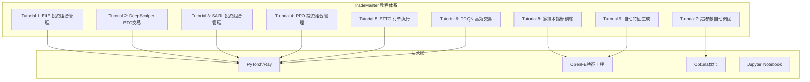
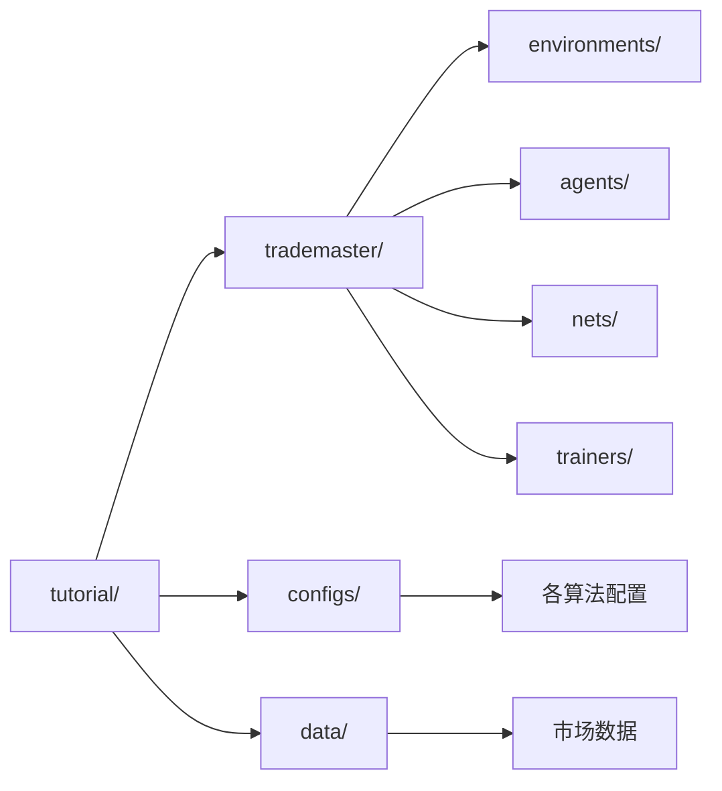

[根目录](../CLAUDE.md) > **tutorial**

# TradeMaster 教程模块

## 模块职责

TradeMaster教程模块提供完整的量化交易机器学习教程体系，涵盖从基础算法到高级应用的9个实践教程，帮助用户掌握投资组合管理、算法交易、高频交易、订单执行等核心量化交易技能。

## 模块结构图



## 教程清单和学习路径

### 初级入门教程（推荐顺序）

| 教程编号 | 教程名称 | 算法类型 | 应用领域 | 难度级别 | 预计时长 |
|---------|---------|---------|---------|---------|---------|
| Tutorial 1 | EIIE 投资组合管理 | 强化学习 | Portfolio Management | ⭐⭐ | 2-3小时 |
| Tutorial 2 | DeepScalper BTC交易 | DQN | Algorithmic Trading | ⭐⭐ | 2小时 |
| Tutorial 4 | PPO 投资组合管理 | PPO | Portfolio Management | ⭐⭐⭐ | 3小时 |

### 中级进阶教程

| 教程编号 | 教程名称 | 算法类型 | 应用领域 | 难度级别 | 预计时长 |
|---------|---------|---------|---------|---------|---------|
| Tutorial 3 | SARL 投资组合管理 | SARL | Portfolio Management | ⭐⭐⭐ | 3-4小时 |
| Tutorial 5 | ETTO 订单执行 | ETTO | Order Execution | ⭐⭐⭐ | 3小时 |
| Tutorial 6 | DDQN 高频交易 | Double DQN | High Frequency Trading | ⭐⭐⭐ | 3-4小时 |

### 高级专题教程

| 教程编号 | 教程名称 | 核心技术 | 应用场景 | 难度级别 | 预计时长 |
|---------|---------|---------|---------|---------|---------|
| Tutorial 7 | 超参数自动调优 | Optuna | 模型优化 | ⭐⭐⭐⭐ | 4-5小时 |
| Tutorial 8 | 多技术指标训练 | Alpha158 | 特征工程 | ⭐⭐⭐⭐ | 5-6小时 |
| Tutorial 9 | 自动特征生成 | OpenFE | 特征工程 | ⭐⭐⭐⭐⭐ | 6-8小时 |

## 每个教程的功能说明和前置知识

### Tutorial 1: EIIE 投资组合管理
**功能说明：** 使用 EIIE (Ensemble of Identical Independent Evaluators) 算法进行DJ30股票投资组合管理，学习基础的强化学习交易策略。

**前置知识：**
- Python 基础编程
- 机器学习基础概念
- PyTorch 基础使用
- 量化交易基本概念

**核心学习点：**
- 投资组合环境构建
- EIIE 网络架构
- 强化学习训练流程
- 交易性能评估指标

### Tutorial 2: DeepScalper BTC 交易
**功能说明：** 使用 DeepScalper (基于DQN) 进行比特币算法交易，学习离散动作空间的交易策略。

**前置知识：**
- DQN 算法原理
- 加密货币交易基础
- 技术指标分析

**核心学习点：**
- 算法交易环境设置
- DQN 网络结构
- 经验回放机制
- 加密货币数据处理

### Tutorial 3: SARL 投资组合管理
**功能说明：** 使用 SARL (Single-Agent Reinforcement Learning) 进行投资组合管理，基于Ray RLlib框架实现。

**前置知识：**
- Ray 框架基础
- DDPG 算法原理
- 分布式训练概念

**核心学习点：**
- Ray RLlib 环境配置
- SARL 环境适配
- 分布式训练策略
- 模型检查点管理

### Tutorial 4: PPO 投资组合管理
**功能说明：** 使用 PPO (Proximal Policy Optimization) 算法进行投资组合管理，学习策略梯度方法。

**前置知识：**
- PPO 算法原理
- 策略梯度方法
- Ray RLlib 使用

**核心学习点：**
- PPO 策略网络
- 环境注册机制
- 分布式训练可能遇到的问题
- 模型性能分析

### Tutorial 5: ETTO 订单执行
**功能说明：** 使用 ETTO (Enhanced Time-series Transformer for Optimal) 算法进行订单执行优化，学习市场微结构建模。

**前置知识：**
- 订单执行基本概念
- 市场微结构理论
- TWAP 基准理解
- 时间序列建模

**核心学习点：**
- 订单执行环境构建
- 市场数据处理 (155维特征)
- 执行成本评估
- Cash Left Ratio 指标

### Tutorial 6: DDQN 高频交易
**功能说明：** 使用 Double DQN 进行比特币高频交易，学习高频数据处理和交易策略。

**前置知识：**
- Double DQN 算法
- 高频交易原理
- 订单簿数据结构
- 市场微观结构

**核心学习点：**
- 高频数据预处理
- 多维状态空间处理 (96维特征)
- 高频交易环境设置
- 风险控制机制

### Tutorial 7: 超参数自动调优
**功能说明：** 使用 Optuna 库对 DeepScalper 模型进行超参数自动优化，学习自动化机器学习。

**前置知识：**
- Optuna 库使用
- 超参数调优概念
- 贝叶斯优化原理
- 模型验证方法

**核心学习点：**
- 目标函数设计
- 超参数空间定义
- 优化过程监控
- 最佳模型选择

### Tutorial 8: 多技术指标训练
**功能说明：** 扩展 EIIE 模型使用 Alpha158 技术指标集合，从11个指标扩展到118个指标，学习特征工程。

**前置知识：**
- Alpha158 指标体系
- Yahoo Finance API
- 技术分析基础
- 特征选择方法

**核心学习点：**
- 数据获取和预处理
- 技术指标计算
- 高维特征处理
- 模型复杂度平衡

### Tutorial 9: 自动特征生成
**功能说明：** 使用 OpenFE 库进行自动特征工程，结合PPO算法进行投资组合管理。

**前置知识：**
- OpenFE 库使用
- 自动特征工程概念
- 特征选择算法
- 机器学习流水线

**核心学习点：**
- 自动特征生成流程
- 特征重要性评估
- 特征组合优化
- 模型性能提升策略

## 运行环境和依赖要求

### 基础环境要求
- **Python:** 3.8+
- **PyTorch:** 1.8+
- **CUDA:** 支持GPU加速（推荐）
- **内存:** 最低8GB，推荐16GB+
- **磁盘空间:** 至少5GB用于数据和模型存储

### 核心依赖包
```python
# 核心框架
torch>=1.8.0
ray[rllib]>=1.9.0
mmcv-full>=1.3.0

# 数据处理
pandas>=1.3.0
numpy>=1.20.0
yfinance>=0.1.70

# 优化和特征工程
optuna>=2.10.0
openfe>=0.0.10
scikit-learn>=1.0.0

# 可视化
matplotlib>=3.3.0
seaborn>=0.11.0
```

### 特殊环境配置

#### Ray RLlib 配置（Tutorial 3, 4）
```python
import ray
from ray.tune.registry import register_env

ray.init(ignore_reinit_error=True)
# 环境注册代码
```

#### Jupyter Notebook 要求
- JupyterLab 或 Jupyter Notebook
- 支持长时间运行（部分教程需要数小时）
- 建议使用 JupyterLab 以获得更好的用户体验

## 与项目其他模块的关联

### 配置文件依赖
- `configs/`: 各教程使用对应的配置文件
- `data/`: 训练数据存储位置
- `work_dir/`: 模型检查点和结果输出

### 代码模块关联


### 数据流关系
1. **数据输入：** `data/` → 各教程环境
2. **配置管理：** `configs/` → 教程参数设置
3. **模型输出：** 教程结果 → `work_dir/`
4. **核心逻辑：** `trademaster/` 包提供算法实现

## 常见问题 (FAQ)

### Q1: 教程运行时出现 CUDA 内存不足怎么办？
**A:** 
1. 减小 batch_size 参数
2. 使用 CPU 训练：`device = torch.device('cpu')`
3. 减少并行线程数：`num_threads = 1`

### Q2: Ray 相关教程报错如何解决？
**A:**
1. 确保 Ray 版本兼容：`pip install ray[rllib]==1.9.0`
2. 重启 Ray：`ray.shutdown(); ray.init()`
3. 检查环境注册是否正确

### Q3: 数据下载失败怎么处理？
**A:**
1. 检查网络连接
2. 使用代理：`export https_proxy=your_proxy`
3. 手动下载数据到 `data/` 目录

### Q4: 训练时间过长如何优化？
**A:**
1. 减少 epochs 参数
2. 使用较小的数据集进行测试
3. 启用 GPU 加速
4. 调整网络结构参数

### Q5: 如何自定义教程参数？
**A:**
1. 修改对应的 `configs/*.py` 文件
2. 在教程中直接修改 `cfg` 对象
3. 使用命令行参数传递

## 相关文件清单

### Jupyter Notebook 文件
- `Tutorial1_EIIE.ipynb` - EIIE 投资组合管理教程
- `Tutorial2_DeepScalper.ipynb` - DeepScalper BTC交易教程
- `Tutorial3_SARL.ipynb` - SARL 投资组合管理教程
- `Tutorial4_PPO.ipynb` - PPO 投资组合管理教程
- `Tutorial5_ETTO.ipynb` - ETTO 订单执行教程
- `Tutorial6_DDQN.ipynb` - DDQN 高频交易教程
- `Tutorial7_auto_tuning.ipynb` - 自动超参数调优教程
- `Tutorial8_Train_with_more_technical_indicators.ipynb` - 多技术指标训练教程
- `Tutorial9_Feature_Generation.ipynb` - 自动特征生成教程

### 依赖配置文件
- `../configs/portfolio_management/` - 投资组合管理配置
- `../configs/algorithmic_trading/` - 算法交易配置
- `../configs/high_frequency_trading/` - 高频交易配置
- `../configs/order_execution/` - 订单执行配置

### 数据文件（运行时生成）
- `../data/portfolio_management/dj30/` - DJ30数据集
- `../data/algorithmic_trading/BTC/` - BTC交易数据
- `../data/high_frequency_trading/small_BTC/` - 高频BTC数据
- `../data/order_execution/BTC/` - BTC订单执行数据

### 输出目录
- `../work_dir/` - 各教程的训练结果和模型检查点

## 变更记录 (Changelog)

### 2024-01-XX（最新分析）
- **新增：** 完成9个教程的详细功能分析
- **新增：** 建立教程难度分级和学习路径
- **新增：** 详细的前置知识和核心学习点说明
- **新增：** 环境配置和依赖要求文档
- **新增：** 常见问题解答和故障排除指南
- **分析：** 各教程的代码结构和数据流关系
- **评估：** 教程完整性和教学设计质量