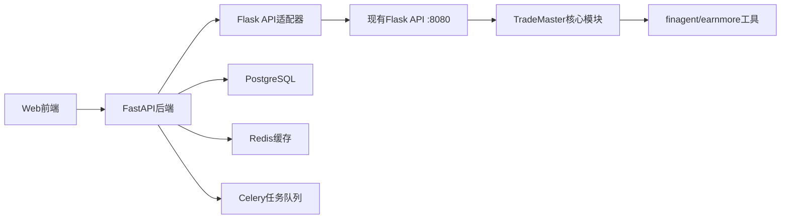

# TradeMaster Web Interface 架构设计文档

## 📋 目录结构详细设计

### 🎨 前端项目结构 (frontend/)

```
frontend/
├── public/                          # 静态资源目录
│   ├── index.html                   # HTML模板
│   ├── favicon.ico                  # 网站图标
│   ├── manifest.json                # PWA配置
│   └── assets/                      # 静态资源
│       ├── images/                  # 图片资源
│       ├── icons/                   # 图标资源
│       └── fonts/                   # 字体资源
├── src/                             # 源代码目录
│   ├── components/                  # 通用组件
│   │   ├── Layout/                  # 布局组件
│   │   │   ├── MainLayout.tsx       # 主布局
│   │   │   ├── Sidebar.tsx          # 侧边栏
│   │   │   ├── Header.tsx           # 头部导航
│   │   │   └── Footer.tsx           # 底部组件
│   │   ├── Charts/                  # 图表组件
│   │   │   ├── LineChart.tsx        # 折线图
│   │   │   ├── CandlestickChart.tsx # K线图  
│   │   │   ├── RadarChart.tsx       # 雷达图
│   │   │   └── HeatmapChart.tsx     # 热力图
│   │   ├── Forms/                   # 表单组件
│   │   │   ├── StrategyForm.tsx     # 策略配置表单
│   │   │   ├── DataUploadForm.tsx   # 数据上传表单
│   │   │   └── ModelConfigForm.tsx  # 模型配置表单
│   │   ├── Tables/                  # 表格组件
│   │   │   ├── DataTable.tsx        # 数据表格
│   │   │   ├── TradeTable.tsx       # 交易记录表格
│   │   │   └── PerformanceTable.tsx # 性能指标表格
│   │   ├── Modals/                  # 弹窗组件
│   │   │   ├── StrategyModal.tsx    # 策略弹窗
│   │   │   ├── UploadModal.tsx      # 上传弹窗
│   │   │   └── ConfigModal.tsx      # 配置弹窗
│   │   └── Common/                  # 通用组件
│   │       ├── Loading.tsx          # 加载组件
│   │       ├── ErrorBoundary.tsx    # 错误边界
│   │       ├── Empty.tsx            # 空状态
│   │       └── StatusBadge.tsx      # 状态徽章
│   ├── pages/                       # 页面组件
│   │   ├── Dashboard/               # 仪表板页面
│   │   │   ├── index.tsx           # 主仪表板
│   │   │   ├── Overview.tsx        # 总览页面
│   │   │   └── Analytics.tsx       # 分析页面
│   │   ├── Strategy/                # 策略管理页面
│   │   │   ├── index.tsx           # 策略列表
│   │   │   ├── Create.tsx          # 创建策略
│   │   │   ├── Edit.tsx            # 编辑策略
│   │   │   ├── Detail.tsx          # 策略详情
│   │   │   └── Monitor.tsx         # 策略监控
│   │   ├── Data/                    # 数据管理页面
│   │   │   ├── index.tsx           # 数据列表
│   │   │   ├── Upload.tsx          # 数据上传
│   │   │   ├── Preprocess.tsx      # 数据预处理
│   │   │   └── Visualize.tsx       # 数据可视化
│   │   ├── Training/                # 模型训练页面
│   │   │   ├── index.tsx           # 训练任务列表
│   │   │   ├── Create.tsx          # 创建训练任务
│   │   │   ├── Monitor.tsx         # 训练监控
│   │   │   └── Results.tsx         # 训练结果
│   │   ├── Evaluation/              # 评估分析页面
│   │   │   ├── index.tsx           # 评估列表
│   │   │   ├── Performance.tsx     # 性能评估
│   │   │   ├── Risk.tsx            # 风险分析
│   │   │   ├── Backtest.tsx        # 回测分析
│   │   │   └── Compare.tsx         # 对比分析
│   │   ├── Tools/                   # 工具集成页面
│   │   │   ├── index.tsx           # 工具列表
│   │   │   ├── FinAgent.tsx        # FinAgent工具
│   │   │   ├── EarnMore.tsx        # EarnMore工具
│   │   │   └── External.tsx        # 外部工具集成
│   │   ├── Settings/                # 系统设置页面
│   │   │   ├── index.tsx           # 设置主页
│   │   │   ├── Profile.tsx         # 个人资料
│   │   │   ├── System.tsx          # 系统配置
│   │   │   └── API.tsx             # API配置
│   │   ├── Auth/                    # 认证页面
│   │   │   ├── Login.tsx           # 登录页面
│   │   │   ├── Register.tsx        # 注册页面
│   │   │   └── Reset.tsx           # 密码重置
│   │   └── Error/                   # 错误页面
│   │       ├── 404.tsx             # 404页面
│   │       ├── 500.tsx             # 500页面
│   │       └── Network.tsx         # 网络错误页面
│   ├── stores/                      # 状态管理
│   │   ├── index.ts                # Store入口
│   │   ├── authStore.ts            # 认证状态
│   │   ├── strategyStore.ts        # 策略状态
│   │   ├── dataStore.ts            # 数据状态
│   │   ├── trainingStore.ts        # 训练状态
│   │   ├── evaluationStore.ts      # 评估状态
│   │   └── settingsStore.ts        # 设置状态
│   ├── services/                    # API服务
│   │   ├── api.ts                  # API基础配置
│   │   ├── auth.ts                 # 认证服务
│   │   ├── strategy.ts             # 策略服务
│   │   ├── data.ts                 # 数据服务
│   │   ├── training.ts             # 训练服务
│   │   ├── evaluation.ts           # 评估服务
│   │   ├── tools.ts                # 工具服务
│   │   └── websocket.ts            # WebSocket服务
│   ├── hooks/                       # 自定义Hook
│   │   ├── useAuth.ts              # 认证Hook
│   │   ├── useWebSocket.ts         # WebSocket Hook
│   │   ├── useCharts.ts            # 图表Hook
│   │   ├── useUpload.ts            # 上传Hook
│   │   └── usePolling.ts           # 轮询Hook
│   ├── utils/                       # 工具函数
│   │   ├── request.ts              # 请求工具
│   │   ├── storage.ts              # 存储工具
│   │   ├── validation.ts           # 验证工具
│   │   ├── format.ts               # 格式化工具
│   │   ├── chart.ts                # 图表工具
│   │   └── constants.ts            # 常量定义
│   ├── types/                       # TypeScript类型定义
│   │   ├── api.ts                  # API类型
│   │   ├── strategy.ts             # 策略类型
│   │   ├── data.ts                 # 数据类型
│   │   ├── training.ts             # 训练类型
│   │   ├── evaluation.ts           # 评估类型
│   │   ├── user.ts                 # 用户类型
│   │   └── common.ts               # 通用类型
│   ├── styles/                      # 样式文件
│   │   ├── globals.css             # 全局样式
│   │   ├── variables.css           # CSS变量
│   │   ├── themes/                 # 主题样式
│   │   │   ├── light.css           # 亮色主题
│   │   │   └── dark.css            # 暗色主题
│   │   └── components/             # 组件样式
│   ├── locales/                     # 国际化
│   │   ├── zh-CN.json              # 中文
│   │   ├── en-US.json              # 英文
│   │   └── index.ts                # 国际化配置
│   ├── App.tsx                      # 应用根组件
│   ├── main.tsx                     # 应用入口
│   └── vite-env.d.ts               # Vite类型声明
├── .eslintrc.js                     # ESLint配置
├── .prettierrc                      # Prettier配置
├── tsconfig.json                    # TypeScript配置
├── vite.config.ts                   # Vite配置
├── tailwind.config.js               # Tailwind配置
├── package.json                     # 依赖管理
└── README.md                        # 前端说明文档
```

### 🔧 后端项目结构 (backend/)

```
backend/
├── app/                             # 应用核心
│   ├── __init__.py                 # 应用初始化
│   ├── main.py                     # FastAPI应用入口
│   ├── api/                        # API路由
│   │   ├── __init__.py            
│   │   ├── v1/                     # API版本1
│   │   │   ├── __init__.py        
│   │   │   ├── auth.py            # 认证路由
│   │   │   ├── strategy.py        # 策略路由
│   │   │   ├── data.py            # 数据路由  
│   │   │   ├── training.py        # 训练路由
│   │   │   ├── evaluation.py      # 评估路由
│   │   │   ├── tools.py           # 工具路由
│   │   │   ├── users.py           # 用户路由
│   │   │   └── websocket.py       # WebSocket路由
│   │   └── dependencies.py        # 依赖注入
│   ├── core/                       # 核心配置
│   │   ├── __init__.py            
│   │   ├── config.py              # 应用配置
│   │   ├── security.py            # 安全配置
│   │   ├── database.py            # 数据库配置
│   │   ├── cache.py               # 缓存配置
│   │   ├── logging.py             # 日志配置
│   │   └── celery_app.py          # Celery配置
│   ├── models/                     # 数据模型
│   │   ├── __init__.py            
│   │   ├── base.py                # 基础模型
│   │   ├── user.py                # 用户模型
│   │   ├── strategy.py            # 策略模型
│   │   ├── data.py                # 数据模型
│   │   ├── training.py            # 训练模型
│   │   ├── evaluation.py          # 评估模型
│   │   └── task.py                # 任务模型
│   ├── schemas/                    # Pydantic模式
│   │   ├── __init__.py            
│   │   ├── base.py                # 基础模式
│   │   ├── user.py                # 用户模式
│   │   ├── strategy.py            # 策略模式
│   │   ├── data.py                # 数据模式
│   │   ├── training.py            # 训练模式
│   │   ├── evaluation.py          # 评估模式
│   │   └── response.py            # 响应模式
│   ├── services/                   # 业务逻辑服务
│   │   ├── __init__.py            
│   │   ├── auth_service.py        # 认证服务
│   │   ├── strategy_service.py    # 策略服务
│   │   ├── data_service.py        # 数据服务
│   │   ├── training_service.py    # 训练服务
│   │   ├── evaluation_service.py  # 评估服务
│   │   ├── trademaster_service.py # TradeMaster集成服务
│   │   ├── finagent_service.py    # FinAgent集成服务
│   │   └── earnmore_service.py    # EarnMore集成服务
│   ├── tasks/                      # Celery任务
│   │   ├── __init__.py            
│   │   ├── training_tasks.py      # 训练任务
│   │   ├── evaluation_tasks.py    # 评估任务
│   │   ├── data_tasks.py          # 数据处理任务
│   │   └── notification_tasks.py  # 通知任务
│   ├── crud/                       # CRUD操作
│   │   ├── __init__.py            
│   │   ├── base.py                # 基础CRUD
│   │   ├── user.py                # 用户CRUD
│   │   ├── strategy.py            # 策略CRUD
│   │   ├── data.py                # 数据CRUD
│   │   ├── training.py            # 训练CRUD
│   │   └── evaluation.py          # 评估CRUD
│   ├── utils/                      # 工具函数
│   │   ├── __init__.py            
│   │   ├── security.py            # 安全工具
│   │   ├── email.py               # 邮件工具
│   │   ├── file.py                # 文件处理工具
│   │   ├── validation.py          # 验证工具
│   │   └── helpers.py             # 辅助函数
│   ├── middleware/                 # 中间件
│   │   ├── __init__.py            
│   │   ├── cors.py                # CORS中间件
│   │   ├── auth.py                # 认证中间件
│   │   ├── logging.py             # 日志中间件
│   │   └── rate_limit.py          # 限流中间件
│   └── tests/                      # 测试
│       ├── __init__.py            
│       ├── conftest.py            # 测试配置
│       ├── test_auth.py           # 认证测试
│       ├── test_strategy.py       # 策略测试
│       ├── test_data.py           # 数据测试
│       ├── test_training.py       # 训练测试
│       └── test_evaluation.py     # 评估测试
├── alembic/                        # 数据库迁移
│   ├── versions/                   # 迁移版本
│   ├── env.py                     # 迁移环境
│   ├── script.py.mako             # 迁移模板
│   └── alembic.ini                # 迁移配置
├── scripts/                        # 脚本文件
│   ├── init_db.py                 # 初始化数据库
│   ├── create_user.py             # 创建用户
│   └── seed_data.py               # 种子数据
├── requirements/                   # 依赖文件
│   ├── base.txt                   # 基础依赖
│   ├── dev.txt                    # 开发依赖
│   ├── prod.txt                   # 生产依赖
│   └── test.txt                   # 测试依赖
├── .env.example                    # 环境变量示例
├── pyproject.toml                  # Python项目配置
├── requirements.txt                # 依赖管理
└── README.md                       # 后端说明文档
```

### 🐳 Docker配置结构 (docker/)

```
docker/
├── docker-compose.yml              # 生产环境编排
├── docker-compose.dev.yml          # 开发环境编排
├── docker-compose.test.yml         # 测试环境编排
├── Dockerfile.frontend             # 前端镜像构建
├── Dockerfile.backend              # 后端镜像构建
├── Dockerfile.nginx                # Nginx镜像构建
├── nginx/                          # Nginx配置
│   ├── nginx.conf                 # 主配置文件
│   ├── default.conf               # 默认配置
│   └── ssl/                       # SSL证书
├── postgres/                       # PostgreSQL配置
│   ├── init.sql                   # 初始化SQL
│   └── postgresql.conf            # PostgreSQL配置
├── redis/                          # Redis配置
│   └── redis.conf                 # Redis配置文件
└── scripts/                        # Docker脚本
    ├── wait-for-it.sh             # 等待服务脚本
    ├── entrypoint.sh              # 入口脚本
    └── healthcheck.sh             # 健康检查脚本
```

### 📜 脚本和工具 (scripts/)

```
scripts/
├── dev-setup.sh                    # 开发环境搭建
├── deploy.sh                       # 生产部署脚本
├── test.sh                         # 测试脚本
├── build.sh                        # 构建脚本
├── backup.sh                       # 备份脚本
├── restore.sh                      # 恢复脚本
├── migration.sh                    # 数据库迁移脚本
├── logs.sh                         # 日志查看脚本
└── monitoring/                     # 监控脚本
    ├── health-check.sh            # 健康检查
    ├── performance-test.sh        # 性能测试
    └── load-test.sh               # 负载测试
```

### 📚 文档结构 (docs/)

```
docs/
├── api/                            # API文档
│   ├── README.md                  # API概述
│   ├── authentication.md         # 认证文档
│   ├── strategy.md                # 策略API文档
│   ├── data.md                    # 数据API文档
│   ├── training.md                # 训练API文档
│   ├── evaluation.md              # 评估API文档
│   └── websocket.md               # WebSocket文档
├── deployment/                     # 部署文档
│   ├── README.md                  # 部署概述
│   ├── development.md             # 开发环境部署
│   ├── production.md              # 生产环境部署
│   ├── docker.md                  # Docker部署
│   └── kubernetes.md              # K8s部署
├── development/                    # 开发文档
│   ├── README.md                  # 开发指南
│   ├── frontend.md                # 前端开发指南
│   ├── backend.md                 # 后端开发指南
│   ├── testing.md                 # 测试指南
│   └── contributing.md            # 贡献指南
├── architecture/                  # 架构文档
│   ├── README.md                  # 架构概述
│   ├── system-design.md           # 系统设计
│   ├── database-design.md         # 数据库设计
│   ├── api-design.md              # API设计
│   └── security.md                # 安全设计
└── user/                          # 用户文档
    ├── README.md                  # 用户指南
    ├── quickstart.md              # 快速开始
    ├── features.md                # 功能介绍
    └── troubleshooting.md         # 故障排除
```

## 🔄 集成TradeMaster现有服务

### Flask API集成适配器

```typescript
// 在backend/app/services/trademaster_service.py中
class TradeMasterService:
    """TradeMaster Flask API集成服务"""
    
    def __init__(self):
        self.flask_api_url = "http://localhost:8080"
        self.session = requests.Session()
    
    async def train_strategy(self, strategy_config: StrategyConfig):
        """调用现有Flask API进行策略训练"""
        url = f"{self.flask_api_url}/api/TradeMaster/train"
        response = await self.session.post(url, json=strategy_config.dict())
        return response.json()
    
    async def get_train_status(self, session_id: str):
        """获取训练状态"""
        url = f"{self.flask_api_url}/api/TradeMaster/train_status"
        response = await self.session.post(url, json={"session_id": session_id})
        return response.json()
```

### 数据流集成



## 🏗️ 开发和部署工作流

### 开发工作流

1. **环境搭建**: 运行`scripts/dev-setup.sh`
2. **前端开发**: 在`frontend/`目录下使用Vite开发服务器
3. **后端开发**: 使用FastAPI + Uvicorn热重载
4. **数据库**: 使用Alembic进行迁移管理
5. **测试**: 前后端分别运行测试套件

### 部署工作流

1. **构建**: Docker镜像构建
2. **测试**: 自动化测试验证
3. **部署**: Docker Compose部署
4. **监控**: 健康检查和性能监控
5. **回滚**: 快速回滚机制

这个架构设计确保了：
- **模块化**: 各功能模块独立，易于维护
- **可扩展**: 支持水平扩展和功能扩展
- **集成性**: 无缝集成现有TradeMaster服务
- **现代化**: 使用最新的技术栈和开发实践
- **可维护**: 完整的文档和标准化的代码结构