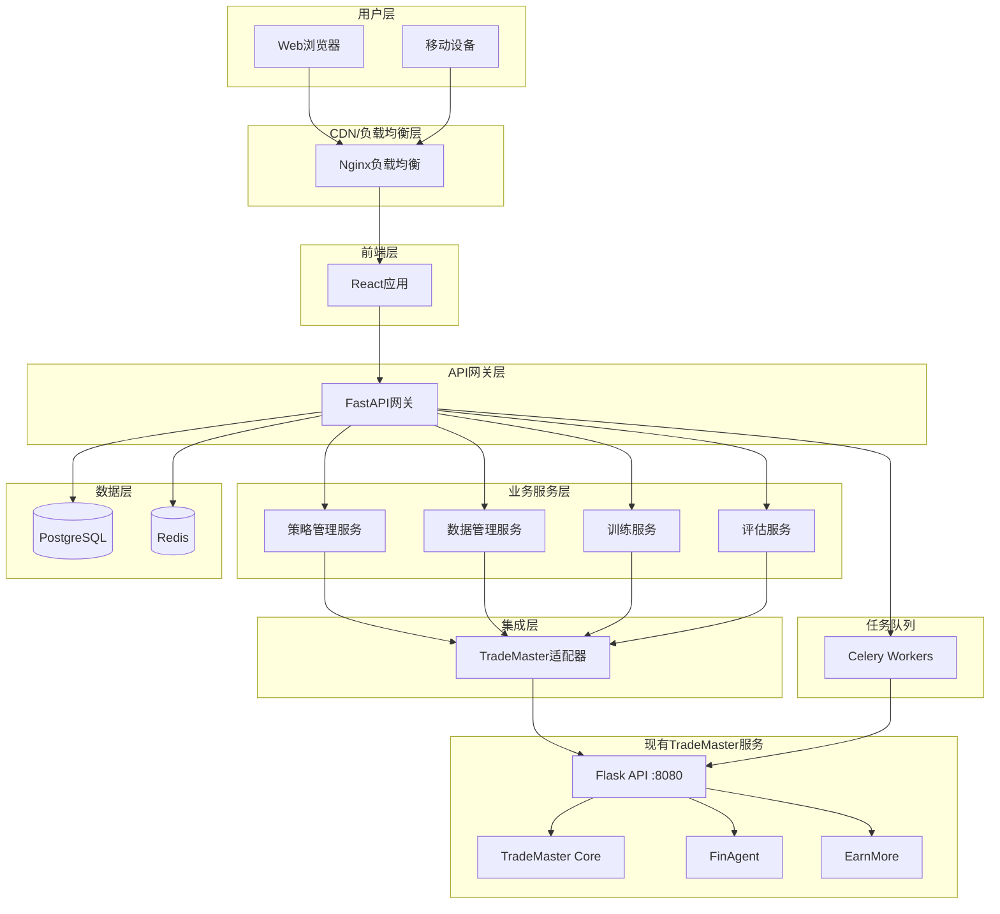
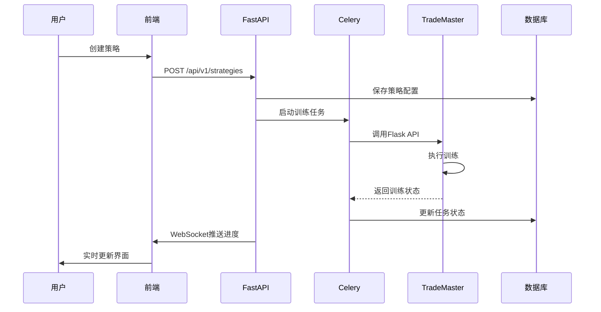
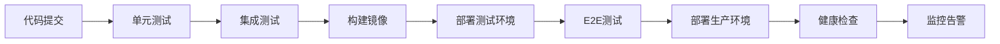

# TradeMaster Web Interface 项目总结

## 📋 项目概览

### 🎯 项目目标
为TradeMaster量化交易平台设计和开发现代化的Web界面，提供完整的策略管理、数据分析、模型训练和评估功能，无缝集成现有TradeMaster核心模块。

### 🏗️ 架构特点
- **微服务架构**: 前后端分离，服务组件化
- **现代化技术栈**: React 18 + FastAPI + PostgreSQL + Redis
- **容器化部署**: Docker + Docker Compose
- **集成现有服务**: 无缝对接TradeMaster Flask API (端口8080)
- **高可用设计**: 负载均衡、健康检查、故障恢复

## 🛠️ 技术栈总览

### 前端技术栈
| 技术 | 版本 | 用途 |
|------|------|------|
| React | 18.2+ | 前端框架 |
| TypeScript | 4.9+ | 类型安全 |
| Ant Design Pro | 5.x | UI组件库 |
| Vite | 4.x | 构建工具 |
| Zustand | 4.x | 状态管理 |
| ECharts | 5.x | 数据可视化 |
| React Query | 4.x | 服务端状态管理 |
| Tailwind CSS | 3.x | 样式框架 |

### 后端技术栈
| 技术 | 版本 | 用途 |
|------|------|------|
| FastAPI | 0.95+ | Web框架 |
| Python | 3.8+ | 编程语言 |
| SQLAlchemy | 2.0+ | ORM |
| PostgreSQL | 13+ | 主数据库 |
| Redis | 6+ | 缓存/消息队列 |
| Celery | 5.3+ | 异步任务 |
| Alembic | 1.10+ | 数据库迁移 |
| Pydantic | 2.0+ | 数据验证 |

### 部署技术栈
| 技术 | 版本 | 用途 |
|------|------|------|
| Docker | 20.10+ | 容器化 |
| Docker Compose | 2.0+ | 服务编排 |
| Nginx | 1.20+ | 反向代理 |
| Prometheus | latest | 监控 |
| Grafana | latest | 可视化监控 |

## 📊 系统架构设计

### 整体架构图



### 数据流架构



## 📁 完整目录结构

### 主目录结构
```
web_interface/
├── README.md                        # 项目说明
├── PROJECT_SUMMARY.md               # 项目总结 (本文档)
├── ARCHITECTURE.md                  # 架构设计文档
├── .gitignore                       # Git忽略文件
├── .env.example                     # 环境变量模板
├── frontend/                        # 前端项目
├── backend/                         # 后端项目
├── docker/                          # Docker配置
├── scripts/                         # 部署脚本
├── docs/                            # 详细文档
│   ├── FRONTEND_SPECIFICATION.md    # 前端技术规范
│   ├── BACKEND_SPECIFICATION.md     # 后端技术规范
│   ├── DATABASE_DESIGN.md           # 数据库设计
│   ├── DOCKER_DEPLOYMENT.md         # Docker部署指南
│   └── DEVELOPMENT_GUIDE.md         # 开发指南
└── tests/                           # 集成测试
```

### 关键文件说明

| 文件/目录 | 描述 |
|-----------|------|
| `frontend/src/` | React应用源代码 |
| `backend/app/` | FastAPI应用源代码 |
| `docker/docker-compose.yml` | 生产环境容器编排 |
| `docker/docker-compose.dev.yml` | 开发环境容器编排 |
| `scripts/deploy.sh` | 自动化部署脚本 |
| `docs/` | 详细技术文档 |

## 🌟 核心功能模块

### 1. 策略管理中心
**功能特性：**
- ✅ 策略创建与配置
- ✅ 多种算法交易策略支持
- ✅ 策略版本管理
- ✅ 实时策略监控
- ✅ 策略性能分析
- ✅ 参数优化建议

**技术实现：**
- 前端：React + Ant Design Form + ECharts
- 后端：FastAPI + SQLAlchemy + Celery
- 集成：TradeMaster Flask API

### 2. 数据管理模块
**功能特性：**
- ✅ 多格式数据上传 (CSV, JSON, Excel)
- ✅ 数据预处理管道
- ✅ 数据质量检查
- ✅ 交互式数据可视化
- ✅ 数据源管理
- ✅ 实时数据接入

**技术实现：**
- 前端：React + Ant Design Upload + D3.js
- 后端：Pandas + NumPy + FastAPI
- 存储：PostgreSQL + MinIO

### 3. 模型训练模块
**功能特性：**
- ✅ 分布式训练任务管理
- ✅ 实时训练监控
- ✅ 超参数自动调优
- ✅ 模型版本控制
- ✅ 训练结果可视化
- ✅ GPU资源管理

**技术实现：**
- 前端：WebSocket实时通信
- 后端：Celery分布式任务
- 集成：TradeMaster训练引擎

### 4. 评估分析模块
**功能特性：**
- ✅ 多维度性能评估
- ✅ 风险指标分析
- ✅ 回测报告生成
- ✅ 策略对比分析
- ✅ 交互式图表展示
- ✅ PDF报告导出

**技术实现：**
- 前端：ECharts + Ant Design Pro
- 后端：NumPy + Pandas + ReportLab
- 算法：TradeMaster评估引擎

### 5. 工具集成模块
**功能特性：**
- ✅ FinAgent AI智能体集成
- ✅ EarnMore收益优化工具
- ✅ 第三方API集成
- ✅ 插件化架构
- ✅ 工具配置管理
- ✅ 使用统计分析

**技术实现：**
- 架构：微服务 + API Gateway
- 集成：RESTful API + WebSocket
- 配置：动态配置管理

## 🔐 安全架构设计

### 认证授权
- **JWT Token**: 无状态认证机制
- **RBAC权限控制**: 基于角色的访问控制
- **OAuth2集成**: 支持第三方登录
- **会话管理**: Redis会话存储

### 数据安全
- **数据加密**: 敏感数据AES加密存储
- **传输加密**: HTTPS/TLS加密传输
- **输入验证**: Pydantic数据验证
- **SQL注入防护**: ORM参数化查询

### 网络安全
- **CORS配置**: 跨域请求控制
- **Rate Limiting**: API请求限流
- **CSRF防护**: CSRF Token验证
- **安全头**: 安全HTTP响应头

## 📈 性能优化策略

### 前端性能优化
- **代码分割**: React懒加载和动态导入
- **缓存策略**: 浏览器缓存和CDN
- **虚拟化**: 长列表虚拟滚动
- **图片优化**: WebP格式和响应式图片
- **Bundle优化**: Tree shaking和压缩

### 后端性能优化
- **数据库优化**: 索引优化和查询优化
- **缓存策略**: Redis多级缓存
- **异步处理**: FastAPI异步编程
- **连接池**: 数据库连接池管理
- **负载均衡**: Nginx负载均衡

### 系统性能优化
- **容器优化**: Docker镜像优化
- **资源限制**: CPU和内存限制
- **监控告警**: Prometheus + Grafana
- **自动扩缩容**: 基于负载的自动扩展

## 🔄 部署和运维

### 环境管理
- **开发环境**: Docker Compose本地开发
- **测试环境**: CI/CD自动化测试
- **生产环境**: 容器化生产部署
- **配置管理**: 环境变量和配置文件

### CI/CD流程


### 监控体系
- **应用监控**: APM性能监控
- **基础设施监控**: 服务器资源监控
- **业务监控**: 业务指标监控
- **日志管理**: ELK日志分析
- **告警通知**: 多渠道告警通知

## 🧪 测试策略

### 测试金字塔
```
        /\
       /  \
      / E2E \     <- 少量E2E测试
     /______\
    /        \
   /Integration\ <- 适量集成测试
  /__________\
 /            \
/  Unit Tests  \   <- 大量单元测试
/______________\
```

### 测试覆盖率目标
- **单元测试覆盖率**: ≥ 80%
- **集成测试覆盖率**: ≥ 60%
- **E2E测试覆盖率**: ≥ 40%
- **API测试覆盖率**: ≥ 90%

### 测试工具栈
| 层级 | 前端工具 | 后端工具 |
|------|----------|----------|
| 单元测试 | Vitest + RTL | Pytest |
| 集成测试 | MSW | Testcontainers |
| E2E测试 | Playwright | Playwright |
| API测试 | - | httpx |

## 📊 项目指标

### 开发效率指标
- **开发环境搭建时间**: < 10分钟
- **代码构建时间**: < 5分钟
- **测试执行时间**: < 10分钟
- **部署时间**: < 15分钟

### 性能指标
- **页面加载时间**: < 3秒
- **API响应时间**: < 500ms
- **数据库查询时间**: < 100ms
- **并发用户支持**: > 1000

### 可用性指标
- **系统可用性**: > 99.9%
- **故障恢复时间**: < 5分钟
- **数据备份频率**: 每日
- **监控覆盖率**: > 95%

## 🚀 交付成果

### 1. 完整的架构设计文档
- ✅ 系统架构图和技术选型
- ✅ 前端架构设计和组件规范
- ✅ 后端架构设计和API规范
- ✅ 数据库设计和数据模型
- ✅ Docker部署配置和脚本

### 2. 详细的技术规范
- ✅ 前端开发规范和最佳实践
- ✅ 后端开发规范和代码标准
- ✅ 数据库设计规范和索引策略
- ✅ API接口规范和文档标准
- ✅ 安全设计规范和实施方案

### 3. 开发和部署工具
- ✅ Docker容器化配置
- ✅ 自动化部署脚本
- ✅ 开发环境搭建指南
- ✅ 监控和日志配置
- ✅ 测试框架和工具配置

### 4. 项目文档体系
- ✅ 项目概述和架构说明
- ✅ 开发指南和最佳实践
- ✅ 部署指南和运维手册
- ✅ API文档和接口规范
- ✅ 用户手册和功能说明

## 🔮 未来扩展规划

### 短期目标 (1-3个月)
- [ ] **MVP开发**: 核心功能实现
- [ ] **基础测试**: 单元测试和集成测试
- [ ] **部署上线**: 生产环境部署
- [ ] **用户反馈**: 收集用户使用反馈

### 中期目标 (3-6个月)
- [ ] **功能增强**: 高级分析功能
- [ ] **性能优化**: 系统性能调优
- [ ] **用户体验**: UI/UX优化
- [ ] **移动支持**: 响应式设计完善

### 长期目标 (6-12个月)
- [ ] **AI集成**: 智能推荐和预测
- [ ] **多租户**: SaaS化改造
- [ ] **国际化**: 多语言支持
- [ ] **生态建设**: 插件和API生态

## 💡 创新特性

### 1. 智能化功能
- **智能参数推荐**: 基于历史数据的参数优化建议
- **异常检测**: 自动识别异常交易模式
- **风险预警**: 实时风险监控和预警
- **性能预测**: 基于机器学习的性能预测

### 2. 可视化创新
- **3D数据可视化**: 复杂数据的三维展示
- **实时图表**: WebSocket驱动的实时图表更新
- **交互式分析**: 拖拽式数据分析界面
- **自定义仪表板**: 用户个性化仪表板配置

### 3. 协作功能
- **团队协作**: 多用户协作开发策略
- **版本控制**: 策略代码版本管理
- **知识分享**: 策略模板和知识库
- **社区功能**: 用户交流和分享平台

## 📝 结语

TradeMaster Web Interface项目采用现代化的微服务架构和前后端分离设计，完美集成了现有的TradeMaster生态系统，为量化交易提供了专业、高效、易用的Web界面。

### 项目优势
1. **技术先进**: 采用最新的前后端技术栈
2. **架构合理**: 微服务架构，易于扩展和维护
3. **集成完善**: 无缝对接现有TradeMaster服务
4. **性能优异**: 多层缓存和性能优化策略
5. **安全可靠**: 完整的安全防护体系
6. **易于部署**: Docker容器化，一键部署
7. **文档完善**: 详细的技术文档和开发指南

### 技术亮点
- **React 18 + TypeScript**: 现代前端开发
- **FastAPI + SQLAlchemy**: 高性能异步后端
- **PostgreSQL + Redis**: 企业级数据存储
- **Celery分布式任务**: 异步任务处理
- **Docker容器化**: 标准化部署方案
- **Nginx负载均衡**: 高可用架构
- **Prometheus监控**: 全面的系统监控

这个完整的架构设计为TradeMaster项目提供了现代化、可扩展、高性能的Web界面解决方案，为量化交易用户带来卓越的用户体验。

---

**项目架构设计完成时间**: 2024年8月15日  
**设计团队**: TradeMaster Architecture Team  
**文档版本**: v1.0.0