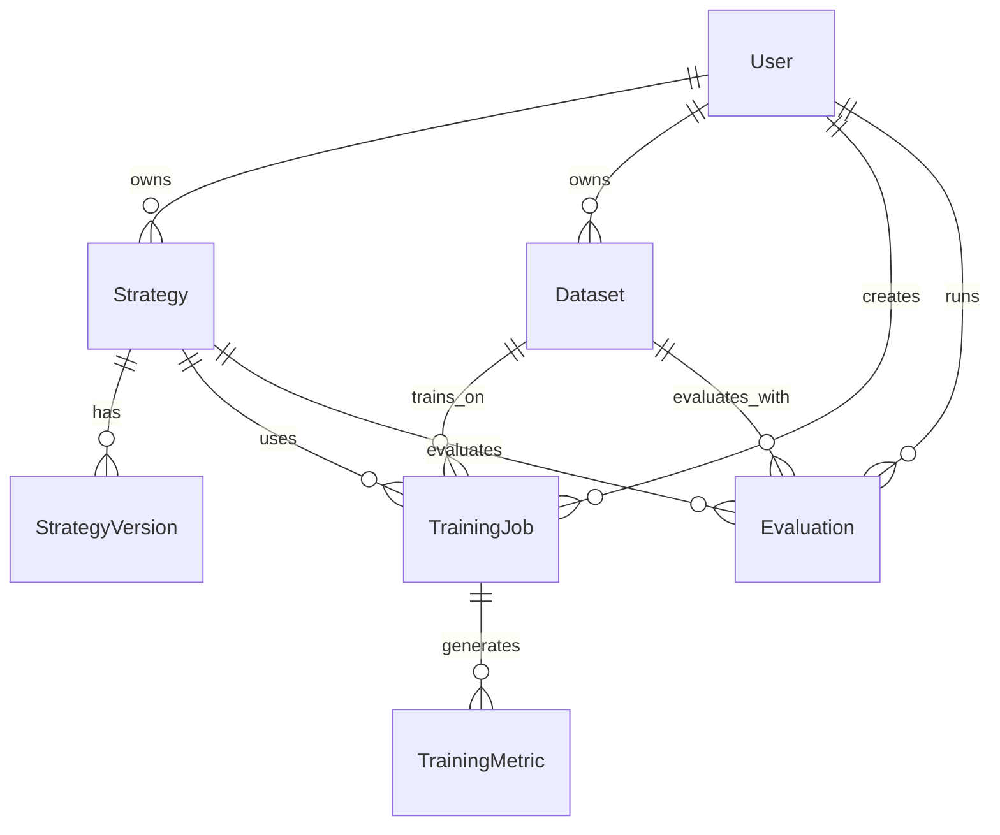

# TradeMaster 数据模型系统

完整的SQLAlchemy数据库模型和Pydantic数据验证模式实现，专为TradeMaster量化交易平台设计。

## 🏗️ 系统架构

### 核心组件

- **数据库层**: SQLAlchemy 2.0 + PostgreSQL异步驱动
- **数据验证层**: Pydantic v2数据模式和验证
- **迁移管理**: Alembic数据库版本控制
- **初始化工具**: 数据库和示例数据初始化脚本

### 目录结构

```
web_interface/backend/
├── alembic/                    # 数据库迁移
│   ├── versions/              # 迁移脚本
│   ├── env.py                 # 迁移环境配置
│   └── script.py.mako         # 迁移脚本模板
├── app/
│   ├── core/
│   │   └── database.py        # 数据库核心配置
│   ├── models/
│   │   ├── __init__.py        # 模型导出
│   │   └── database.py        # SQLAlchemy数据模型
│   ├── schemas/
│   │   ├── __init__.py        # 模式导出
│   │   ├── base.py           # 基础Pydantic模式
│   │   ├── user.py           # 用户相关模式
│   │   ├── strategy.py       # 策略相关模式
│   │   ├── dataset.py        # 数据集相关模式
│   │   ├── training.py       # 训练任务相关模式
│   │   └── common.py         # 通用模式
│   └── scripts/
│       ├── init_database.py  # 数据库初始化脚本
│       └── test_database.py  # 数据库测试脚本
├── alembic.ini               # Alembic配置文件
└── DATABASE_MODELS_README.md # 本文档
```

## 📊 数据模型概览

### 核心实体模型

1. **用户管理**
   - [`User`](app/models/database.py): 用户基本信息、权限、设置
   - [`UserSession`](app/models/database.py): 用户会话管理

2. **策略管理**
   - [`Strategy`](app/models/database.py): 量化交易策略信息
   - [`StrategyVersion`](app/models/database.py): 策略版本控制

3. **数据管理**
   - [`Dataset`](app/models/database.py): 数据集元数据和统计信息

4. **训练任务**
   - [`TrainingJob`](app/models/database.py): 机器学习训练任务
   - [`TrainingMetric`](app/models/database.py): 训练过程指标记录

5. **评估分析**
   - [`Evaluation`](app/models/database.py): 策略评估任务

6. **系统监控**
   - [`SystemLog`](app/models/database.py): 系统日志记录
   - [`CeleryTask`](app/models/database.py): 异步任务跟踪

### 数据关系图



## 🚀 快速开始

### 1. 环境配置

确保已安装依赖：
```bash
pip install -r requirements.txt
```

配置环境变量（创建 `.env` 文件）：
```bash
# 数据库配置
POSTGRES_SERVER=localhost
POSTGRES_USER=postgres
POSTGRES_PASSWORD=your_password
POSTGRES_DB=trademaster_web
POSTGRES_PORT=5432

# 应用配置
SECRET_KEY=your-secret-key
DEBUG=true
```

### 2. 数据库初始化

运行初始化脚本：
```bash
cd web_interface/backend
python app/scripts/init_database.py
```

这将：
- 创建所有数据表和索引
- 设置数据库触发器和约束
- 创建管理员用户 (admin/admin123)
- 插入示例数据（开发环境）

### 3. 数据库迁移

生成新的迁移脚本：
```bash
alembic revision --autogenerate -m "描述变更内容"
```

应用迁移：
```bash
alembic upgrade head
```

回滚迁移：
```bash
alembic downgrade -1
```

### 4. 运行测试

验证数据模型正确性：
```bash
python app/scripts/test_database.py
```

## 💡 使用示例

### SQLAlchemy模型使用

```python
from app.models import User, Strategy, get_db_session
from app.models.database import StrategyType, StrategyStatus

async def create_strategy_example():
    async with get_db_session() as session:
        # 创建用户
        user = User(
            username="trader",
            email="trader@example.com",
            hashed_password="hashed_password_here"
        )
        session.add(user)
        await session.flush()
        
        # 创建策略
        strategy = Strategy(
            name="我的DQN策略",
            description="基于深度Q学习的交易策略",
            strategy_type=StrategyType.ALGORITHMIC_TRADING,
            status=StrategyStatus.DRAFT,
            config={
                "task_name": "algorithmic_trading",
                "dataset_name": "BTC_1H",
                "agent_name": "algorithmic_trading:dqn"
            },
            owner_id=user.id
        )
        session.add(strategy)
        await session.commit()
```

### Pydantic模式使用

```python
from app.schemas import StrategyCreate, StrategyResponse

# 验证输入数据
strategy_data = {
    "name": "测试策略",
    "strategy_type": "algorithmic_trading",
    "config": {
        "task_name": "algorithmic_trading",
        "dataset_name": "BTC",
        "agent_name": "algorithmic_trading:dqn"
    }
}

# 使用Pydantic验证
validated_strategy = StrategyCreate(**strategy_data)

# 转换数据库对象为响应模式
response = StrategyResponse.from_orm(strategy_db_object)
```

## 🔧 核心特性

### 1. 类型安全
- 完整的Python类型注解
- Pydantic数据验证
- SQLAlchemy 2.0类型支持

### 2. 异步支持
- AsyncPG数据库驱动
- 异步会话管理
- 高性能数据库操作

### 3. 数据完整性
- 外键约束和级联删除
- 数据验证规则
- 自动时间戳更新

### 4. 扩展性设计
- JSONB字段存储灵活配置
- 枚举类型易于扩展
- 模块化架构设计

### 5. TradeMaster集成
- 兼容现有TradeMaster配置格式
- 支持所有策略类型
- 完整的训练和评估流程

## 📋 数据模式说明

### 策略配置模式
支持TradeMaster标准配置格式：
```json
{
  "task_name": "algorithmic_trading",
  "dataset_name": "algorithmic_trading:BTC", 
  "agent_name": "algorithmic_trading:dqn",
  "optimizer_name": "adam",
  "loss_name": "mse"
}
```

### 训练超参数模式
```json
{
  "hidden_layers": [128, 64],
  "activation": "relu",
  "learning_rate": 0.001,
  "gamma": 0.99,
  "epsilon": 0.1
}
```

### 评估结果模式
```json
{
  "total_return": 15.5,
  "sharpe_ratio": 1.8,
  "max_drawdown": -5.2,
  "win_rate": 0.65
}
```

## 🛠️ 开发指南

### 添加新模型

1. 在 `app/models/database.py` 中定义SQLAlchemy模型
2. 在对应的 `app/schemas/*.py` 中定义Pydantic模式
3. 更新 `__init__.py` 文件导出新模型/模式
4. 生成并应用数据库迁移
5. 更新测试脚本

### 模型关系定义

```python
class User(Base):
    # 一对多关系
    strategies: Mapped[List["Strategy"]] = relationship(
        "Strategy", 
        back_populates="owner", 
        cascade="all, delete-orphan"
    )

class Strategy(Base):
    # 多对一关系
    owner: Mapped["User"] = relationship("User", back_populates="strategies")
    owner_id: Mapped[int] = mapped_column(ForeignKey("users.id"))
```

### 数据验证规则

```python
class StrategyCreate(BaseSchema):
    name: str = Field(..., min_length=1, max_length=100)
    
    @validator('config')
    def validate_config(cls, v):
        required_fields = ['task_name', 'dataset_name', 'agent_name']
        for field in required_fields:
            if field not in v:
                raise ValueError(f'缺少必需字段: {field}')
        return v
```

## 🔍 故障排除

### 常见问题

1. **数据库连接失败**
   - 检查PostgreSQL服务状态
   - 验证连接配置参数
   - 确认数据库用户权限

2. **迁移失败**
   - 检查模型定义语法
   - 验证外键关系正确性
   - 查看Alembic日志详情

3. **导入错误**
   - 确认模块路径正确
   - 检查循环导入问题
   - 验证__init__.py导出

### 性能优化

1. **查询优化**
   ```python
   # 使用select_related避免N+1问题
   from sqlalchemy.orm import selectinload
   
   result = await session.execute(
       select(Strategy).options(selectinload(Strategy.owner))
   )
   ```

2. **批量操作**
   ```python
   # 批量插入
   session.add_all([obj1, obj2, obj3])
   await session.commit()
   ```

3. **索引使用**
   - 为常用查询字段添加索引
   - 使用GIN索引优化JSONB查询
   - 监控查询执行计划

## 📚 相关文档

- [SQLAlchemy 2.0 Documentation](https://docs.sqlalchemy.org/en/20/)
- [Pydantic Documentation](https://docs.pydantic.dev/)
- [Alembic Documentation](https://alembic.sqlalchemy.org/)
- [TradeMaster Documentation](../../../README.md)

## 🤝 贡献指南

1. 遵循现有代码风格
2. 添加完整的类型注解
3. 编写单元测试
4. 更新相关文档
5. 提交前运行测试脚本

---

**注意**: 本数据模型系统严格遵循KISS、YAGNI、DRY、SOLID原则，确保代码简洁、高效、可维护。在修改或扩展时请保持这些设计原则。