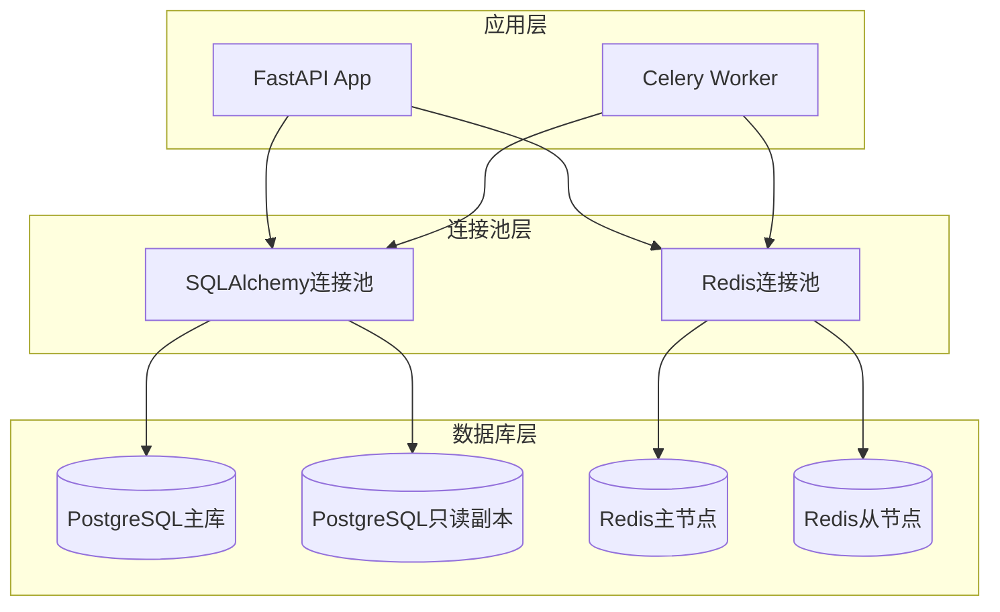

# 数据库设计与API接口规范

## 🗃️ 数据库架构设计

### 数据库选型
- **主数据库**: PostgreSQL 13+ (ACID事务，JSON支持，性能优秀)
- **缓存数据库**: Redis 6+ (高性能缓存，会话存储)
- **搜索引擎**: ElasticSearch 8+ (可选，用于日志和数据搜索)

### 数据库连接架构



## 📊 数据表设计

### 1. 用户管理模块

#### users 表 - 用户信息
```sql
CREATE TABLE users (
    id SERIAL PRIMARY KEY,
    username VARCHAR(50) UNIQUE NOT NULL,
    email VARCHAR(100) UNIQUE NOT NULL,
    hashed_password VARCHAR(255) NOT NULL,
    full_name VARCHAR(100),
    avatar_url VARCHAR(500),
    is_active BOOLEAN DEFAULT TRUE,
    is_superuser BOOLEAN DEFAULT FALSE,
    is_verified BOOLEAN DEFAULT FALSE,
    last_login_at TIMESTAMP,
    login_count INTEGER DEFAULT 0,
    settings JSONB DEFAULT '{}',
    created_at TIMESTAMP DEFAULT CURRENT_TIMESTAMP,
    updated_at TIMESTAMP DEFAULT CURRENT_TIMESTAMP
);

-- 索引
CREATE INDEX idx_users_username ON users(username);
CREATE INDEX idx_users_email ON users(email);
CREATE INDEX idx_users_active ON users(is_active);
CREATE INDEX idx_users_created_at ON users(created_at);

-- 触发器：自动更新updated_at
CREATE OR REPLACE FUNCTION update_updated_at_column()
RETURNS TRIGGER AS $$
BEGIN
    NEW.updated_at = CURRENT_TIMESTAMP;
    RETURN NEW;
END;
$$ language 'plpgsql';

CREATE TRIGGER update_users_updated_at 
    BEFORE UPDATE ON users 
    FOR EACH ROW EXECUTE FUNCTION update_updated_at_column();
```

#### user_sessions 表 - 用户会话
```sql
CREATE TABLE user_sessions (
    id SERIAL PRIMARY KEY,
    user_id INTEGER REFERENCES users(id) ON DELETE CASCADE,
    session_token VARCHAR(255) UNIQUE NOT NULL,
    refresh_token VARCHAR(255) UNIQUE,
    ip_address INET,
    user_agent TEXT,
    is_active BOOLEAN DEFAULT TRUE,
    expires_at TIMESTAMP NOT NULL,
    created_at TIMESTAMP DEFAULT CURRENT_TIMESTAMP,
    last_activity_at TIMESTAMP DEFAULT CURRENT_TIMESTAMP
);

CREATE INDEX idx_sessions_user_id ON user_sessions(user_id);
CREATE INDEX idx_sessions_token ON user_sessions(session_token);
CREATE INDEX idx_sessions_expires ON user_sessions(expires_at);
```

### 2. 策略管理模块

#### strategies 表 - 策略信息
```sql
CREATE TYPE strategy_type AS ENUM (
    'algorithmic_trading',
    'portfolio_management', 
    'order_execution',
    'high_frequency_trading'
);

CREATE TYPE strategy_status AS ENUM (
    'draft',
    'active',
    'paused',
    'stopped',
    'error'
);

CREATE TABLE strategies (
    id SERIAL PRIMARY KEY,
    name VARCHAR(100) NOT NULL,
    description TEXT,
    strategy_type strategy_type NOT NULL,
    status strategy_status DEFAULT 'draft',
    version VARCHAR(20) DEFAULT '1.0.0',
    
    -- 配置信息
    config JSONB DEFAULT '{}',
    parameters JSONB DEFAULT '{}',
    
    -- 性能指标
    total_return DECIMAL(10, 4),
    sharpe_ratio DECIMAL(8, 4),
    max_drawdown DECIMAL(8, 4),
    win_rate DECIMAL(5, 2),
    
    -- 关联信息
    owner_id INTEGER REFERENCES users(id) ON DELETE CASCADE,
    parent_strategy_id INTEGER REFERENCES strategies(id),
    
    -- 标签和分类
    tags TEXT[],
    category VARCHAR(50),
    
    -- 时间信息
    created_at TIMESTAMP DEFAULT CURRENT_TIMESTAMP,
    updated_at TIMESTAMP DEFAULT CURRENT_TIMESTAMP,
    last_run_at TIMESTAMP,
    
    CONSTRAINT valid_return_range CHECK (total_return >= -100 AND total_return <= 1000),
    CONSTRAINT valid_sharpe_ratio CHECK (sharpe_ratio >= -10 AND sharpe_ratio <= 10)
);

-- 索引
CREATE INDEX idx_strategies_owner ON strategies(owner_id);
CREATE INDEX idx_strategies_type ON strategies(strategy_type);
CREATE INDEX idx_strategies_status ON strategies(status);
CREATE INDEX idx_strategies_created ON strategies(created_at);
CREATE INDEX idx_strategies_tags ON strategies USING GIN(tags);
CREATE INDEX idx_strategies_config ON strategies USING GIN(config);

-- 触发器
CREATE TRIGGER update_strategies_updated_at 
    BEFORE UPDATE ON strategies 
    FOR EACH ROW EXECUTE FUNCTION update_updated_at_column();
```

#### strategy_versions 表 - 策略版本管理
```sql
CREATE TABLE strategy_versions (
    id SERIAL PRIMARY KEY,
    strategy_id INTEGER REFERENCES strategies(id) ON DELETE CASCADE,
    version VARCHAR(20) NOT NULL,
    config JSONB NOT NULL,
    parameters JSONB DEFAULT '{}',
    changelog TEXT,
    is_active BOOLEAN DEFAULT FALSE,
    created_by INTEGER REFERENCES users(id),
    created_at TIMESTAMP DEFAULT CURRENT_TIMESTAMP,
    
    UNIQUE(strategy_id, version)
);

CREATE INDEX idx_strategy_versions_strategy ON strategy_versions(strategy_id);
CREATE INDEX idx_strategy_versions_active ON strategy_versions(strategy_id, is_active);
```

### 3. 数据管理模块

#### datasets 表 - 数据集信息
```sql
CREATE TYPE dataset_status AS ENUM (
    'uploading',
    'processing', 
    'ready',
    'error'
);

CREATE TABLE datasets (
    id SERIAL PRIMARY KEY,
    name VARCHAR(100) NOT NULL,
    description TEXT,
    file_path VARCHAR(500) NOT NULL,
    file_size BIGINT,
    file_type VARCHAR(20),
    
    -- 数据信息
    row_count INTEGER,
    column_count INTEGER,
    columns JSONB, -- 列信息 [{"name": "col1", "type": "float64", "description": "..."}]
    
    -- 状态信息
    status dataset_status DEFAULT 'uploading',
    error_message TEXT,
    
    -- 统计信息
    statistics JSONB, -- 数据统计信息
    sample_data JSONB, -- 样本数据
    
    -- 关联信息
    owner_id INTEGER REFERENCES users(id) ON DELETE CASCADE,
    
    -- 时间信息
    created_at TIMESTAMP DEFAULT CURRENT_TIMESTAMP,
    updated_at TIMESTAMP DEFAULT CURRENT_TIMESTAMP,
    processed_at TIMESTAMP
);

CREATE INDEX idx_datasets_owner ON datasets(owner_id);
CREATE INDEX idx_datasets_status ON datasets(status);
CREATE INDEX idx_datasets_created ON datasets(created_at);
CREATE INDEX idx_datasets_columns ON datasets USING GIN(columns);
```

### 4. 训练任务模块

#### training_jobs 表 - 训练任务
```sql
CREATE TYPE training_status AS ENUM (
    'pending',
    'running',
    'completed',
    'failed',
    'cancelled'
);

CREATE TABLE training_jobs (
    id SERIAL PRIMARY KEY,
    name VARCHAR(100) NOT NULL,
    description TEXT,
    
    -- 状态信息
    status training_status DEFAULT 'pending',
    progress DECIMAL(5, 2) DEFAULT 0.0, -- 0-100%
    current_epoch INTEGER DEFAULT 0,
    total_epochs INTEGER,
    
    -- 配置信息
    config JSONB NOT NULL,
    hyperparameters JSONB DEFAULT '{}',
    
    -- 结果信息
    metrics JSONB DEFAULT '{}', -- 训练指标
    best_metrics JSONB DEFAULT '{}', -- 最佳指标
    model_path VARCHAR(500),
    logs TEXT,
    error_message TEXT,
    
    -- TradeMaster集成
    trademaster_session_id VARCHAR(100),
    
    -- 关联信息
    strategy_id INTEGER REFERENCES strategies(id) ON DELETE CASCADE,
    dataset_id INTEGER REFERENCES datasets(id),
    user_id INTEGER REFERENCES users(id) ON DELETE CASCADE,
    parent_job_id INTEGER REFERENCES training_jobs(id),
    
    -- 资源使用
    estimated_duration INTEGER, -- 预估时长(秒)
    actual_duration INTEGER, -- 实际时长(秒)
    cpu_usage DECIMAL(5, 2),
    memory_usage DECIMAL(5, 2),
    gpu_usage DECIMAL(5, 2),
    
    -- 时间信息
    created_at TIMESTAMP DEFAULT CURRENT_TIMESTAMP,
    updated_at TIMESTAMP DEFAULT CURRENT_TIMESTAMP,
    started_at TIMESTAMP,
    completed_at TIMESTAMP
);

-- 索引
CREATE INDEX idx_training_jobs_user ON training_jobs(user_id);
CREATE INDEX idx_training_jobs_strategy ON training_jobs(strategy_id);
CREATE INDEX idx_training_jobs_status ON training_jobs(status);
CREATE INDEX idx_training_jobs_created ON training_jobs(created_at);
CREATE INDEX idx_training_jobs_session ON training_jobs(trademaster_session_id);

-- 触发器
CREATE TRIGGER update_training_jobs_updated_at 
    BEFORE UPDATE ON training_jobs 
    FOR EACH ROW EXECUTE FUNCTION update_updated_at_column();
```

#### training_metrics 表 - 训练指标历史
```sql
CREATE TABLE training_metrics (
    id SERIAL PRIMARY KEY,
    training_job_id INTEGER REFERENCES training_jobs(id) ON DELETE CASCADE,
    epoch INTEGER NOT NULL,
    step INTEGER,
    
    -- 指标数据
    metrics JSONB NOT NULL,
    
    -- 时间戳
    recorded_at TIMESTAMP DEFAULT CURRENT_TIMESTAMP
);

CREATE INDEX idx_training_metrics_job ON training_metrics(training_job_id);
CREATE INDEX idx_training_metrics_epoch ON training_metrics(training_job_id, epoch);
```

### 5. 评估分析模块

#### evaluations 表 - 评估任务
```sql
CREATE TYPE evaluation_type AS ENUM (
    'backtest',
    'performance',
    'risk',
    'comparison'
);

CREATE TYPE evaluation_status AS ENUM (
    'pending',
    'running', 
    'completed',
    'failed'
);

CREATE TABLE evaluations (
    id SERIAL PRIMARY KEY,
    name VARCHAR(100) NOT NULL,
    evaluation_type evaluation_type NOT NULL,
    status evaluation_status DEFAULT 'pending',
    
    -- 配置信息
    config JSONB NOT NULL,
    time_range TSRANGE, -- 评估时间范围
    
    -- 结果信息
    results JSONB DEFAULT '{}',
    report_path VARCHAR(500),
    charts JSONB DEFAULT '[]', -- 图表数据
    
    -- 关联信息
    strategy_id INTEGER REFERENCES strategies(id) ON DELETE CASCADE,
    dataset_id INTEGER REFERENCES datasets(id),
    user_id INTEGER REFERENCES users(id) ON DELETE CASCADE,
    
    -- 时间信息
    created_at TIMESTAMP DEFAULT CURRENT_TIMESTAMP,
    updated_at TIMESTAMP DEFAULT CURRENT_TIMESTAMP,
    completed_at TIMESTAMP
);

CREATE INDEX idx_evaluations_user ON evaluations(user_id);
CREATE INDEX idx_evaluations_strategy ON evaluations(strategy_id);
CREATE INDEX idx_evaluations_type ON evaluations(evaluation_type);
CREATE INDEX idx_evaluations_status ON evaluations(status);
```

### 6. 系统日志模块

#### system_logs 表 - 系统日志
```sql
CREATE TYPE log_level AS ENUM (
    'DEBUG',
    'INFO', 
    'WARNING',
    'ERROR',
    'CRITICAL'
);

CREATE TABLE system_logs (
    id BIGSERIAL PRIMARY KEY,
    level log_level NOT NULL,
    message TEXT NOT NULL,
    module VARCHAR(100),
    function_name VARCHAR(100),
    
    -- 上下文信息
    user_id INTEGER REFERENCES users(id),
    session_id VARCHAR(255),
    request_id VARCHAR(100),
    
    -- 额外数据
    metadata JSONB DEFAULT '{}',
    stack_trace TEXT,
    ip_address INET,
    user_agent TEXT,
    
    -- 时间戳
    created_at TIMESTAMP DEFAULT CURRENT_TIMESTAMP
);

-- 分区表 (按月分区)
CREATE TABLE system_logs_y2024m01 PARTITION OF system_logs
    FOR VALUES FROM ('2024-01-01') TO ('2024-02-01');

-- 索引
CREATE INDEX idx_system_logs_level ON system_logs(level);
CREATE INDEX idx_system_logs_user ON system_logs(user_id);
CREATE INDEX idx_system_logs_created ON system_logs(created_at);
CREATE INDEX idx_system_logs_module ON system_logs(module);
```

### 7. 任务队列模块

#### celery_tasks 表 - Celery任务记录
```sql
CREATE TYPE task_status AS ENUM (
    'PENDING',
    'STARTED', 
    'SUCCESS',
    'FAILURE',
    'RETRY',
    'REVOKED'
);

CREATE TABLE celery_tasks (
    id VARCHAR(155) PRIMARY KEY, -- Celery task ID
    task_name VARCHAR(255) NOT NULL,
    status task_status DEFAULT 'PENDING',
    
    -- 任务信息
    args JSONB,
    kwargs JSONB,
    result JSONB,
    
    -- 执行信息
    worker_name VARCHAR(100),
    retries INTEGER DEFAULT 0,
    max_retries INTEGER DEFAULT 3,
    
    -- 时间信息
    created_at TIMESTAMP DEFAULT CURRENT_TIMESTAMP,
    started_at TIMESTAMP,
    completed_at TIMESTAMP,
    
    -- 关联信息
    user_id INTEGER REFERENCES users(id),
    related_id INTEGER, -- 关联的业务对象ID
    related_type VARCHAR(50) -- 关联的业务对象类型
);

CREATE INDEX idx_celery_tasks_status ON celery_tasks(status);
CREATE INDEX idx_celery_tasks_user ON celery_tasks(user_id);
CREATE INDEX idx_celery_tasks_created ON celery_tasks(created_at);
CREATE INDEX idx_celery_tasks_related ON celery_tasks(related_type, related_id);
```

## 🔄 数据库迁移管理

### Alembic 配置

```python
# alembic/env.py
from logging.config import fileConfig
from sqlalchemy import engine_from_config, pool
from alembic import context
import os
import sys

# 添加项目路径
sys.path.append(os.path.dirname(os.path.dirname(__file__)))

from app.core.config import settings
from app.models.base import Base

# Alembic Config object
config = context.config

# 设置数据库URL
config.set_main_option("sqlalchemy.url", str(settings.DATABASE_URL))

# 配置日志
if config.config_file_name is not None:
    fileConfig(config.config_file_name)

# 目标元数据
target_metadata = Base.metadata

def run_migrations_offline() -> None:
    """离线模式运行迁移"""
    url = config.get_main_option("sqlalchemy.url")
    context.configure(
        url=url,
        target_metadata=target_metadata,
        literal_binds=True,
        dialect_opts={"paramstyle": "named"},
    )

    with context.begin_transaction():
        context.run_migrations()

def run_migrations_online() -> None:
    """在线模式运行迁移"""
    connectable = engine_from_config(
        config.get_section(config.config_ini_section),
        prefix="sqlalchemy.",
        poolclass=pool.NullPool,
    )

    with connectable.connect() as connection:
        context.configure(
            connection=connection, 
            target_metadata=target_metadata
        )

        with context.begin_transaction():
            context.run_migrations()

if context.is_offline_mode():
    run_migrations_offline()
else:
    run_migrations_online()
```

### 迁移脚本示例

```python
# alembic/versions/001_initial_migration.py
"""Initial migration

Revision ID: 001
Revises: 
Create Date: 2024-01-01 00:00:00.000000

"""
from alembic import op
import sqlalchemy as sa
from sqlalchemy.dialects import postgresql

# revision identifiers
revision = '001'
down_revision = None
branch_labels = None
depends_on = None

def upgrade() -> None:
    # 创建枚举类型
    strategy_type = sa.Enum(
        'algorithmic_trading', 
        'portfolio_management', 
        'order_execution', 
        'high_frequency_trading',
        name='strategy_type'
    )
    strategy_type.create(op.get_bind())
    
    strategy_status = sa.Enum(
        'draft', 'active', 'paused', 'stopped', 'error',
        name='strategy_status'
    )
    strategy_status.create(op.get_bind())
    
    # 创建users表
    op.create_table(
        'users',
        sa.Column('id', sa.Integer(), nullable=False),
        sa.Column('username', sa.String(50), nullable=False),
        sa.Column('email', sa.String(100), nullable=False),
        sa.Column('hashed_password', sa.String(255), nullable=False),
        sa.Column('full_name', sa.String(100), nullable=True),
        sa.Column('is_active', sa.Boolean(), default=True),
        sa.Column('is_superuser', sa.Boolean(), default=False),
        sa.Column('last_login_at', sa.DateTime(), nullable=True),
        sa.Column('settings', postgresql.JSONB(), default={}),
        sa.Column('created_at', sa.DateTime(), server_default=sa.text('CURRENT_TIMESTAMP')),
        sa.Column('updated_at', sa.DateTime(), server_default=sa.text('CURRENT_TIMESTAMP')),
        sa.PrimaryKeyConstraint('id'),
        sa.UniqueConstraint('username'),
        sa.UniqueConstraint('email')
    )
    
    # 创建索引
    op.create_index('idx_users_username', 'users', ['username'])
    op.create_index('idx_users_email', 'users', ['email'])
    op.create_index('idx_users_active', 'users', ['is_active'])
    
    # 创建strategies表
    op.create_table(
        'strategies',
        sa.Column('id', sa.Integer(), nullable=False),
        sa.Column('name', sa.String(100), nullable=False),
        sa.Column('description', sa.Text(), nullable=True),
        sa.Column('strategy_type', strategy_type, nullable=False),
        sa.Column('status', strategy_status, default='draft'),
        sa.Column('config', postgresql.JSONB(), default={}),
        sa.Column('parameters', postgresql.JSONB(), default={}),
        sa.Column('owner_id', sa.Integer(), nullable=False),
        sa.Column('created_at', sa.DateTime(), server_default=sa.text('CURRENT_TIMESTAMP')),
        sa.Column('updated_at', sa.DateTime(), server_default=sa.text('CURRENT_TIMESTAMP')),
        sa.PrimaryKeyConstraint('id'),
        sa.ForeignKeyConstraint(['owner_id'], ['users.id'], ondelete='CASCADE')
    )
    
    # 创建触发器函数
    op.execute("""
        CREATE OR REPLACE FUNCTION update_updated_at_column()
        RETURNS TRIGGER AS $$
        BEGIN
            NEW.updated_at = CURRENT_TIMESTAMP;
            RETURN NEW;
        END;
        $$ language 'plpgsql';
    """)
    
    # 创建触发器
    op.execute("""
        CREATE TRIGGER update_users_updated_at 
        BEFORE UPDATE ON users 
        FOR EACH ROW EXECUTE FUNCTION update_updated_at_column();
    """)
    
    op.execute("""
        CREATE TRIGGER update_strategies_updated_at 
        BEFORE UPDATE ON strategies 
        FOR EACH ROW EXECUTE FUNCTION update_updated_at_column();
    """)

def downgrade() -> None:
    # 删除触发器
    op.execute("DROP TRIGGER IF EXISTS update_strategies_updated_at ON strategies;")
    op.execute("DROP TRIGGER IF EXISTS update_users_updated_at ON users;")
    op.execute("DROP FUNCTION IF EXISTS update_updated_at_column();")
    
    # 删除表
    op.drop_table('strategies')
    op.drop_table('users')
    
    # 删除枚举类型
    op.execute("DROP TYPE IF EXISTS strategy_status;")
    op.execute("DROP TYPE IF EXISTS strategy_type;")
```

## 🚀 API 接口规范

### RESTful API 设计原则

1. **资源导向**: URL表示资源，HTTP方法表示操作
2. **统一响应格式**: 统一的成功和错误响应结构
3. **版本控制**: API版本化管理 `/api/v1/`
4. **状态码规范**: 正确使用HTTP状态码
5. **分页和过滤**: 统一的分页和查询参数

### API 响应格式规范

#### 成功响应格式
```json
{
  "success": true,
  "data": {
    // 响应数据
  },
  "message": "Success",
  "code": 200,
  "timestamp": 1640995200,
  "request_id": "req_123456789"
}
```

#### 分页响应格式
```json
{
  "success": true,
  "data": {
    "items": [...],
    "total": 100,
    "page": 1,
    "size": 20,
    "pages": 5
  },
  "message": "Success",
  "code": 200,
  "timestamp": 1640995200,
  "request_id": "req_123456789"
}
```

#### 错误响应格式
```json
{
  "success": false,
  "error": {
    "code": 400,
    "message": "Validation error",
    "type": "validation_error",
    "details": [
      {
        "field": "email",
        "message": "Invalid email format"
      }
    ]
  },
  "timestamp": 1640995200,
  "request_id": "req_123456789"
}
```

### 核心API接口设计

#### 1. 认证接口 `/api/v1/auth/`

```yaml
# 用户登录
POST /api/v1/auth/login
Content-Type: application/json

Request:
{
  "username": "string",
  "password": "string",
  "remember_me": "boolean"
}

Response:
{
  "success": true,
  "data": {
    "access_token": "string",
    "refresh_token": "string",
    "token_type": "bearer",
    "expires_in": 3600,
    "user": {
      "id": 1,
      "username": "string",
      "email": "string",
      "full_name": "string"
    }
  }
}

# 刷新Token
POST /api/v1/auth/refresh
Authorization: Bearer <refresh_token>

Response:
{
  "success": true,
  "data": {
    "access_token": "string",
    "expires_in": 3600
  }
}

# 用户注册
POST /api/v1/auth/register
Content-Type: application/json

Request:
{
  "username": "string",
  "email": "string",
  "password": "string",
  "full_name": "string"
}

# 登出
POST /api/v1/auth/logout
Authorization: Bearer <access_token>
```

#### 2. 策略管理接口 `/api/v1/strategies/`

```yaml
# 获取策略列表
GET /api/v1/strategies/
Authorization: Bearer <access_token>
Query Parameters:
  - page: integer (default: 1)
  - size: integer (default: 20)
  - type: strategy_type (optional)
  - status: strategy_status (optional)
  - search: string (optional)
  - sort: string (default: -created_at)

Response:
{
  "success": true,
  "data": {
    "items": [
      {
        "id": 1,
        "name": "string",
        "description": "string",
        "strategy_type": "algorithmic_trading",
        "status": "active",
        "config": {},
        "parameters": {},
        "performance": {
          "total_return": 15.5,
          "sharpe_ratio": 1.8,
          "max_drawdown": -5.2
        },
        "created_at": "2024-01-01T00:00:00Z",
        "updated_at": "2024-01-01T00:00:00Z"
      }
    ],
    "total": 50,
    "page": 1,
    "size": 20,
    "pages": 3
  }
}

# 创建策略
POST /api/v1/strategies/
Authorization: Bearer <access_token>
Content-Type: application/json

Request:
{
  "name": "string",
  "description": "string",
  "strategy_type": "algorithmic_trading",
  "config": {},
  "parameters": {},
  "tags": ["tag1", "tag2"]
}

# 获取策略详情
GET /api/v1/strategies/{strategy_id}
Authorization: Bearer <access_token>

# 更新策略
PUT /api/v1/strategies/{strategy_id}
Authorization: Bearer <access_token>

# 删除策略
DELETE /api/v1/strategies/{strategy_id}
Authorization: Bearer <access_token>

# 启动策略
POST /api/v1/strategies/{strategy_id}/start
Authorization: Bearer <access_token>

# 停止策略
POST /api/v1/strategies/{strategy_id}/stop
Authorization: Bearer <access_token>

# 复制策略
POST /api/v1/strategies/{strategy_id}/clone
Authorization: Bearer <access_token>
```

#### 3. 训练任务接口 `/api/v1/training/`

```yaml
# 创建训练任务
POST /api/v1/training/jobs
Authorization: Bearer <access_token>
Content-Type: application/json

Request:
{
  "name": "string",
  "strategy_id": 1,
  "dataset_id": 1,
  "config": {
    "task_name": "algorithmic_trading",
    "dataset_name": "algorithmic_trading:BTC",
    "agent_name": "algorithmic_trading:dqn",
    "optimizer_name": "adam",
    "loss_name": "mse"
  },
  "hyperparameters": {
    "learning_rate": 0.001,
    "batch_size": 32,
    "epochs": 100
  }
}

Response:
{
  "success": true,
  "data": {
    "id": 1,
    "name": "string",
    "status": "pending",
    "celery_task_id": "task_123456",
    "estimated_duration": 3600
  }
}

# 获取训练任务状态
GET /api/v1/training/jobs/{job_id}
Authorization: Bearer <access_token>

Response:
{
  "success": true,
  "data": {
    "id": 1,
    "name": "string",
    "status": "running",
    "progress": 45.5,
    "current_epoch": 45,
    "total_epochs": 100,
    "metrics": {
      "loss": 0.125,
      "accuracy": 0.85,
      "val_loss": 0.145,
      "val_accuracy": 0.82
    },
    "logs": "Training progress logs...",
    "started_at": "2024-01-01T00:00:00Z",
    "estimated_completion": "2024-01-01T01:00:00Z"
  }
}

# 取消训练任务
POST /api/v1/training/jobs/{job_id}/cancel
Authorization: Bearer <access_token>

# 获取训练指标历史
GET /api/v1/training/jobs/{job_id}/metrics
Authorization: Bearer <access_token>
Query Parameters:
  - start_epoch: integer (optional)
  - end_epoch: integer (optional)
```

#### 4. 数据管理接口 `/api/v1/data/`

```yaml
# 上传数据文件
POST /api/v1/data/upload
Authorization: Bearer <access_token>
Content-Type: multipart/form-data

Request:
{
  "file": "binary",
  "name": "string",
  "description": "string"
}

Response:
{
  "success": true,
  "data": {
    "id": 1,
    "name": "string",
    "status": "processing",
    "upload_progress": 100,
    "processing_progress": 0
  }
}

# 获取数据集列表
GET /api/v1/data/datasets
Authorization: Bearer <access_token>

# 获取数据集详情
GET /api/v1/data/datasets/{dataset_id}
Authorization: Bearer <access_token>

Response:
{
  "success": true,
  "data": {
    "id": 1,
    "name": "string",
    "status": "ready",
    "file_size": 1024000,
    "row_count": 10000,
    "column_count": 15,
    "columns": [
      {
        "name": "timestamp",
        "type": "datetime",
        "description": "Time series data"
      }
    ],
    "statistics": {
      "numerical_summary": {},
      "missing_values": {},
      "data_types": {}
    },
    "sample_data": [...],
    "created_at": "2024-01-01T00:00:00Z"
  }
}

# 数据预处理
POST /api/v1/data/datasets/{dataset_id}/preprocess
Authorization: Bearer <access_token>

Request:
{
  "operations": [
    {
      "type": "fill_missing",
      "method": "forward_fill",
      "columns": ["price", "volume"]
    },
    {
      "type": "normalize",
      "method": "min_max",
      "columns": ["price"]
    }
  ]
}
```

#### 5. 评估分析接口 `/api/v1/evaluations/`

```yaml
# 创建评估任务
POST /api/v1/evaluations/
Authorization: Bearer <access_token>
Content-Type: application/json

Request:
{
  "name": "string",
  "evaluation_type": "backtest",
  "strategy_id": 1,
  "config": {
    "start_date": "2024-01-01",
    "end_date": "2024-12-31",
    "initial_capital": 100000,
    "benchmark": "SPY"
  }
}

# 获取评估结果
GET /api/v1/evaluations/{evaluation_id}
Authorization: Bearer <access_token>

Response:
{
  "success": true,
  "data": {
    "id": 1,
    "name": "string",
    "status": "completed",
    "results": {
      "total_return": 15.5,
      "annual_return": 12.3,
      "sharpe_ratio": 1.8,
      "max_drawdown": -5.2,
      "win_rate": 0.65,
      "profit_factor": 1.45
    },
    "charts": [
      {
        "type": "equity_curve",
        "data": [...],
        "config": {}
      }
    ],
    "report_url": "/reports/evaluation_1.pdf"
  }
}
```

### WebSocket 实时通信接口

```yaml
# WebSocket连接
WS /api/v1/ws
Authorization: Bearer <access_token>

# 订阅训练任务更新
Message:
{
  "type": "subscribe",
  "channel": "training_job",
  "job_id": 1
}

# 接收训练进度更新
Message:
{
  "type": "training_progress",
  "data": {
    "job_id": 1,
    "progress": 45.5,
    "current_epoch": 45,
    "metrics": {
      "loss": 0.125,
      "accuracy": 0.85
    }
  }
}

# 订阅策略状态更新
Message:
{
  "type": "subscribe", 
  "channel": "strategy_status",
  "strategy_id": 1
}
```

这个数据库设计和API规范确保了：

- **完整的数据模型**：覆盖所有业务场景的数据表设计
- **性能优化**：合理的索引设计和分区策略
- **数据完整性**：外键约束和数据验证规则  
- **审计追踪**：完整的时间戳和操作日志
- **扩展性**：JSONB字段支持灵活的配置存储
- **标准化API**：RESTful设计和统一响应格式
- **实时通信**：WebSocket支持实时数据推送
- **版本管理**：完整的数据库迁移和API版本控制